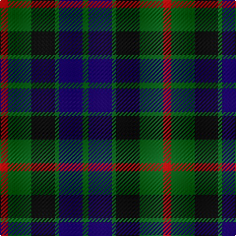

**Bands:** [RGKGBG](/stripes/rgkgbg/) · **Stripes:** [R G K G DB G](/stripes/stripes6/) R G K G DB G

This was sourced from tartans-authority.  It is a [6 band tartan](/bands/bands6/).

Original link http://www.tartansauthority.com/tartan-ferret/display/708/

## Variants

Other setts woven to the same stripe pattern.

- [Gunn](/setts/s6/r2g12k12g1db12g2~x2/)
- [Gunn](/setts/s6/r2g12k12g1db12g1~x2/)
- [Lauder (Family)](/setts/s6/g3db8g3k4g15r2~x2/)

## Thread count
R/8 G24 K24 G4 DB24 G/6

## Palette
Each colour and its ΔE from the base-6 reference it is a variant of.

| Colour | Shade | Base | ΔE (OKLab) |
|---|---|---|---|
| DB | <code style="background-color:#1C0070;">#1C0070</code> `#1C0070` | B <code style="background-color:#2A418A;">#2A418A</code> | 0.14 |
| G | <code style="background-color:#006818;">#006818</code> `#006818` | G <code style="background-color:#006100;">#006100</code> | 0.02 |
| K | <code style="background-color:#101010;">#101010</code> `#101010` | K <code style="background-color:#000000;">#000000</code> | 0.17 |
| R | <code style="background-color:#C80000;">#C80000</code> `#C80000` | R <code style="background-color:#CC0000;">#CC0000</code> | 0.01 |

# Sample pattern

## Nearest tartans

The nearest existing variants by ΔTartan distance.

1. [Lennie Family Tartan Tartan Number: 725. Earliest known date: 1819 Wilson's No 231. See products available Copyright © Blair Urquhart, Comrie, 2015](/setts/s6/k2g10t2k9dp8g2~x2/) — ΔT 0.55
1. [Callum Beg (Fashion)](/setts/s6/g1db6k6g6r1g1~x6/) — ΔT 0.70
1. [Gallamore](/setts/s6/k3db14r2k14g14k3~x2/) — ΔT 0.77
1. [Wellington or Waterloo](/setts/s6/t3dg12k14t11r3t3~x2/) — ΔT 0.78
1. [Morrison Society](/setts/s6/k3g14k14g2b14r3~x2/) — ΔT 0.81
1. [Fletcher of Dunans](/setts/s7/b10k3b10k14r2g14r5~x2/) — ΔT 0.81
1. [Inneryne (Personal)](/setts/s7/db4k3db16k14g14r3g3~x2/) — ΔT 0.84
1. [MacArthur of Milton Hunting Clan Tartan Tartan Number: 700. Earliest known date: 1823 This is the older of the two MacArthur setts, which links the clan with the Campbells. See products available Copyright © Blair Urquhart, Comrie, 2015](/setts/s6/g14db2g2k8dp9k2~x2/) — ΔT 0.88
1. [Hudson Valley Reg. Police P & D (Cor](/setts/s6/ly5g16k16db16k2db2~x2/) — ΔT 0.89
1. [Wilson's No 97](/setts/s7/k11dg12k2dg12k12dp12w3~x2/) — ΔT 0.89

## Neighbour map

Every grey dot is one of 14299 variants placed by the first two principal components of the ΔTartan feature space (44% of its variance). Red is this tartan; blue dots are its nearest — click one to open its page.

<svg viewBox="0 0 640 380" role="img" style="max-width:100%;height:auto;border:1px solid #e0e0e0;border-radius:4px;display:block" xmlns="http://www.w3.org/2000/svg"><image href="/nn/cloud.v1.png" width="640" height="380"/><a href="/setts/s6/k2g10t2k9dp8g2~x2/"><circle cx="165.7" cy="261.8" r="4" fill="#3465a4"><title>Lennie Family Tartan Tartan Number: 725. Earliest known date: 1819 Wilson's No 231. See products available Copyright © Blair Urquhart, Comrie, 2015</title></circle></a><a href="/setts/s6/g1db6k6g6r1g1~x6/"><circle cx="197.7" cy="260.1" r="4" fill="#3465a4"><title>Callum Beg (Fashion)</title></circle></a><a href="/setts/s6/k3db14r2k14g14k3~x2/"><circle cx="214.2" cy="260.7" r="4" fill="#3465a4"><title>Gallamore</title></circle></a><a href="/setts/s6/t3dg12k14t11r3t3~x2/"><circle cx="149.6" cy="264.1" r="4" fill="#3465a4"><title>Wellington or Waterloo</title></circle></a><a href="/setts/s6/k3g14k14g2b14r3~x2/"><circle cx="163.1" cy="247.3" r="4" fill="#3465a4"><title>Morrison Society</title></circle></a><a href="/setts/s7/b10k3b10k14r2g14r5~x2/"><circle cx="141.8" cy="250.5" r="4" fill="#3465a4"><title>Fletcher of Dunans</title></circle></a><a href="/setts/s7/db4k3db16k14g14r3g3~x2/"><circle cx="179.6" cy="259.6" r="4" fill="#3465a4"><title>Inneryne (Personal)</title></circle></a><a href="/setts/s6/g14db2g2k8dp9k2~x2/"><circle cx="221.3" cy="245.2" r="4" fill="#3465a4"><title>MacArthur of Milton Hunting Clan Tartan Tartan Number: 700. Earliest known date: 1823 This is the older of the two MacArthur setts, which links the clan with the Campbells. See products available Copyright © Blair Urquhart, Comrie, 2015</title></circle></a><a href="/setts/s6/ly5g16k16db16k2db2~x2/"><circle cx="151.5" cy="238.7" r="4" fill="#3465a4"><title>Hudson Valley Reg. Police P &amp; D (Cor</title></circle></a><a href="/setts/s7/k11dg12k2dg12k12dp12w3~x2/"><circle cx="165.1" cy="274.7" r="4" fill="#3465a4"><title>Wilson's No 97</title></circle></a><circle cx="167.6" cy="263.6" r="5" fill="#c00000"/></svg>

ID: /setts/s6/r4g12k12g2db12g3~x2/
