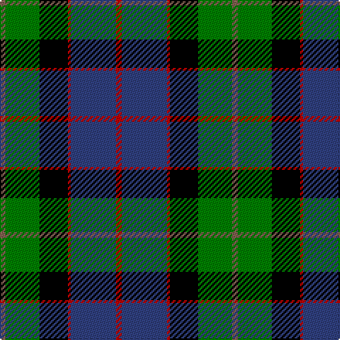

In pattern [RBRKGR](/patterns/rbrkgr/).

This was sourced from weddslist.  It is a [6 stripes tartan](/stripes/stripes6/).

Original link http://www.weddslist.com/cgi-bin/tartans/pg.pl?source=sts

## Thread count
LT/4 G24 K20 R2 B32 R/4

## Palette
Each colour and its ΔE from the base-6 reference it is a variant of.

| Colour | Shade | Base | ΔE (OKLab) |
|---|---|---|---|
| B | <code style="background-color:#304080;">#304080</code> `#304080` | B <code style="background-color:#2C4084;">#2C4084</code> | 0.01 |
| G | <code style="background-color:#008000;">#008000</code> `#008000` | G <code style="background-color:#006400;">#006400</code> | 0.09 |
| K | <code style="background-color:#000000;">#000000</code> `#000000` | K <code style="background-color:#000000;">#000000</code> | 0.00 |
| LT | <code style="background-color:#806050;">#806050</code> `#806050` | R <code style="background-color:#C80000;">#C80000</code> | 0.17 |
| R | <code style="background-color:#C00000;">#C00000</code> `#C00000` | R <code style="background-color:#C80000;">#C80000</code> | 0.02 |

# Sample pattern

## Nearest tartans

The nearest existing variants by ΔTartan distance.

1. [Wilson's, No 221](/setts/s6/b2ba28r4k28g28r2-b5480b0-ba304080-g008000-k000000-rc00000/) — ΔT 0.68
1. [MacPhail, hunting](/setts/s6/r4b46k28g32k4w4-b304080-g008000-k000000-rc00000-we0e0e0/) — ΔT 0.68
1. [Ferguson - 1830 of Atholl (Clan)](/setts/s7/b36k20g12r8g12k2w4-b202060-g006818-k101010-rc80000-wfcfcfc/) — ΔT 0.76
1. [MacLeod of Assynt](/setts/s6/r6k4g30k20b40y4-b304080-g008000-k000000-rc00000-yf0c000/) — ΔT 0.77
1. [Russell, or Mitchell or Hunter or Galbraith](/setts/s6/k4g24k24r2b24w4-b304080-g008000-k000000-rc00000-we0e0e0/) — ΔT 0.80
1. [Genet, Citizen (Commem)](/setts/s7/r8k36g48b32r4b4w4-b1c0070-g006818-k101010-rc80000-we0e0e0/) — ΔT 0.80
1. [Patterson (blue)](/setts/s6/b44w4k20g22r6g8-b304080-g008000-k000000-rc00000-we0e0e0/) — ΔT 0.81
1. [Smith](/setts/s6/b6ba36k40g40k2y6-b5480b0-ba304080-g008000-k000000-yf0c000/) — ΔT 0.81
1. [Russell Clan Tartan Tartan Number: 1094. Earliest known date: c.1815 It seems certain that the tartan was first known as Galbraith. William Wilson and Sons of Bannockburn recorded the pattern as Russell in their pattern book of 1847, although it was named Hunter in the earlier book of 1819. See products available Copyright © Blair Urquhart, Comrie, 2015](/setts/s6/k4g24k24r2b24w4-b2c2c80-g006818-k101010-rc80000-we0e0e0/) — ΔT 0.85
1. [Smith, Sir William (?)](/setts/s6/b6ba36k40g40k2y6-b5c8ca8-ba2c2c80-g006818-k101010-yfccc00/) — ΔT 0.86

## Neighbour map

Every grey dot is one of 15726 variants placed by the first two principal components of the ΔTartan feature space (44% of its variance). Red is this tartan; blue dots are its nearest — click one to open its page.

<svg viewBox="0 0 640 380" role="img" style="max-width:100%;height:auto;border:1px solid #e0e0e0;border-radius:4px;display:block" xmlns="http://www.w3.org/2000/svg"><image href="/nn/cloud.v1.png" width="640" height="380"/><a href="/setts/s6/b2ba28r4k28g28r2-b5480b0-ba304080-g008000-k000000-rc00000/"><circle cx="137.1" cy="180.1" r="4" fill="#3465a4"><title>Wilson's, No 221</title></circle></a><a href="/setts/s6/r4b46k28g32k4w4-b304080-g008000-k000000-rc00000-we0e0e0/"><circle cx="162.8" cy="185.0" r="4" fill="#3465a4"><title>MacPhail, hunting</title></circle></a><a href="/setts/s7/b36k20g12r8g12k2w4-b202060-g006818-k101010-rc80000-wfcfcfc/"><circle cx="185.1" cy="172.7" r="4" fill="#3465a4"><title>Ferguson - 1830 of Atholl (Clan)</title></circle></a><a href="/setts/s6/r6k4g30k20b40y4-b304080-g008000-k000000-rc00000-yf0c000/"><circle cx="150.1" cy="192.0" r="4" fill="#3465a4"><title>MacLeod of Assynt</title></circle></a><a href="/setts/s6/k4g24k24r2b24w4-b304080-g008000-k000000-rc00000-we0e0e0/"><circle cx="132.3" cy="189.4" r="4" fill="#3465a4"><title>Russell, or Mitchell or Hunter or Galbraith</title></circle></a><a href="/setts/s7/r8k36g48b32r4b4w4-b1c0070-g006818-k101010-rc80000-we0e0e0/"><circle cx="166.2" cy="180.2" r="4" fill="#3465a4"><title>Genet, Citizen (Commem)</title></circle></a><a href="/setts/s6/b44w4k20g22r6g8-b304080-g008000-k000000-rc00000-we0e0e0/"><circle cx="171.5" cy="190.3" r="4" fill="#3465a4"><title>Patterson (blue)</title></circle></a><a href="/setts/s6/b6ba36k40g40k2y6-b5480b0-ba304080-g008000-k000000-yf0c000/"><circle cx="143.9" cy="169.0" r="4" fill="#3465a4"><title>Smith</title></circle></a><a href="/setts/s6/k4g24k24r2b24w4-b2c2c80-g006818-k101010-rc80000-we0e0e0/"><circle cx="163.8" cy="201.0" r="4" fill="#3465a4"><title>Russell Clan Tartan Tartan Number: 1094. Earliest known date: c.1815 It seems certain that the tartan was first known as Galbraith. William Wilson and Sons of Bannockburn recorded the pattern as Russell in their pattern book of 1847, although it was named Hunter in the earlier book of 1819. See products available Copyright © Blair Urquhart, Comrie, 2015</title></circle></a><a href="/setts/s6/b6ba36k40g40k2y6-b5c8ca8-ba2c2c80-g006818-k101010-yfccc00/"><circle cx="174.8" cy="180.5" r="4" fill="#3465a4"><title>Smith, Sir William (?)</title></circle></a><circle cx="166.0" cy="177.6" r="5" fill="#c00000"/></svg>

ID: /setts/s6/r4g24k20ra2b32ra4-b304080-g008000-k000000-r806050-rac00000/
