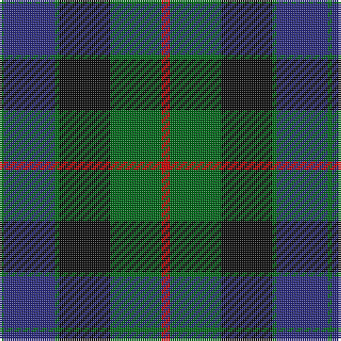

In pattern [GBGKGR](/patterns/gbgkgr/).

This was sourced from house-of-tartan.  It is a [6 stripes tartan](/stripes/stripes6/).

Original link http://www.house-of-tartan.scotland.net/house/TartanViewjs.asp?colr=Def&tnam=708

## Thread count
G/2 DB24 G2 K24 G24 R/4

## Palette
Each colour and its ΔE from the base-6 reference it is a variant of.

| Colour | Shade | Base | ΔE (OKLab) |
|---|---|---|---|
| DB | <code style="background-color:#2C2C80;">#2C2C80</code> `#2C2C80` | B <code style="background-color:#2A418A;">#2A418A</code> | 0.06 |
| G | <code style="background-color:#006818;">#006818</code> `#006818` | G <code style="background-color:#006100;">#006100</code> | 0.02 |
| K | <code style="background-color:#101010;">#101010</code> `#101010` | K <code style="background-color:#000000;">#000000</code> | 0.17 |
| R | <code style="background-color:#C80000;">#C80000</code> `#C80000` | R <code style="background-color:#CC0000;">#CC0000</code> | 0.01 |

# Sample pattern

## Nearest tartans

The nearest existing variants by ΔTartan distance.

1. [Gunn](/setts/s6/g4b24g2k24g24r4-b1c0070-g006400-k101010-rc80000/) — ΔT 0.38
1. [Reid and Taylor](/setts/s7/b4k2r2b18k18g20k4-b2c2c80-g006818-k101010-rc80000/) — ΔT 0.53
1. [Blair Clan Tartan Tartan Number: 416. Earliest known date: pre 1963 Described by MacKinlay as a "Modern family sett". See products available Copyright © Blair Urquhart, Comrie, 2015](/setts/s7/b12r4b40k32g40r4g12-b2c2c80-g006818-k101010-rc80000/) — ΔT 0.54
1. [Black Watch (Coarse Kilt)](/setts/s7/r8k8b48k48g48k4r6-b202060-g006818-k101010-rc80000/) — ΔT 0.56
1. [Ferguson of Balquhidder #2](/setts/s6/g8b48r6k48g50k8-b2c2c80-g006818-k101010-rc80000/) — ΔT 0.61
1. [National Galleries of Scotland Corporate Tartan Tartan Number: 2050. Earliest known date: November 1991 Based on the Black Watch or Government tartan. The three claret stripes represent the three galleries and the colour is that of William Playfair's original colour scheme for the National Gallery. See products available Copyright © Blair Urquhart, Comrie, 2015](/setts/s7/k14g44k44b12r4b30r4-b202060-g006818-k101010-rc80000/) — ΔT 0.65
1. [National Galleries of Scotland](/setts/s7/k14g44k44b12r4b30r4-b1c0070-g006818-k101010-rc80000/) — ΔT 0.66
1. [Dundas #2](/setts/s7/k8b32k24g24r2g4k4-b2c2c80-g006818-k101010-rc80000/) — ΔT 0.70
1. [Renfrew](/setts/s7/b12k4b36k36g36k6r4-b2c2c80-g006818-k101010-rc80000/) — ΔT 0.73
1. [Bedford High School](/setts/s8/b8k6b24k22g26ga2g2ga6-b2c2c80-g006818-ga289c18-k101010/) — ΔT 0.73

## Neighbour map

Every grey dot is one of 15726 variants placed by the first two principal components of the ΔTartan feature space (44% of its variance). Red is this tartan; blue dots are its nearest — click one to open its page.

<svg viewBox="0 0 640 380" role="img" style="max-width:100%;height:auto;border:1px solid #e0e0e0;border-radius:4px;display:block" xmlns="http://www.w3.org/2000/svg"><image href="/nn/cloud.v1.png" width="640" height="380"/><a href="/setts/s6/g4b24g2k24g24r4-b1c0070-g006400-k101010-rc80000/"><circle cx="212.6" cy="226.2" r="4" fill="#3465a4"><title>Gunn</title></circle></a><a href="/setts/s7/b4k2r2b18k18g20k4-b2c2c80-g006818-k101010-rc80000/"><circle cx="217.1" cy="226.5" r="4" fill="#3465a4"><title>Reid and Taylor</title></circle></a><a href="/setts/s7/b12r4b40k32g40r4g12-b2c2c80-g006818-k101010-rc80000/"><circle cx="206.9" cy="229.5" r="4" fill="#3465a4"><title>Blair Clan Tartan Tartan Number: 416. Earliest known date: pre 1963 Described by MacKinlay as a &quot;Modern family sett&quot;. See products available Copyright © Blair Urquhart, Comrie, 2015</title></circle></a><a href="/setts/s7/r8k8b48k48g48k4r6-b202060-g006818-k101010-rc80000/"><circle cx="216.3" cy="213.2" r="4" fill="#3465a4"><title>Black Watch (Coarse Kilt)</title></circle></a><a href="/setts/s6/g8b48r6k48g50k8-b2c2c80-g006818-k101010-rc80000/"><circle cx="200.7" cy="243.5" r="4" fill="#3465a4"><title>Ferguson of Balquhidder #2</title></circle></a><a href="/setts/s7/k14g44k44b12r4b30r4-b202060-g006818-k101010-rc80000/"><circle cx="225.8" cy="229.5" r="4" fill="#3465a4"><title>National Galleries of Scotland Corporate Tartan Tartan Number: 2050. Earliest known date: November 1991 Based on the Black Watch or Government tartan. The three claret stripes represent the three galleries and the colour is that of William Playfair's original colour scheme for the National Gallery. See products available Copyright © Blair Urquhart, Comrie, 2015</title></circle></a><a href="/setts/s7/k14g44k44b12r4b30r4-b1c0070-g006818-k101010-rc80000/"><circle cx="214.5" cy="224.8" r="4" fill="#3465a4"><title>National Galleries of Scotland</title></circle></a><a href="/setts/s7/k8b32k24g24r2g4k4-b2c2c80-g006818-k101010-rc80000/"><circle cx="244.3" cy="210.9" r="4" fill="#3465a4"><title>Dundas #2</title></circle></a><a href="/setts/s7/b12k4b36k36g36k6r4-b2c2c80-g006818-k101010-rc80000/"><circle cx="215.3" cy="233.5" r="4" fill="#3465a4"><title>Renfrew</title></circle></a><a href="/setts/s8/b8k6b24k22g26ga2g2ga6-b2c2c80-g006818-ga289c18-k101010/"><circle cx="193.0" cy="207.5" r="4" fill="#3465a4"><title>Bedford High School</title></circle></a><circle cx="215.7" cy="223.1" r="5" fill="#c00000"/></svg>

ID: /setts/s6/r4g24k24g2b24g2-b2c2c80-g006818-k101010-rc80000/
