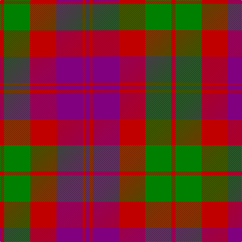

In pattern [BRBRGR](/stripes/brbrgr/).

This was sourced from weddslist.  It is a [6 stripe tartan](/stripes/stripes6/).

Original link http://www.weddslist.com/cgi-bin/tartans/pg.pl?source=sts

## Also known as

This cloth is also recorded under:

- Unidentified #21
- Unidentified 16

## Thread count
R/8 G52 R52 P52 R6 P/8

## Palette
Each colour and the base-6 reference it is a variant of.

| Colour | Shade | Base |
|---|---|---|
| G | <code style="background-color:#008000;">#008000</code> `oklch(52.0% 0.177 142.5)` <small>#008000</small> | G <code style="background-color:#006100;">#006100</code> |
| P | <code style="background-color:#800080;">#800080</code> `oklch(42.1% 0.193 328.4)` <small>#800080</small> | B <code style="background-color:#2A418A;">#2A418A</code> |
| R | <code style="background-color:#C00000;">#C00000</code> `oklch(50.7% 0.208 29.2)` <small>#C00000</small> | R <code style="background-color:#CC0000;">#CC0000</code> |

# Sample pattern

## Nearest tartans

The nearest existing variants by ΔTartan distance, with this tartan at the top so the swatches line up against it.

ΔTartan

Tartan

Sett

—

<a href="/ttd/edit/#slug=r4g26r26p26r3p4~x2">Unidentified 16</a> <a class="nn-out" href="/setts/s6/r4g26r26p26r3p4~x2/" title="open its dictionary page">↗</a>

0.37

<a href="/ttd/edit/#slug=dp4r3dp26r26g26r4~x2">Unidentified Artifact Tartan Tartan Number: 463. Earliest known date: 0 Wilson's of Bannockburn 'New Broad Sett' perhaps. See products available Copyright © Blair Urquhart, Comrie, 2015</a> <a class="nn-out" href="/setts/s6/dp4r3dp26r26g26r4~x2/" title="open its dictionary page">↗</a>

0.78

<a href="/ttd/edit/#slug=dp4r3dp26r26dg26r4~x2">Unidentified #21</a> <a class="nn-out" href="/setts/s6/dp4r3dp26r26dg26r4~x2/" title="open its dictionary page">↗</a>

0.87

<a href="/ttd/edit/#slug=p3r14g2p10r2g14p3~x2">Scottish Netball Association</a> <a class="nn-out" href="/setts/s7/p3r14g2p10r2g14p3~x2/" title="open its dictionary page">↗</a>

0.88

<a href="/ttd/edit/#slug=dg3dp3dg19dp18r19dp3~x2">MacNab (Macgregor - Hastie)</a> <a class="nn-out" href="/setts/s6/dg3dp3dg19dp18r19dp3~x2/" title="open its dictionary page">↗</a>

0.99

<a href="/ttd/edit/#slug=db3r25db17r5g22r9db3~x2">MacFadyan (MacGregor Hastie)</a> <a class="nn-out" href="/setts/s7/db3r25db17r5g22r9db3~x2/" title="open its dictionary page">↗</a>

1.05

<a href="/ttd/edit/#slug=dp3r19dp18g19dp3g3~x2">MacNab 1</a> <a class="nn-out" href="/setts/s6/dp3r19dp18g19dp3g3~x2/" title="open its dictionary page">↗</a>

1.08

<a href="/ttd/edit/#slug=t4r28k6t12k12t3~x2">Thomson, Red (Name)</a> <a class="nn-out" href="/setts/s6/t4r28k6t12k12t3~x2/" title="open its dictionary page">↗</a>

1.20

<a href="/ttd/edit/#slug=r8r1dg4r1db4~x2">Moray of Abercairney #2</a> <a class="nn-out" href="/setts/s5/r8r1dg4r1db4~x2/" title="open its dictionary page">↗</a>

1.23

<a href="/ttd/edit/#slug=db4r30k6db13k13db3~x2">Thompson/Thomson/MacTavish (Bonner)</a> <a class="nn-out" href="/setts/s6/db4r30k6db13k13db3~x2/" title="open its dictionary page">↗</a>

1.25

<a href="/ttd/edit/#slug=g1m1g7m4r7m1~x4">MacNab #2</a> <a class="nn-out" href="/setts/s6/g1m1g7m4r7m1~x4/" title="open its dictionary page">↗</a>

## Neighbour map

Every grey dot is one of 14299 variants placed by the first two principal components of the ΔTartan feature space (44% of its variance). Red is this tartan; blue dots are its nearest — click one to open its page.

<svg viewBox="0 0 640 380" role="img" style="max-width:100%;height:auto;border:1px solid #e0e0e0;border-radius:4px;display:block" xmlns="http://www.w3.org/2000/svg"><image href="/nn/cloud.v1.png" width="640" height="380"/><a href="/setts/s6/dp4r3dp26r26g26r4~x2/"><circle cx="249.6" cy="235.9" r="4" fill="#3465a4"><title>Unidentified Artifact Tartan Tartan Number: 463. Earliest known date: 0 Wilson's of Bannockburn 'New Broad Sett' perhaps. See products available Copyright © Blair Urquhart, Comrie, 2015</title></circle></a><a href="/setts/s6/dp4r3dp26r26dg26r4~x2/"><circle cx="232.6" cy="229.3" r="4" fill="#3465a4"><title>Unidentified #21</title></circle></a><a href="/setts/s7/p3r14g2p10r2g14p3~x2/"><circle cx="220.1" cy="240.3" r="4" fill="#3465a4"><title>Scottish Netball Association</title></circle></a><a href="/setts/s6/dg3dp3dg19dp18r19dp3~x2/"><circle cx="226.3" cy="251.0" r="4" fill="#3465a4"><title>MacNab (Macgregor - Hastie)</title></circle></a><a href="/setts/s7/db3r25db17r5g22r9db3~x2/"><circle cx="266.1" cy="233.3" r="4" fill="#3465a4"><title>MacFadyan (MacGregor Hastie)</title></circle></a><a href="/setts/s6/dp3r19dp18g19dp3g3~x2/"><circle cx="210.6" cy="245.5" r="4" fill="#3465a4"><title>MacNab 1</title></circle></a><a href="/setts/s6/t4r28k6t12k12t3~x2/"><circle cx="243.3" cy="217.1" r="4" fill="#3465a4"><title>Thomson, Red (Name)</title></circle></a><a href="/setts/s5/r8r1dg4r1db4~x2/"><circle cx="239.8" cy="231.3" r="4" fill="#3465a4"><title>Moray of Abercairney #2</title></circle></a><a href="/setts/s6/db4r30k6db13k13db3~x2/"><circle cx="255.9" cy="216.2" r="4" fill="#3465a4"><title>Thompson/Thomson/MacTavish (Bonner)</title></circle></a><a href="/setts/s6/g1m1g7m4r7m1~x4/"><circle cx="261.6" cy="251.4" r="4" fill="#3465a4"><title>MacNab #2</title></circle></a><circle cx="240.3" cy="231.3" r="5" fill="#c00000"/></svg>

ID: /setts/s6/r4g26r26p26r3p4~x2/
