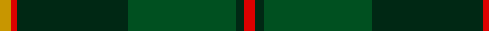
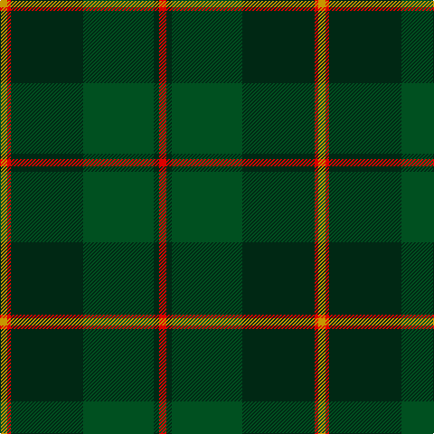

In pattern [RGGGRY](/patterns/rgggry/).

This was sourced from register-of-tartans.  It is a [6 stripes tartan](/stripes/stripes6/).

Original link https://www.tartanregister.gov.uk/tartanDetails.aspx?ref=2884

## Thread count
DY/8 R4 DG80 G78 DG6 R/8

## Palette
Each colour and its ΔE from the base-6 reference it is a variant of.

| Colour | Shade | Base | ΔE (OKLab) |
|---|---|---|---|
| DG | <code style="background-color:#002814;">#002814</code> `#002814` | G <code style="background-color:#006100;">#006100</code> | 0.20 |
| DY | <code style="background-color:#C89600;">#C89600</code> `#C89600` | Y <code style="background-color:#F2BF00;">#F2BF00</code> | 0.13 |
| G | <code style="background-color:#005020;">#005020</code> `#005020` | G <code style="background-color:#006100;">#006100</code> | 0.07 |
| R | <code style="background-color:#DC0000;">#DC0000</code> `#DC0000` | R <code style="background-color:#CC0000;">#CC0000</code> | 0.03 |

# Sample pattern

## Nearest tartans

The nearest existing variants by ΔTartan distance.

1. [John Telfar Dunbar/Hunting Tartan Tartan Number: 776. Earliest known date: pre 2003 Check this entry... See products available Copyright © Blair Urquhart, Comrie, 2015](/setts/s7/g5k2g28k10ga26b4g4~b2c2c80-g006818-ga604000-k101010~x2/) — ΔT 1.24
1. [Hunting Kenmore Trade Com. Tartan Tartan Number: 2234. Earliest known date: 1995 Designed by Polly Wittering of House of Edgar for a range of gifts produced for Macnaughtons of Pitlochry See products available Copyright © Blair Urquhart, Comrie, 2015](/setts/s7/k2g19ga2g2ga19g2k2~g003820-ga006818-k000000~x2/) — ΔT 1.39
1. [Scottish Chieftain (Universal)](/setts/s8/k20r1g3k8g2k2g20w2~g003820-k101010-rc80000-we0e0e0~x2/) — ΔT 1.44
1. [Symonds (2016)](/setts/s6/g18y1b5y1ga18r1~b780078-g006818-ga003820-rc80000-ye8c000~x4/) — ΔT 1.46
1. [Java Saint Andrew Society Hunting](/setts/s7/b50g26k9g4w2r2g10~b003c64-g006818-k101010-r880000-wc0c0c0~x2/) — ΔT 1.55
1. [Mitchell, Cameron (Personal)](/setts/s6/k16g32k8r4ra11r2~g003c14-k101010-r888888-ra880000~x2/) — ΔT 1.55
1. [Unidentified, Toy Bear](/setts/s8/g47y2g5y2g4k15b19r2~b141e46-g003c14-k101010-rdc0000-ye8c000~x2/) — ΔT 1.56
1. [St Andrews Links](/setts/s7/b16g4b3g3y2g24r2~b14283c-g006818-r880000-yd09800~x2/) — ΔT 1.57
1. [Manor (Corporate)](/setts/s8/g14k1g2k1g2k10ga14w2~g003820-ga006818-k101010-wf4c4c4/) — ΔT 1.58
1. [Pride of Ireland Fashion Tartan Tartan Number: 5157. Earliest known date: 2008 ONLY FOR DISPLAY PURPOSES. Count and sample from Lochcarron Feb. 2008. See products available Copyright © Blair Urquhart, Comrie, 2015](/setts/s10/g9k2g2ga13k2ga2y1g13k26y2~g003820-ga006818-k101010-ye8c000~x2/) — ΔT 1.61

## Neighbour map

Every grey dot is one of 15726 variants placed by the first two principal components of the ΔTartan feature space (44% of its variance). Red is this tartan; blue dots are its nearest — click one to open its page.

<svg viewBox="0 0 640 380" role="img" style="max-width:100%;height:auto;border:1px solid #e0e0e0;border-radius:4px;display:block" xmlns="http://www.w3.org/2000/svg"><image href="/nn/cloud.v1.png" width="640" height="380"/><a href="/setts/s7/g5k2g28k10ga26b4g4~b2c2c80-g006818-ga604000-k101010~x2/"><circle cx="331.6" cy="224.3" r="4" fill="#3465a4"><title>John Telfar Dunbar/Hunting Tartan Tartan Number: 776. Earliest known date: pre 2003 Check this entry... See products available Copyright © Blair Urquhart, Comrie, 2015</title></circle></a><a href="/setts/s7/k2g19ga2g2ga19g2k2~g003820-ga006818-k000000~x2/"><circle cx="348.4" cy="228.3" r="4" fill="#3465a4"><title>Hunting Kenmore Trade Com. Tartan Tartan Number: 2234. Earliest known date: 1995 Designed by Polly Wittering of House of Edgar for a range of gifts produced for Macnaughtons of Pitlochry See products available Copyright © Blair Urquhart, Comrie, 2015</title></circle></a><a href="/setts/s8/k20r1g3k8g2k2g20w2~g003820-k101010-rc80000-we0e0e0~x2/"><circle cx="390.9" cy="198.5" r="4" fill="#3465a4"><title>Scottish Chieftain (Universal)</title></circle></a><a href="/setts/s6/g18y1b5y1ga18r1~b780078-g006818-ga003820-rc80000-ye8c000~x4/"><circle cx="276.4" cy="179.6" r="4" fill="#3465a4"><title>Symonds (2016)</title></circle></a><a href="/setts/s7/b50g26k9g4w2r2g10~b003c64-g006818-k101010-r880000-wc0c0c0~x2/"><circle cx="351.7" cy="172.1" r="4" fill="#3465a4"><title>Java Saint Andrew Society Hunting</title></circle></a><a href="/setts/s6/k16g32k8r4ra11r2~g003c14-k101010-r888888-ra880000~x2/"><circle cx="295.8" cy="222.9" r="4" fill="#3465a4"><title>Mitchell, Cameron (Personal)</title></circle></a><a href="/setts/s8/g47y2g5y2g4k15b19r2~b141e46-g003c14-k101010-rdc0000-ye8c000~x2/"><circle cx="389.7" cy="164.1" r="4" fill="#3465a4"><title>Unidentified, Toy Bear</title></circle></a><a href="/setts/s7/b16g4b3g3y2g24r2~b14283c-g006818-r880000-yd09800~x2/"><circle cx="381.6" cy="215.6" r="4" fill="#3465a4"><title>St Andrews Links</title></circle></a><a href="/setts/s8/g14k1g2k1g2k10ga14w2~g003820-ga006818-k101010-wf4c4c4/"><circle cx="254.5" cy="201.9" r="4" fill="#3465a4"><title>Manor (Corporate)</title></circle></a><a href="/setts/s10/g9k2g2ga13k2ga2y1g13k26y2~g003820-ga006818-k101010-ye8c000~x2/"><circle cx="298.6" cy="164.7" r="4" fill="#3465a4"><title>Pride of Ireland Fashion Tartan Tartan Number: 5157. Earliest known date: 2008 ONLY FOR DISPLAY PURPOSES. Count and sample from Lochcarron Feb. 2008. See products available Copyright © Blair Urquhart, Comrie, 2015</title></circle></a><circle cx="365.5" cy="202.6" r="5" fill="#c00000"/></svg>

ID: /setts/s6/r4g3ga39g40r2y4~g002814-ga005020-rdc0000-yc89600~x2/
