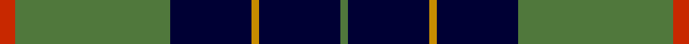

This page is one **sett** — a single exact thread-count. It belongs to the [tartan](/tartans/r4g40k21lo2k21g2/)
(the same proportion at any scale), whose colour order is pattern [GKYKGR](/stripes/gkykgr/).

Sourced from register-of-tartans.  It is a [6 stripe tartan](/stripes/stripes6/).

Original link https://www.tartanregister.gov.uk/tartanDetails.aspx?ref=4298

## Register references

External register numbers recorded for this tartan.

- Scottish Register of Tartans: [4298](https://www.tartanregister.gov.uk/tartanDetails.aspx?ref=4298)
- Scottish Tartans Authority (ITI): 4402

## Thread count
R/8 G80 DB42 DY4 DB42 G/4

## Palette

Palette: <strong>Tartan Register</strong> <small style="color:#888">(5 of 8 colours)</small>
<table><thead><tr><th>Colour</th><th>Threads</th><th>Shade</th><th>Base</th><th>OKLCh</th></tr></thead><tbody><tr><td>R/</td><td style="text-align:right;font-variant-numeric:tabular-nums">8</td><td><code style="background-color:#C82800;">#C82800</code> <small style="color:#888">#C82800</small></td><td>R <code style="background-color:#CC0000;">#CC0000</code></td><td><small style="color:#888">oklch(54.0% 0.199 33.0)</small></td></tr><tr><td>G</td><td style="text-align:right;font-variant-numeric:tabular-nums">80</td><td><code style="background-color:#50783C;">#50783C</code> <small style="color:#888">#50783C</small></td><td>G <code style="background-color:#006100;">#006100</code></td><td><small style="color:#888">oklch(52.8% 0.099 136.1)</small></td></tr><tr><td>DB</td><td style="text-align:right;font-variant-numeric:tabular-nums">42</td><td><code style="background-color:#000034;">#000034</code> <small style="color:#888">#000034</small></td><td>K <code style="background-color:#000000;">#000000</code></td><td><small style="color:#888">oklch(14.7% 0.102 264.1)</small></td></tr><tr><td>DY</td><td style="text-align:right;font-variant-numeric:tabular-nums">4</td><td><code style="background-color:#C88C00;">#C88C00</code> <small style="color:#888">#C88C00</small></td><td>Y <code style="background-color:#F2BF00;">#F2BF00</code></td><td><small style="color:#888">oklch(68.2% 0.142 78.2)</small></td></tr><tr><td>DB</td><td style="text-align:right;font-variant-numeric:tabular-nums">42</td><td><code style="background-color:#000034;">#000034</code> <small style="color:#888">#000034</small></td><td>K <code style="background-color:#000000;">#000000</code></td><td><small style="color:#888">oklch(14.7% 0.102 264.1)</small></td></tr><tr><td>G/</td><td style="text-align:right;font-variant-numeric:tabular-nums">4</td><td><code style="background-color:#50783C;">#50783C</code> <small style="color:#888">#50783C</small></td><td>G <code style="background-color:#006100;">#006100</code></td><td><small style="color:#888">oklch(52.8% 0.099 136.1)</small></td></tr></tbody></table>

# Sample pattern

## Nearest tartans

The nearest existing variants by ΔTartan distance, with this tartan at the top so the swatches line up against it.

ΔTartan

Tartan

Sett

—

<a href="/ttd/edit/#slug=r4g40k21lo2k21g2~x2">Unidentified Furnishing #2</a> <a class="nn-out" href="/setts/s6/r4g40k21lo2k21g2~x2/" title="open its dictionary page">↗</a>

0.99

<a href="/ttd/edit/#slug=r2db32g14db5g16w2~x2">Connacht Irish District Tartan Tartan Number: 4485. Earliest known date: 1994 Phil Smith obtained in Perthshire from a swatch dated 1994 shown to him by Keith Lumsden of the Scottish Tartans Society. However www.uniq-orn.com shows this as Connaught Green. See products available Copyright © Blair Urquhart, Comrie, 2015</a> <a class="nn-out" href="/setts/s6/r2db32g14db5g16w2~x2/" title="open its dictionary page">↗</a>

1.10

<a href="/ttd/edit/#slug=k3w2n27k31lr3~x2">Kelley Oliphint (Commemorative)</a> <a class="nn-out" href="/setts/s5/k3w2n27k31lr3~x2/" title="open its dictionary page">↗</a>

1.13

<a href="/ttd/edit/#slug=r3k1b27k27w3~x2">Bro-Spirit of Northmen (Corporate)</a> <a class="nn-out" href="/setts/s5/r3k1b27k27w3~x2/" title="open its dictionary page">↗</a>

1.15

<a href="/ttd/edit/#slug=dg30w8dt32ly1dt8~x2">Boroughmuir</a> <a class="nn-out" href="/setts/s5/dg30w8dt32ly1dt8~x2/" title="open its dictionary page">↗</a>

1.17

<a href="/ttd/edit/#slug=db72k21g16t3g17t3~x2">MacRobart</a> <a class="nn-out" href="/setts/s6/db72k21g16t3g17t3~x2/" title="open its dictionary page">↗</a>

1.22

<a href="/ttd/edit/#slug=k36r3k3r3k9b36g3b2~x2">Home (Clan)</a> <a class="nn-out" href="/setts/s8/k36r3k3r3k9b36g3b2~x2/" title="open its dictionary page">↗</a>

1.25

<a href="/ttd/edit/#slug=r1b1k17b17k1w1~x4">Sorbie (Name)</a> <a class="nn-out" href="/setts/s6/r1b1k17b17k1w1~x4/" title="open its dictionary page">↗</a>

1.26

<a href="/ttd/edit/#slug=db26g4db3g3ly2g24r2~x2">St Andrews Links</a> <a class="nn-out" href="/setts/s7/db26g4db3g3ly2g24r2~x2/" title="open its dictionary page">↗</a>

1.29

<a href="/ttd/edit/#slug=dg4db12r3db12dg32lb4">MacIntyre L</a> <a class="nn-out" href="/setts/s6/dg4db12r3db12dg32lb4/" title="open its dictionary page">↗</a>

1.29

<a href="/ttd/edit/#slug=k41lg16dg14w2~x2">Hamworthy Association</a> <a class="nn-out" href="/setts/s4/k41lg16dg14w2~x2/" title="open its dictionary page">↗</a>

## Neighbour map

Every grey dot is one of 14299 variants placed by the first two principal components of the ΔTartan feature space (44% of its variance). Red is this tartan; blue dots are its nearest — click one to open its page.

<svg viewBox="0 0 640 380" role="img" style="max-width:100%;height:auto;border:1px solid #e0e0e0;border-radius:4px;display:block" xmlns="http://www.w3.org/2000/svg"><image href="/nn/cloud.v1.png" width="640" height="380"/><a href="/setts/s6/r2db32g14db5g16w2~x2/"><circle cx="323.6" cy="202.1" r="4" fill="#3465a4"><title>Connacht Irish District Tartan Tartan Number: 4485. Earliest known date: 1994 Phil Smith obtained in Perthshire from a swatch dated 1994 shown to him by Keith Lumsden of the Scottish Tartans Society. However www.uniq-orn.com shows this as Connaught Green. See products available Copyright © Blair Urquhart, Comrie, 2015</title></circle></a><a href="/setts/s5/k3w2n27k31lr3~x2/"><circle cx="328.9" cy="199.6" r="4" fill="#3465a4"><title>Kelley Oliphint (Commemorative)</title></circle></a><a href="/setts/s5/r3k1b27k27w3~x2/"><circle cx="303.9" cy="173.9" r="4" fill="#3465a4"><title>Bro-Spirit of Northmen (Corporate)</title></circle></a><a href="/setts/s5/dg30w8dt32ly1dt8~x2/"><circle cx="322.7" cy="193.2" r="4" fill="#3465a4"><title>Boroughmuir</title></circle></a><a href="/setts/s6/db72k21g16t3g17t3~x2/"><circle cx="327.8" cy="172.8" r="4" fill="#3465a4"><title>MacRobart</title></circle></a><a href="/setts/s8/k36r3k3r3k9b36g3b2~x2/"><circle cx="318.7" cy="160.7" r="4" fill="#3465a4"><title>Home (Clan)</title></circle></a><a href="/setts/s6/r1b1k17b17k1w1~x4/"><circle cx="316.0" cy="172.5" r="4" fill="#3465a4"><title>Sorbie (Name)</title></circle></a><a href="/setts/s7/db26g4db3g3ly2g24r2~x2/"><circle cx="288.7" cy="182.4" r="4" fill="#3465a4"><title>St Andrews Links</title></circle></a><a href="/setts/s6/dg4db12r3db12dg32lb4/"><circle cx="301.3" cy="218.4" r="4" fill="#3465a4"><title>MacIntyre L</title></circle></a><a href="/setts/s4/k41lg16dg14w2~x2/"><circle cx="312.6" cy="213.7" r="4" fill="#3465a4"><title>Hamworthy Association</title></circle></a><circle cx="298.8" cy="185.1" r="5" fill="#c00000"/></svg>

ID: /setts/s6/r4g40k21lo2k21g2~x2/
