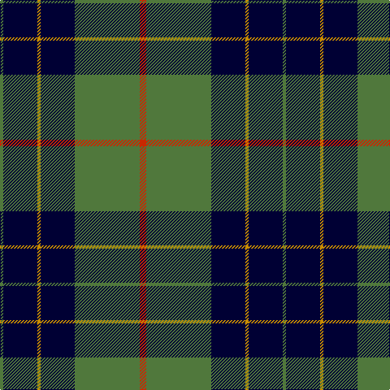

In pattern [GKYKGR](/patterns/gkykgr/).

This was sourced from register-of-tartans.  It is a [6 stripes tartan](/stripes/stripes6/).

Original link https://www.tartanregister.gov.uk/tartanDetails.aspx?ref=4298

## Thread count
G/4 DB42 DY4 DB42 G80 R/8

## Palette
Each colour and its ΔE from the base-6 reference it is a variant of.

| Colour | Shade | Base | ΔE (OKLab) |
|---|---|---|---|
| B | <code style="background-color:#788CB4;">#788CB4</code> `#788CB4` | B <code style="background-color:#2A418A;">#2A418A</code> | 0.25 |
| DB | <code style="background-color:#000034;">#000034</code> `#000034` | K <code style="background-color:#000000;">#000000</code> | 0.18 |
| DY | <code style="background-color:#C88C00;">#C88C00</code> `#C88C00` | Y <code style="background-color:#F2BF00;">#F2BF00</code> | 0.15 |
| G | <code style="background-color:#50783C;">#50783C</code> `#50783C` | G <code style="background-color:#006100;">#006100</code> | 0.11 |
| K | <code style="background-color:#000000;">#000000</code> `#000000` | K <code style="background-color:#000000;">#000000</code> | 0.00 |
| N | <code style="background-color:#C8C8C8;">#C8C8C8</code> `#C8C8C8` | W <code style="background-color:#F7F7F7;">#F7F7F7</code> | 0.14 |
| P | <code style="background-color:#64008C;">#64008C</code> `#64008C` | B <code style="background-color:#2A418A;">#2A418A</code> | 0.14 |
| R | <code style="background-color:#C82800;">#C82800</code> `#C82800` | R <code style="background-color:#CC0000;">#CC0000</code> | 0.02 |

# Sample pattern

## Nearest tartans

The nearest existing variants by ΔTartan distance.

1. [Connacht Irish District Tartan Tartan Number: 4485. Earliest known date: 1994 Phil Smith obtained in Perthshire from a swatch dated 1994 shown to him by Keith Lumsden of the Scottish Tartans Society. However www.uniq-orn.com shows this as Connaught Green. See products available Copyright © Blair Urquhart, Comrie, 2015](/setts/s6/r2b32g14b5g16w2~b202060-g288028-ra00000-we0e0e0~x2/) — ΔT 0.99
1. [Kelley Oliphint (Commemorative)](/setts/s5/k3w2b27k31y3~b5c5c5c-k101010-we0e0e0-ydc94c4~x2/) — ΔT 1.10
1. [Bro-Spirit of Northmen (Corporate)](/setts/s5/r3k1b27k27w3~b1474b4-k101010-r880000-we0e0e0~x2/) — ΔT 1.14
1. [Boroughmuir](/setts/s5/g30w8b32y1b8~b102040-g004010-we0e0e0-yf0c000~x2/) — ΔT 1.15
1. [MacRobart](/setts/s6/b72k21g16ba3g17ba3~b304080-ba5480b0-g008000-k000000~x2/) — ΔT 1.17
1. [Home (Clan)](/setts/s8/k36r3k3r3k9b36g3b2~b1474b4-g289c18-k101010-rc80000~x2/) — ΔT 1.22
1. [Sorbie (Name)](/setts/s6/r1b1k17b17k1w1~b1474b4-k101010-rc80000-wfcfcfc~x4/) — ΔT 1.24
1. [St Andrews Links](/setts/s7/b26g4b3g3y2g24r2~b000050-g008000-rc00000-yf0c000~x2/) — ΔT 1.25
1. [MacIntyre L](/setts/s6/g4b12r3b12g32w4~b000064-g004c00-rc80000-wd0d0d0/) — ΔT 1.29
1. [Hamworthy Association](/setts/s4/k41y16g14w2~g003c14-k101010-we0e0e0-y48a4c0~x2/) — ΔT 1.29

## Neighbour map

Every grey dot is one of 15726 variants placed by the first two principal components of the ΔTartan feature space (44% of its variance). Red is this tartan; blue dots are its nearest — click one to open its page.

<svg viewBox="0 0 640 380" role="img" style="max-width:100%;height:auto;border:1px solid #e0e0e0;border-radius:4px;display:block" xmlns="http://www.w3.org/2000/svg"><image href="/nn/cloud.v1.png" width="640" height="380"/><a href="/setts/s6/r2b32g14b5g16w2~b202060-g288028-ra00000-we0e0e0~x2/"><circle cx="320.6" cy="201.9" r="4" fill="#3465a4"><title>Connacht Irish District Tartan Tartan Number: 4485. Earliest known date: 1994 Phil Smith obtained in Perthshire from a swatch dated 1994 shown to him by Keith Lumsden of the Scottish Tartans Society. However www.uniq-orn.com shows this as Connaught Green. See products available Copyright © Blair Urquhart, Comrie, 2015</title></circle></a><a href="/setts/s5/k3w2b27k31y3~b5c5c5c-k101010-we0e0e0-ydc94c4~x2/"><circle cx="326.4" cy="200.7" r="4" fill="#3465a4"><title>Kelley Oliphint (Commemorative)</title></circle></a><a href="/setts/s5/r3k1b27k27w3~b1474b4-k101010-r880000-we0e0e0~x2/"><circle cx="300.5" cy="175.1" r="4" fill="#3465a4"><title>Bro-Spirit of Northmen (Corporate)</title></circle></a><a href="/setts/s5/g30w8b32y1b8~b102040-g004010-we0e0e0-yf0c000~x2/"><circle cx="319.7" cy="192.7" r="4" fill="#3465a4"><title>Boroughmuir</title></circle></a><a href="/setts/s6/b72k21g16ba3g17ba3~b304080-ba5480b0-g008000-k000000~x2/"><circle cx="324.5" cy="172.4" r="4" fill="#3465a4"><title>MacRobart</title></circle></a><a href="/setts/s8/k36r3k3r3k9b36g3b2~b1474b4-g289c18-k101010-rc80000~x2/"><circle cx="315.4" cy="160.9" r="4" fill="#3465a4"><title>Home (Clan)</title></circle></a><a href="/setts/s6/r1b1k17b17k1w1~b1474b4-k101010-rc80000-wfcfcfc~x4/"><circle cx="312.5" cy="173.7" r="4" fill="#3465a4"><title>Sorbie (Name)</title></circle></a><a href="/setts/s7/b26g4b3g3y2g24r2~b000050-g008000-rc00000-yf0c000~x2/"><circle cx="284.9" cy="183.3" r="4" fill="#3465a4"><title>St Andrews Links</title></circle></a><a href="/setts/s6/g4b12r3b12g32w4~b000064-g004c00-rc80000-wd0d0d0/"><circle cx="298.0" cy="217.8" r="4" fill="#3465a4"><title>MacIntyre L</title></circle></a><a href="/setts/s4/k41y16g14w2~g003c14-k101010-we0e0e0-y48a4c0~x2/"><circle cx="309.6" cy="215.4" r="4" fill="#3465a4"><title>Hamworthy Association</title></circle></a><circle cx="295.5" cy="186.3" r="5" fill="#c00000"/></svg>

ID: /setts/s6/r4g40k21y2k21g2~g50783c-k000034-rc82800-yc88c00~x2/
