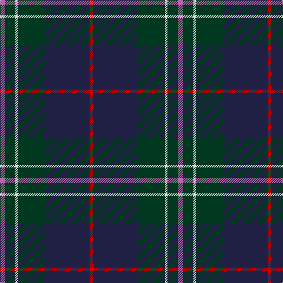

In pattern [RBGWGR](/patterns/rbgwgr/).

This was sourced from tartans-authority.  It is a [6 stripes tartan](/stripes/stripes6/).

Original link http://www.tartansauthority.com/tartan-ferret/display/3903/

## Thread count
P/8 DG18 LN4 DG48 DB74 R/6

## Palette
Each colour and its ΔE from the base-6 reference it is a variant of.

| Colour | Shade | Base | ΔE (OKLab) |
|---|---|---|---|
| DB | <code style="background-color:#202044;">#202044</code> `#202044` | B <code style="background-color:#2A418A;">#2A418A</code> | 0.15 |
| DG | <code style="background-color:#003820;">#003820</code> `#003820` | G <code style="background-color:#006100;">#006100</code> | 0.15 |
| LN | <code style="background-color:#E0E0E0;">#E0E0E0</code> `#E0E0E0` | W <code style="background-color:#F7F7F7;">#F7F7F7</code> | 0.07 |
| P | <code style="background-color:#B468AC;">#B468AC</code> `#B468AC` | R <code style="background-color:#CC0000;">#CC0000</code> | 0.21 |
| R | <code style="background-color:#C80000;">#C80000</code> `#C80000` | R <code style="background-color:#CC0000;">#CC0000</code> | 0.01 |

# Sample pattern

## Nearest tartans

The nearest existing variants by ΔTartan distance.

1. [Kilkenny, County (District)](/setts/s7/b4g27r2ba25y5g3r3~b480800-ba202060-g003820-rb84c00-ybc8c00~x2/) — ΔT 0.96
1. [MacFadzean](/setts/s6/b48w2k20g22r3g4~b2c4084-g005020-k101010-rdc0000-we0e0e0~x2/) — ΔT 1.02
1. [Bressuire](/setts/s7/b1g4ga1g3b4ba15w1~b680b2a-ba283a48-g062e14-ga8e7c34-wffffff~x4/) — ΔT 1.07
1. [Laurie](/setts/s7/b6r2b1g25ba16k2ba4~b6c006c-ba28287c-g005c34-k101010-rc80000~x2/) — ΔT 1.09
1. [Deeside, Royal](/setts/s6/w4g2b4g35ba27r3~b280032-ba07648c-g503c14-rdc0000-wc49cd8~x2/) — ΔT 1.10
1. [Peter of Lee (Chief) (Personal)](/setts/s8/r4g4k2g29b21k3b3y3~b2c2c80-g003820-k101010-rc80000-ye8c000~x2/) — ΔT 1.15
1. [Lowry](/setts/s7/b6y2b1g25ba16k2ba4~b440044-ba282878-g006438-k101010-yd8b000~x2/) — ΔT 1.17
1. [Lawrie Clan Tartan Tartan Number: 3202. Earliest known date: 2000 One of a set of three similar designs for Laurie, Lawrie and Lowry, designed by Peter MacDonald for Iain Laurie. See products available Copyright © Blair Urquhart, Comrie, 2015](/setts/s7/b6r2b1g25ba16k2ba4~b440044-ba2c2c80-g006818-k101010-r945008~x2/) — ΔT 1.22
1. [Dollar Academy (1999)](/setts/s8/w2b19k4b4k4g9ba2k1~b003c64-ba1c0070-g006818-k101010-wc0c0c0~x4/) — ΔT 1.25
1. [Patriot, The (Fashion)](/setts/s7/k10b4k34ba2k2ba30w3~b1c0070-ba2c3c44-k101010-we0e0e0~x2/) — ΔT 1.25

## Neighbour map

Every grey dot is one of 15726 variants placed by the first two principal components of the ΔTartan feature space (44% of its variance). Red is this tartan; blue dots are its nearest — click one to open its page.

<svg viewBox="0 0 640 380" role="img" style="max-width:100%;height:auto;border:1px solid #e0e0e0;border-radius:4px;display:block" xmlns="http://www.w3.org/2000/svg"><image href="/nn/cloud.v1.png" width="640" height="380"/><a href="/setts/s7/b4g27r2ba25y5g3r3~b480800-ba202060-g003820-rb84c00-ybc8c00~x2/"><circle cx="280.3" cy="187.4" r="4" fill="#3465a4"><title>Kilkenny, County (District)</title></circle></a><a href="/setts/s6/b48w2k20g22r3g4~b2c4084-g005020-k101010-rdc0000-we0e0e0~x2/"><circle cx="311.9" cy="176.3" r="4" fill="#3465a4"><title>MacFadzean</title></circle></a><a href="/setts/s7/b1g4ga1g3b4ba15w1~b680b2a-ba283a48-g062e14-ga8e7c34-wffffff~x4/"><circle cx="336.9" cy="185.2" r="4" fill="#3465a4"><title>Bressuire</title></circle></a><a href="/setts/s7/b6r2b1g25ba16k2ba4~b6c006c-ba28287c-g005c34-k101010-rc80000~x2/"><circle cx="321.9" cy="169.3" r="4" fill="#3465a4"><title>Laurie</title></circle></a><a href="/setts/s6/w4g2b4g35ba27r3~b280032-ba07648c-g503c14-rdc0000-wc49cd8~x2/"><circle cx="336.2" cy="181.9" r="4" fill="#3465a4"><title>Deeside, Royal</title></circle></a><a href="/setts/s8/r4g4k2g29b21k3b3y3~b2c2c80-g003820-k101010-rc80000-ye8c000~x2/"><circle cx="294.9" cy="170.5" r="4" fill="#3465a4"><title>Peter of Lee (Chief) (Personal)</title></circle></a><a href="/setts/s7/b6y2b1g25ba16k2ba4~b440044-ba282878-g006438-k101010-yd8b000~x2/"><circle cx="301.2" cy="162.7" r="4" fill="#3465a4"><title>Lowry</title></circle></a><a href="/setts/s7/b6r2b1g25ba16k2ba4~b440044-ba2c2c80-g006818-k101010-r945008~x2/"><circle cx="301.9" cy="162.9" r="4" fill="#3465a4"><title>Lawrie Clan Tartan Tartan Number: 3202. Earliest known date: 2000 One of a set of three similar designs for Laurie, Lawrie and Lowry, designed by Peter MacDonald for Iain Laurie. See products available Copyright © Blair Urquhart, Comrie, 2015</title></circle></a><a href="/setts/s8/w2b19k4b4k4g9ba2k1~b003c64-ba1c0070-g006818-k101010-wc0c0c0~x4/"><circle cx="303.2" cy="175.0" r="4" fill="#3465a4"><title>Dollar Academy (1999)</title></circle></a><a href="/setts/s7/k10b4k34ba2k2ba30w3~b1c0070-ba2c3c44-k101010-we0e0e0~x2/"><circle cx="386.5" cy="204.8" r="4" fill="#3465a4"><title>Patriot, The (Fashion)</title></circle></a><circle cx="331.6" cy="193.4" r="5" fill="#c00000"/></svg>

ID: /setts/s6/r4g9w2g24b37ra3~b202044-g003820-rb468ac-rac80000-we0e0e0~x2/
