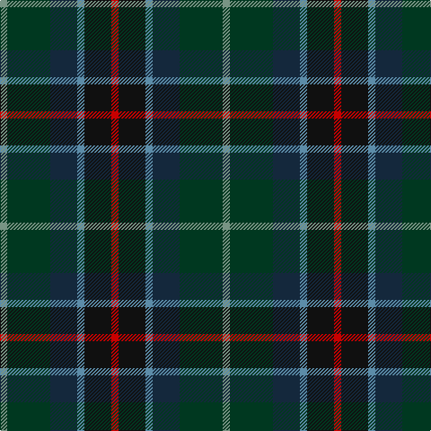

In pattern [GGBBKR](/stripes/ggbbkr/).

This was sourced from tartans-authority.  It is a [6 stripe tartan](/stripes/stripes6/).

Original link http://www.tartansauthority.com/tartan-ferret/display/5819/

## Thread count
R/8 K30 B8 DN30 DG48 LG/8

## Palette
Each colour and the base-6 reference it is a variant of.

| Colour | Shade | Base |
|---|---|---|
| B | <code style="background-color:#5C8CA8;">#5C8CA8</code> `oklch(61.7% 0.067 235.0)` <small>#5C8CA8</small> | B <code style="background-color:#2A418A;">#2A418A</code> |
| DG | <code style="background-color:#003820;">#003820</code> `oklch(30.0% 0.070 158.3)` <small>#003820</small> | G <code style="background-color:#006100;">#006100</code> |
| DN | <code style="background-color:#14283C;">#14283C</code> `oklch(27.1% 0.046 249.9)` <small>#14283C</small> | B <code style="background-color:#2A418A;">#2A418A</code> |
| K | <code style="background-color:#101010;">#101010</code> `oklch(17.3% 0.000 89.9)` <small>#101010</small> | K <code style="background-color:#000000;">#000000</code> |
| LG | <code style="background-color:#789484;">#789484</code> `oklch(64.0% 0.040 160.0)` <small>#789484</small> | G <code style="background-color:#006100;">#006100</code> |
| R | <code style="background-color:#C80000;">#C80000</code> `oklch(52.3% 0.215 29.2)` <small>#C80000</small> | R <code style="background-color:#CC0000;">#CC0000</code> |

# Sample pattern

## Nearest tartans

The nearest existing variants by ΔTartan distance, with this tartan at the top so the swatches line up against it.

ΔTartan

Tartan

Sett

—

<a href="/ttd/edit/#slug=r4k15t4dt15dg24y4~x2">Haughfoot (Commemorative)</a> <a class="nn-out" href="/setts/s6/r4k15t4dt15dg24y4~x2/" title="open its dictionary page">↗</a>

1.20

<a href="/ttd/edit/#slug=n15k10dt30dy11w3lg5~x2">McHale, Barry Name Tartan Tartan Number: 10708. Earliest known date: 27 September 2012 Barry McHale commissioned the production of this tartan to be worn at his wedding. It may be worn by any of his McHale relatives. See products available Copyright © Blair Urquhart, Comrie, 2015</a> <a class="nn-out" href="/setts/s6/n15k10dt30dy11w3lg5~x2/" title="open its dictionary page">↗</a>

1.22

<a href="/ttd/edit/#slug=ly4dg17k10dt3k3dt17r3dt3~x2">Royal Highland Society (Corporate)</a> <a class="nn-out" href="/setts/s8/ly4dg17k10dt3k3dt17r3dt3~x2/" title="open its dictionary page">↗</a>

1.27

<a href="/ttd/edit/#slug=lb4dg17k10dt3k3dt17r3dt3~x2">Royal Highland</a> <a class="nn-out" href="/setts/s8/lb4dg17k10dt3k3dt17r3dt3~x2/" title="open its dictionary page">↗</a>

1.31

<a href="/ttd/edit/#slug=dg3dt22dr10o5dg21r6dt3~x2">Swankie</a> <a class="nn-out" href="/setts/s7/dg3dt22dr10o5dg21r6dt3~x2/" title="open its dictionary page">↗</a>

1.32

<a href="/ttd/edit/#slug=lb3db17do16dt2dg17lo2~x2">Ancient Atlantic (Fashion)</a> <a class="nn-out" href="/setts/s6/lb3db17do16dt2dg17lo2~x2/" title="open its dictionary page">↗</a>

1.33

<a href="/ttd/edit/#slug=k26n10dt19r6ly2db9~x2">Meeson Hunting</a> <a class="nn-out" href="/setts/s6/k26n10dt19r6ly2db9~x2/" title="open its dictionary page">↗</a>

1.37

<a href="/ttd/edit/#slug=r3db12k12dg12b2dg12w3~x2">Game Fair</a> <a class="nn-out" href="/setts/s7/r3db12k12dg12b2dg12w3~x2/" title="open its dictionary page">↗</a>

1.37

<a href="/ttd/edit/#slug=r4g11k11g2n11y3~x4">Casely</a> <a class="nn-out" href="/setts/s6/r4g11k11g2n11y3~x4/" title="open its dictionary page">↗</a>

1.43

<a href="/ttd/edit/#slug=k15t4dt15dg24y4dg24dt15t4k15r4~x2">Haughfoot</a> <a class="nn-out" href="/setts/s10/k15t4dt15dg24y4dg24dt15t4k15r4~x2/" title="open its dictionary page">↗</a>

1.45

<a href="/ttd/edit/#slug=dt4k9g20dp2dg20k5dt6lb2~x2">Linden</a> <a class="nn-out" href="/setts/s8/dt4k9g20dp2dg20k5dt6lb2~x2/" title="open its dictionary page">↗</a>

## Neighbour map

Every grey dot is one of 14299 variants placed by the first two principal components of the ΔTartan feature space (44% of its variance). Red is this tartan; blue dots are its nearest — click one to open its page.

<svg viewBox="0 0 640 380" role="img" style="max-width:100%;height:auto;border:1px solid #e0e0e0;border-radius:4px;display:block" xmlns="http://www.w3.org/2000/svg"><image href="/nn/cloud.v1.png" width="640" height="380"/><a href="/setts/s6/n15k10dt30dy11w3lg5~x2/"><circle cx="192.5" cy="219.8" r="4" fill="#3465a4"><title>McHale, Barry Name Tartan Tartan Number: 10708. Earliest known date: 27 September 2012 Barry McHale commissioned the production of this tartan to be worn at his wedding. It may be worn by any of his McHale relatives. See products available Copyright © Blair Urquhart, Comrie, 2015</title></circle></a><a href="/setts/s8/ly4dg17k10dt3k3dt17r3dt3~x2/"><circle cx="197.4" cy="245.0" r="4" fill="#3465a4"><title>Royal Highland Society (Corporate)</title></circle></a><a href="/setts/s8/lb4dg17k10dt3k3dt17r3dt3~x2/"><circle cx="188.7" cy="240.6" r="4" fill="#3465a4"><title>Royal Highland</title></circle></a><a href="/setts/s7/dg3dt22dr10o5dg21r6dt3~x2/"><circle cx="217.3" cy="248.4" r="4" fill="#3465a4"><title>Swankie</title></circle></a><a href="/setts/s6/lb3db17do16dt2dg17lo2~x2/"><circle cx="143.3" cy="213.6" r="4" fill="#3465a4"><title>Ancient Atlantic (Fashion)</title></circle></a><a href="/setts/s6/k26n10dt19r6ly2db9~x2/"><circle cx="181.2" cy="214.4" r="4" fill="#3465a4"><title>Meeson Hunting</title></circle></a><a href="/setts/s7/r3db12k12dg12b2dg12w3~x2/"><circle cx="149.9" cy="236.3" r="4" fill="#3465a4"><title>Game Fair</title></circle></a><a href="/setts/s6/r4g11k11g2n11y3~x4/"><circle cx="132.9" cy="263.6" r="4" fill="#3465a4"><title>Casely</title></circle></a><a href="/setts/s10/k15t4dt15dg24y4dg24dt15t4k15r4~x2/"><circle cx="178.6" cy="247.2" r="4" fill="#3465a4"><title>Haughfoot</title></circle></a><a href="/setts/s8/dt4k9g20dp2dg20k5dt6lb2~x2/"><circle cx="159.2" cy="208.7" r="4" fill="#3465a4"><title>Linden</title></circle></a><circle cx="157.6" cy="244.8" r="5" fill="#c00000"/></svg>

ID: /setts/s6/r4k15t4dt15dg24y4~x2/
