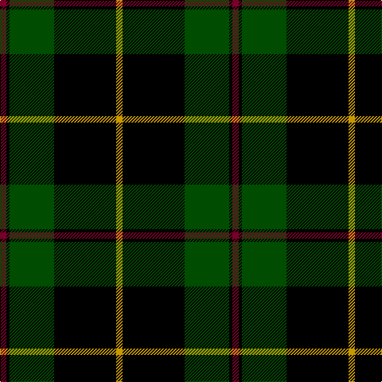

This page is one **sett** — a single exact thread-count. It belongs to the [tartan](/tartans/r4k2dg28k38k1ly4/)
(the same proportion at any scale), whose colour order is pattern [RKGKKY](/stripes/rkgkky/).

Sourced from register-of-tartans.  It is a [6 stripe tartan](/stripes/stripes6/).

Original link https://www.tartanregister.gov.uk/tartanDetails.aspx?ref=4556

## Register references

External register numbers recorded for this tartan.

- Scottish Register of Tartans: [4556](https://www.tartanregister.gov.uk/tartanDetails.aspx?ref=4556)
- Scottish Tartans Authority (ITI): 4523

## Thread count
DR/8 K4 G56 K76 K2 DY/8

## Palette

Palette: <strong>Tartan Register</strong> <small style="color:#888">(3 of 4 colours)</small>
<table><thead><tr><th>Colour</th><th>Threads</th><th>Shade</th><th>Base</th><th>OKLCh</th></tr></thead><tbody><tr><td>DR/</td><td style="text-align:right;font-variant-numeric:tabular-nums">8</td><td><code style="background-color:#780028;">#780028</code> <small style="color:#888">#780028</small></td><td>R <code style="background-color:#CC0000;">#CC0000</code></td><td><small style="color:#888">oklch(36.5% 0.146 12.8)</small></td></tr><tr><td>K</td><td style="text-align:right;font-variant-numeric:tabular-nums">4</td><td><code style="background-color:#000000;">#000000</code> <small style="color:#888">#000000</small></td><td>K <code style="background-color:#000000;">#000000</code></td><td><small style="color:#888">oklch(0.0% 0.000 0.0)</small></td></tr><tr><td>G</td><td style="text-align:right;font-variant-numeric:tabular-nums">56</td><td><code style="background-color:#004C00;">#004C00</code> <small style="color:#888">#004C00</small></td><td>G <code style="background-color:#006100;">#006100</code></td><td><small style="color:#888">oklch(36.1% 0.123 142.5)</small></td></tr><tr><td>K</td><td style="text-align:right;font-variant-numeric:tabular-nums">76</td><td><code style="background-color:#000000;">#000000</code> <small style="color:#888">#000000</small></td><td>K <code style="background-color:#000000;">#000000</code></td><td><small style="color:#888">oklch(0.0% 0.000 0.0)</small></td></tr><tr><td>K</td><td style="text-align:right;font-variant-numeric:tabular-nums">2</td><td><code style="background-color:#000000;">#000000</code> <small style="color:#888">#000000</small></td><td>K <code style="background-color:#000000;">#000000</code></td><td><small style="color:#888">oklch(0.0% 0.000 0.0)</small></td></tr><tr><td>DY/</td><td style="text-align:right;font-variant-numeric:tabular-nums">8</td><td><code style="background-color:#C89800;">#C89800</code> <small style="color:#888">#C89800</small></td><td>Y <code style="background-color:#F2BF00;">#F2BF00</code></td><td><small style="color:#888">oklch(70.6% 0.144 85.9)</small></td></tr></tbody></table>

# Sample pattern

## Nearest tartans

The nearest existing variants by ΔTartan distance, with this tartan at the top so the swatches line up against it.

ΔTartan

Tartan

Sett

—

<a href="/ttd/edit/#slug=r4k2dg28k38k1ly4~x2">Wcwm 9275 5471-2</a> <a class="nn-out" href="/setts/s6/r4k2dg28k38k1ly4~x2/" title="open its dictionary page">↗</a>

1.54

<a href="/ttd/edit/#slug=k8dg1k20dg1k4dg1k3dg4w2dg24lo3~x2">Malone (2016)</a> <a class="nn-out" href="/setts/s11/k8dg1k20dg1k4dg1k3dg4w2dg24lo3~x2/" title="open its dictionary page">↗</a>

1.58

<a href="/ttd/edit/#slug=k22g11k2g4k2g6k16k40k2lb6~x2">Stewart of Bute Hunting Clan/Family Tartan Tartan Number: 5175. Earliest known date: 01/01/2002 No details known. See products available Copyright © Blair Urquhart, Comrie, 2015</a> <a class="nn-out" href="/setts/s10/k22g11k2g4k2g6k16k40k2lb6~x2/" title="open its dictionary page">↗</a>

1.58

<a href="/ttd/edit/#slug=k12r2k28dg12k1w3k1dg12r4~x2">MacDiarmid</a> <a class="nn-out" href="/setts/s9/k12r2k28dg12k1w3k1dg12r4~x2/" title="open its dictionary page">↗</a>

1.59

<a href="/ttd/edit/#slug=k12r2k28g12k1w3k1g12r4~x2">MacDiarmid (Clan)</a> <a class="nn-out" href="/setts/s9/k12r2k28g12k1w3k1g12r4~x2/" title="open its dictionary page">↗</a>

1.64

<a href="/ttd/edit/#slug=r1dg16k8dg3k4ly1~x2">Forbes VS</a> <a class="nn-out" href="/setts/s6/r1dg16k8dg3k4ly1~x2/" title="open its dictionary page">↗</a>

1.65

<a href="/ttd/edit/#slug=g8dg60w1k33g9ly4g4~x2">Duffy</a> <a class="nn-out" href="/setts/s7/g8dg60w1k33g9ly4g4~x2/" title="open its dictionary page">↗</a>

1.66

<a href="/ttd/edit/#slug=dg2r1dg30k16lb1db16r2~x2">Sinclair Hunting</a> <a class="nn-out" href="/setts/s7/dg2r1dg30k16lb1db16r2~x2/" title="open its dictionary page">↗</a>

1.67

<a href="/ttd/edit/#slug=k65g27w2k4ly5~x2">Perry, hunting (Green)</a> <a class="nn-out" href="/setts/s5/k65g27w2k4ly5~x2/" title="open its dictionary page">↗</a>

1.69

<a href="/ttd/edit/#slug=r1dg16k8dg3k4ly1">Forbes VS</a> <a class="nn-out" href="/setts/s6/r1dg16k8dg3k4ly1/" title="open its dictionary page">↗</a>

1.69

<a href="/ttd/edit/#slug=g12k1r1k12m9k45g9~x2">O'Boyle (Name)</a> <a class="nn-out" href="/setts/s7/g12k1r1k12m9k45g9~x2/" title="open its dictionary page">↗</a>

## Neighbour map

Every grey dot is one of 14299 variants placed by the first two principal components of the ΔTartan feature space (44% of its variance). Red is this tartan; blue dots are its nearest — click one to open its page.

<svg viewBox="0 0 640 380" role="img" style="max-width:100%;height:auto;border:1px solid #e0e0e0;border-radius:4px;display:block" xmlns="http://www.w3.org/2000/svg"><image href="/nn/cloud.v1.png" width="640" height="380"/><a href="/setts/s11/k8dg1k20dg1k4dg1k3dg4w2dg24lo3~x2/"><circle cx="312.6" cy="139.7" r="4" fill="#3465a4"><title>Malone (2016)</title></circle></a><a href="/setts/s10/k22g11k2g4k2g6k16k40k2lb6~x2/"><circle cx="323.7" cy="163.5" r="4" fill="#3465a4"><title>Stewart of Bute Hunting Clan/Family Tartan Tartan Number: 5175. Earliest known date: 01/01/2002 No details known. See products available Copyright © Blair Urquhart, Comrie, 2015</title></circle></a><a href="/setts/s9/k12r2k28dg12k1w3k1dg12r4~x2/"><circle cx="352.3" cy="157.8" r="4" fill="#3465a4"><title>MacDiarmid</title></circle></a><a href="/setts/s9/k12r2k28g12k1w3k1g12r4~x2/"><circle cx="343.6" cy="152.9" r="4" fill="#3465a4"><title>MacDiarmid (Clan)</title></circle></a><a href="/setts/s6/r1dg16k8dg3k4ly1~x2/"><circle cx="353.3" cy="204.3" r="4" fill="#3465a4"><title>Forbes VS</title></circle></a><a href="/setts/s7/g8dg60w1k33g9ly4g4~x2/"><circle cx="322.5" cy="123.9" r="4" fill="#3465a4"><title>Duffy</title></circle></a><a href="/setts/s7/dg2r1dg30k16lb1db16r2~x2/"><circle cx="280.5" cy="148.8" r="4" fill="#3465a4"><title>Sinclair Hunting</title></circle></a><a href="/setts/s5/k65g27w2k4ly5~x2/"><circle cx="415.9" cy="161.0" r="4" fill="#3465a4"><title>Perry, hunting (Green)</title></circle></a><a href="/setts/s6/r1dg16k8dg3k4ly1/"><circle cx="340.5" cy="198.4" r="4" fill="#3465a4"><title>Forbes VS</title></circle></a><a href="/setts/s7/g12k1r1k12m9k45g9~x2/"><circle cx="415.5" cy="139.4" r="4" fill="#3465a4"><title>O'Boyle (Name)</title></circle></a><circle cx="358.2" cy="155.8" r="5" fill="#c00000"/></svg>

ID: /setts/s6/r4k2dg28k38k1ly4~x2/
