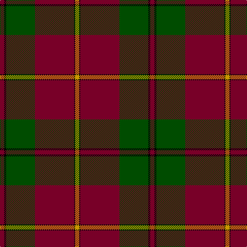

This page is one **sett** — a single exact thread-count. It belongs to the [tartan](/tartans/r4k2dg28r38k1ly4/)
(the same proportion at any scale), whose colour order is pattern [RKGRKY](/stripes/rkgrky/).

Sourced from register-of-tartans.  It is a [6 stripe tartan](/stripes/stripes6/).

Original link https://www.tartanregister.gov.uk/tartanDetails.aspx?ref=4555

## Register references

External register numbers recorded for this tartan.

- Scottish Register of Tartans: [4555](https://www.tartanregister.gov.uk/tartanDetails.aspx?ref=4555)
- Scottish Tartans Authority (ITI): 4525

## Thread count
DR/8 K4 G56 DR76 K2 DY/8

## Palette

Palette: <strong>Tartan Register</strong> <small style="color:#888">(3 of 4 colours)</small>
<table><thead><tr><th>Colour</th><th>Threads</th><th>Shade</th><th>Base</th><th>OKLCh</th></tr></thead><tbody><tr><td>DR/</td><td style="text-align:right;font-variant-numeric:tabular-nums">8</td><td><code style="background-color:#780028;">#780028</code> <small style="color:#888">#780028</small></td><td>R <code style="background-color:#CC0000;">#CC0000</code></td><td><small style="color:#888">oklch(36.5% 0.146 12.8)</small></td></tr><tr><td>K</td><td style="text-align:right;font-variant-numeric:tabular-nums">4</td><td><code style="background-color:#000000;">#000000</code> <small style="color:#888">#000000</small></td><td>K <code style="background-color:#000000;">#000000</code></td><td><small style="color:#888">oklch(0.0% 0.000 0.0)</small></td></tr><tr><td>G</td><td style="text-align:right;font-variant-numeric:tabular-nums">56</td><td><code style="background-color:#004C00;">#004C00</code> <small style="color:#888">#004C00</small></td><td>G <code style="background-color:#006100;">#006100</code></td><td><small style="color:#888">oklch(36.1% 0.123 142.5)</small></td></tr><tr><td>DR</td><td style="text-align:right;font-variant-numeric:tabular-nums">76</td><td><code style="background-color:#780028;">#780028</code> <small style="color:#888">#780028</small></td><td>R <code style="background-color:#CC0000;">#CC0000</code></td><td><small style="color:#888">oklch(36.5% 0.146 12.8)</small></td></tr><tr><td>K</td><td style="text-align:right;font-variant-numeric:tabular-nums">2</td><td><code style="background-color:#000000;">#000000</code> <small style="color:#888">#000000</small></td><td>K <code style="background-color:#000000;">#000000</code></td><td><small style="color:#888">oklch(0.0% 0.000 0.0)</small></td></tr><tr><td>DY/</td><td style="text-align:right;font-variant-numeric:tabular-nums">8</td><td><code style="background-color:#C89800;">#C89800</code> <small style="color:#888">#C89800</small></td><td>Y <code style="background-color:#F2BF00;">#F2BF00</code></td><td><small style="color:#888">oklch(70.6% 0.144 85.9)</small></td></tr></tbody></table>

# Sample pattern

## Nearest tartans

The nearest existing variants by ΔTartan distance, with this tartan at the top so the swatches line up against it.

ΔTartan

Tartan

Sett

—

<a href="/ttd/edit/#slug=r4k2dg28r38k1ly4~x2">Wcwm 9275 5471-1</a> <a class="nn-out" href="/setts/s6/r4k2dg28r38k1ly4~x2/" title="open its dictionary page">↗</a>

1.14

<a href="/ttd/edit/#slug=r36dg18r4dg6k1lr2~x2">MacGregor</a> <a class="nn-out" href="/setts/s6/r36dg18r4dg6k1lr2~x2/" title="open its dictionary page">↗</a>

1.14

<a href="/ttd/edit/#slug=r36dg18r4dg6k1lr2">MacGregor</a> <a class="nn-out" href="/setts/s6/r36dg18r4dg6k1lr2/" title="open its dictionary page">↗</a>

1.26

<a href="/ttd/edit/#slug=lr2r12dg2r1dg32r1dg2r12ly2">MacFie</a> <a class="nn-out" href="/setts/s9/lr2r12dg2r1dg32r1dg2r12ly2/" title="open its dictionary page">↗</a>

1.38

<a href="/ttd/edit/#slug=r96g42r16g17k4y6">MacGregor, Glengyle</a> <a class="nn-out" href="/setts/s6/r96g42r16g17k4y6/" title="open its dictionary page">↗</a>

1.40

<a href="/ttd/edit/#slug=r7dt1r26dt31w1dt1w2~x2">Greater Victoria Police PB (Corp)</a> <a class="nn-out" href="/setts/s7/r7dt1r26dt31w1dt1w2~x2/" title="open its dictionary page">↗</a>

1.42

<a href="/ttd/edit/#slug=k9w2r50g42r16g17k4">McNee (Name)</a> <a class="nn-out" href="/setts/s7/k9w2r50g42r16g17k4/" title="open its dictionary page">↗</a>

1.44

<a href="/ttd/edit/#slug=o50k25dg10o5ly2~x2">MacGleish Formal (Personal)</a> <a class="nn-out" href="/setts/s5/o50k25dg10o5ly2~x2/" title="open its dictionary page">↗</a>

1.44

<a href="/ttd/edit/#slug=dg4r3k1r28dg14r4dg4lr3dg4r4~x2">Scott</a> <a class="nn-out" href="/setts/s10/dg4r3k1r28dg14r4dg4lr3dg4r4~x2/" title="open its dictionary page">↗</a>

1.45

<a href="/ttd/edit/#slug=r36g18r4g6k1lb2k1g2~x2">Strang (Personal)</a> <a class="nn-out" href="/setts/s8/r36g18r4g6k1lb2k1g2~x2/" title="open its dictionary page">↗</a>

1.47

<a href="/ttd/edit/#slug=dg2lo1dg11r50lo12db2lo4db2~x2">Slessor (Personal)</a> <a class="nn-out" href="/setts/s8/dg2lo1dg11r50lo12db2lo4db2~x2/" title="open its dictionary page">↗</a>

## Neighbour map

Every grey dot is one of 14299 variants placed by the first two principal components of the ΔTartan feature space (44% of its variance). Red is this tartan; blue dots are its nearest — click one to open its page.

<svg viewBox="0 0 640 380" role="img" style="max-width:100%;height:auto;border:1px solid #e0e0e0;border-radius:4px;display:block" xmlns="http://www.w3.org/2000/svg"><image href="/nn/cloud.v1.png" width="640" height="380"/><a href="/setts/s6/r36dg18r4dg6k1lr2~x2/"><circle cx="451.1" cy="156.3" r="4" fill="#3465a4"><title>MacGregor</title></circle></a><a href="/setts/s6/r36dg18r4dg6k1lr2/"><circle cx="451.1" cy="156.3" r="4" fill="#3465a4"><title>MacGregor</title></circle></a><a href="/setts/s9/lr2r12dg2r1dg32r1dg2r12ly2/"><circle cx="413.2" cy="136.3" r="4" fill="#3465a4"><title>MacFie</title></circle></a><a href="/setts/s6/r96g42r16g17k4y6/"><circle cx="422.6" cy="167.4" r="4" fill="#3465a4"><title>MacGregor, Glengyle</title></circle></a><a href="/setts/s7/r7dt1r26dt31w1dt1w2~x2/"><circle cx="410.8" cy="168.3" r="4" fill="#3465a4"><title>Greater Victoria Police PB (Corp)</title></circle></a><a href="/setts/s7/k9w2r50g42r16g17k4/"><circle cx="339.6" cy="185.0" r="4" fill="#3465a4"><title>McNee (Name)</title></circle></a><a href="/setts/s5/o50k25dg10o5ly2~x2/"><circle cx="341.9" cy="164.9" r="4" fill="#3465a4"><title>MacGleish Formal (Personal)</title></circle></a><a href="/setts/s10/dg4r3k1r28dg14r4dg4lr3dg4r4~x2/"><circle cx="408.5" cy="141.2" r="4" fill="#3465a4"><title>Scott</title></circle></a><a href="/setts/s8/r36g18r4g6k1lb2k1g2~x2/"><circle cx="423.0" cy="123.2" r="4" fill="#3465a4"><title>Strang (Personal)</title></circle></a><a href="/setts/s8/dg2lo1dg11r50lo12db2lo4db2~x2/"><circle cx="459.8" cy="116.0" r="4" fill="#3465a4"><title>Slessor (Personal)</title></circle></a><circle cx="413.6" cy="158.3" r="5" fill="#c00000"/></svg>

ID: /setts/s6/r4k2dg28r38k1ly4~x2/
