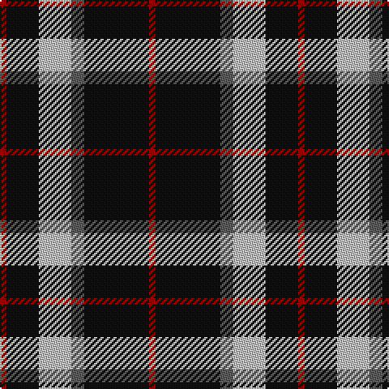

In pattern [RKBWKR](/patterns/rkbwkr/).

This was sourced from register-of-tartans.  It is a [6 stripes tartan](/stripes/stripes6/).

Original link https://www.tartanregister.gov.uk/tartanDetails.aspx?ref=484

## Attestations

This cloth appears in 2 source records; the oldest owns this page.

- 01/01/1997 — Callaway (Corporate) (register-of-tartans, [record](https://www.tartanregister.gov.uk/tartanDetails.aspx?ref=484))
- pre 1997 — Callaway (Corporate) (tartans-authority, [record](http://www.tartansauthority.com/tartan-ferret/display/2313/))

## Thread count
DR/4 K20 N20 Na8 K40 DR/4

## Palette
Each colour and its ΔE from the base-6 reference it is a variant of.

| Colour | Shade | Base | ΔE (OKLab) |
|---|---|---|---|
| DR | <code style="background-color:#880000;">#880000</code> `#880000` | R <code style="background-color:#C80000;">#C80000</code> | 0.14 |
| K | <code style="background-color:#101010;">#101010</code> `#101010` | K <code style="background-color:#000000;">#000000</code> | 0.17 |
| N | <code style="background-color:#C0C0C0;">#C0C0C0</code> `#C0C0C0` | W <code style="background-color:#F4F4F0;">#F4F4F0</code> | 0.16 |
| Na | <code style="background-color:#5C5C5C;">#5C5C5C</code> `#5C5C5C` | B <code style="background-color:#2C4084;">#2C4084</code> | 0.14 |

# Sample pattern

ID: /setts/s6/r4k40b8w20k20r4-b5c5c5c-k101010-r880000-wc0c0c0/
