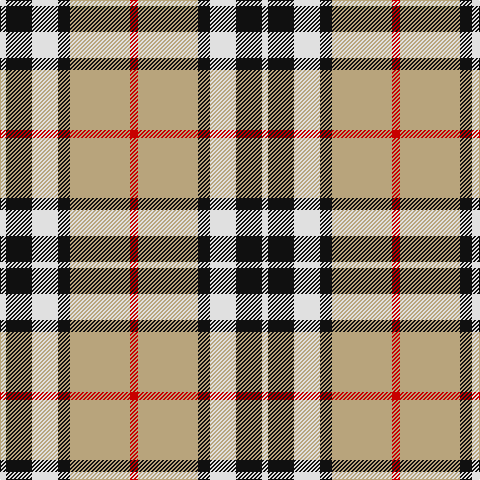

**Bands:** [RYKWKW](/stripes/rykwkw/) · **Stripes:** [R LY K W K W](/stripes/stripes6/) R LY K W K W

This was sourced from tartans-authority.  It is a [6 band tartan](/bands/bands6/).

Original link http://www.tartansauthority.com/tartan-ferret/display/2421/

## Thread count
LN/6 K26 LN26 K12 LG60 R/8

## Palette
Each colour and its ΔE from the base-6 reference it is a variant of.

| Colour | Shade | Base | ΔE (OKLab) |
|---|---|---|---|
| K | <code style="background-color:#101010;">#101010</code> `#101010` | K <code style="background-color:#000000;">#000000</code> | 0.17 |
| LG | <code style="background-color:#B8A47C;">#B8A47C</code> `#B8A47C` | Y <code style="background-color:#F2BF00;">#F2BF00</code> | 0.15 |
| LN | <code style="background-color:#E0E0E0;">#E0E0E0</code> `#E0E0E0` | W <code style="background-color:#F7F7F7;">#F7F7F7</code> | 0.07 |
| R | <code style="background-color:#C80000;">#C80000</code> `#C80000` | R <code style="background-color:#CC0000;">#CC0000</code> | 0.01 |

# Sample pattern

## Nearest tartans

The nearest existing variants by ΔTartan distance.

1. [Thomson Camel](/setts/s6/r4lo30k6w13k13w3~x2/) — ΔT 0.36
1. [Thompson Camel Clan Tartan Tartan Number: 2421. Earliest known date: 1967 Designed by Scotty Thompson. It it a simple colour variation on the usual blue Thompson, but is often confused with the Burberry Check. See products available Copyright © Blair Urquhart, Comrie, 2015](/setts/s6/r2lo20k5w10k10w2~x2/) — ΔT 0.47
1. [Thompson Grey Family Tartan Tartan Number: 1611. Earliest known date: pre 2003 Designed for Lord Thomson of Fleet in 1958 based on a sample in the Moy Hall collection dating from the mid 19th century. The tartan is also suitable for MacTavishs and Thompsons, who claim descent from the Clan MacIntosh. See products available Copyright © Blair Urquhart, Comrie, 2015](/setts/s6/r2o20k5w10k10r2~x2/) — ΔT 0.80
1. [Burberry (Genuine)](/setts/s5/k3w3k3ly10r1~x6/) — ΔT 0.80
1. [Black and White Golf](/setts/s7/ly9k32g6w20ly3w9k5~x2/) — ΔT 0.84
1. [Orange Fanaticos (Corporate)](/setts/s7/t12lo75k22w12k22w16t8/) — ΔT 0.87
1. [Merrilees Dress (Dance)](/setts/s6/k23b6k6r5w35r10~x2/) — ΔT 0.90
1. [Downside (Corporate)](/setts/s6/r4o41k5w14k18r4~x2/) — ΔT 0.91
1. [Black & White Golf (Corporate)](/setts/s7/lo9k32g6lb20lo3lb9k5~x2/) — ΔT 1.00
1. [Merrilees](/setts/s6/w23t6w6r5k35r10~x2/) — ΔT 1.01

## Neighbour map

Every grey dot is one of 14313 variants placed by the first two principal components of the ΔTartan feature space (44% of its variance). Red is this tartan; blue dots are its nearest — click one to open its page.

<svg viewBox="0 0 640 380" role="img" style="max-width:100%;height:auto;border:1px solid #e0e0e0;border-radius:4px;display:block" xmlns="http://www.w3.org/2000/svg"><image href="/nn/cloud.v1.png" width="640" height="380"/><a href="/setts/s6/r4lo30k6w13k13w3~x2/"><circle cx="190.7" cy="187.0" r="4" fill="#3465a4"><title>Thomson Camel</title></circle></a><a href="/setts/s6/r2lo20k5w10k10w2~x2/"><circle cx="176.6" cy="190.1" r="4" fill="#3465a4"><title>Thompson Camel Clan Tartan Tartan Number: 2421. Earliest known date: 1967 Designed by Scotty Thompson. It it a simple colour variation on the usual blue Thompson, but is often confused with the Burberry Check. See products available Copyright © Blair Urquhart, Comrie, 2015</title></circle></a><a href="/setts/s6/r2o20k5w10k10r2~x2/"><circle cx="174.7" cy="192.4" r="4" fill="#3465a4"><title>Thompson Grey Family Tartan Tartan Number: 1611. Earliest known date: pre 2003 Designed for Lord Thomson of Fleet in 1958 based on a sample in the Moy Hall collection dating from the mid 19th century. The tartan is also suitable for MacTavishs and Thompsons, who claim descent from the Clan MacIntosh. See products available Copyright © Blair Urquhart, Comrie, 2015</title></circle></a><a href="/setts/s5/k3w3k3ly10r1~x6/"><circle cx="223.8" cy="195.0" r="4" fill="#3465a4"><title>Burberry (Genuine)</title></circle></a><a href="/setts/s7/ly9k32g6w20ly3w9k5~x2/"><circle cx="178.1" cy="173.6" r="4" fill="#3465a4"><title>Black and White Golf</title></circle></a><a href="/setts/s7/t12lo75k22w12k22w16t8/"><circle cx="198.9" cy="172.2" r="4" fill="#3465a4"><title>Orange Fanaticos (Corporate)</title></circle></a><a href="/setts/s6/k23b6k6r5w35r10~x2/"><circle cx="154.7" cy="190.5" r="4" fill="#3465a4"><title>Merrilees Dress (Dance)</title></circle></a><a href="/setts/s6/r4o41k5w14k18r4~x2/"><circle cx="224.4" cy="181.9" r="4" fill="#3465a4"><title>Downside (Corporate)</title></circle></a><a href="/setts/s7/lo9k32g6lb20lo3lb9k5~x2/"><circle cx="190.3" cy="179.8" r="4" fill="#3465a4"><title>Black &amp; White Golf (Corporate)</title></circle></a><a href="/setts/s6/w23t6w6r5k35r10~x2/"><circle cx="157.4" cy="193.6" r="4" fill="#3465a4"><title>Merrilees</title></circle></a><circle cx="186.1" cy="183.5" r="5" fill="#c00000"/></svg>

ID: /setts/s6/r4ly30k6w13k13w3~x2/
