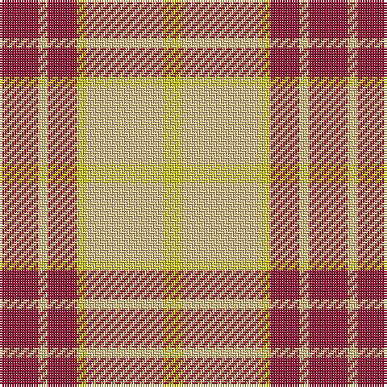

This page is one **sett** — a single exact thread-count. It belongs to the [tartan](/tartans/r4lyi1r3ly1lyi8ly2/)
(the same proportion at any scale), whose colour order is pattern [RYRYYY](/stripes/ryryyy/).

Sourced from tartans-authority.  It is a [6 stripe tartan](/stripes/stripes6/).

Original link http://www.tartansauthority.com/tartan-ferret/display/8124/

## Register references

External register numbers recorded for this tartan.

- Scottish Register of Tartans: [8124](https://www.tartanregister.gov.uk/tartanDetails?ref=8124)
- Scottish Tartans Authority (ITI): 8124

## Thread count
DR/16 LG4 DR12 Y4 LG32 Y/8

## Palette

Palette: <strong>Tartan Register</strong> <small style="color:#888">(1 of 3 colours)</small>
<table><thead><tr><th>Colour</th><th>Threads</th><th>Shade</th><th>Base</th><th>OKLCh</th></tr></thead><tbody><tr><td>DR/</td><td style="text-align:right;font-variant-numeric:tabular-nums">16</td><td><code style="background-color:#901C38;">#901C38</code> <small style="color:#888">#901C38</small></td><td>R <code style="background-color:#CC0000;">#CC0000</code></td><td><small style="color:#888">oklch(43.2% 0.150 13.1)</small></td></tr><tr><td>LG</td><td style="text-align:right;font-variant-numeric:tabular-nums">4</td><td><code style="background-color:#DCC08C;">#DCC08C</code> <small style="color:#888">#DCC08C</small></td><td>Y <code style="background-color:#F2BF00;">#F2BF00</code></td><td><small style="color:#888">oklch(81.9% 0.075 82.6)</small></td></tr><tr><td>DR</td><td style="text-align:right;font-variant-numeric:tabular-nums">12</td><td><code style="background-color:#901C38;">#901C38</code> <small style="color:#888">#901C38</small></td><td>R <code style="background-color:#CC0000;">#CC0000</code></td><td><small style="color:#888">oklch(43.2% 0.150 13.1)</small></td></tr><tr><td>Y</td><td style="text-align:right;font-variant-numeric:tabular-nums">4</td><td><code style="background-color:#D0C830;">#D0C830</code> <small style="color:#888">#D0C830</small></td><td>Y <code style="background-color:#F2BF00;">#F2BF00</code></td><td><small style="color:#888">oklch(81.4% 0.161 106.3)</small></td></tr><tr><td>LG</td><td style="text-align:right;font-variant-numeric:tabular-nums">32</td><td><code style="background-color:#DCC08C;">#DCC08C</code> <small style="color:#888">#DCC08C</small></td><td>Y <code style="background-color:#F2BF00;">#F2BF00</code></td><td><small style="color:#888">oklch(81.9% 0.075 82.6)</small></td></tr><tr><td>Y/</td><td style="text-align:right;font-variant-numeric:tabular-nums">8</td><td><code style="background-color:#D0C830;">#D0C830</code> <small style="color:#888">#D0C830</small></td><td>Y <code style="background-color:#F2BF00;">#F2BF00</code></td><td><small style="color:#888">oklch(81.4% 0.161 106.3)</small></td></tr></tbody></table>

# Sample pattern

## Nearest tartans

The nearest existing variants by ΔTartan distance, with this tartan at the top so the swatches line up against it.

ΔTartan

Tartan

Sett

—

<a href="/ttd/edit/#slug=r4lyi1r3ly1lyi8ly2~x4">Buchele Check (Fashion?)</a> <a class="nn-out" href="/setts/s6/r4lyi1r3ly1lyi8ly2~x4/" title="open its dictionary page">↗</a>

1.31

<a href="/ttd/edit/#slug=dy8lr29dy8lo3dy8lr8lo3~x2">Lister (Misty Mountain)</a> <a class="nn-out" href="/setts/s7/dy8lr29dy8lo3dy8lr8lo3~x2/" title="open its dictionary page">↗</a>

1.32

<a href="/ttd/edit/#slug=w11r32g12r5g12r5~x2">Al-Maktoum</a> <a class="nn-out" href="/setts/s6/w11r32g12r5g12r5~x2/" title="open its dictionary page">↗</a>

1.43

<a href="/ttd/edit/#slug=db4ly1r12ly2r2ly12r1ly4~x4">Glassary #3</a> <a class="nn-out" href="/setts/s8/db4ly1r12ly2r2ly12r1ly4~x4/" title="open its dictionary page">↗</a>

1.47

<a href="/ttd/edit/#slug=db6lo25o16k2db3~x2">Prince of Orange</a> <a class="nn-out" href="/setts/s5/db6lo25o16k2db3~x2/" title="open its dictionary page">↗</a>

1.49

<a href="/ttd/edit/#slug=w11r40g13r5g12r5~x2">Makhtoum</a> <a class="nn-out" href="/setts/s6/w11r40g13r5g12r5~x2/" title="open its dictionary page">↗</a>

1.49

<a href="/ttd/edit/#slug=y16k4w2k4y6lo11y2lo16~x2">Sidney, (Nova Scotia)</a> <a class="nn-out" href="/setts/s8/y16k4w2k4y6lo11y2lo16~x2/" title="open its dictionary page">↗</a>

1.49

<a href="/ttd/edit/#slug=r12dt2ly2lb2dt4lb3~x2">Winnipeg Embroiders' Guild (Corp.)</a> <a class="nn-out" href="/setts/s6/r12dt2ly2lb2dt4lb3~x2/" title="open its dictionary page">↗</a>

1.53

<a href="/ttd/edit/#slug=r4lbi30y14lb11y4~x2">Trinity Bicycles (Corporate)</a> <a class="nn-out" href="/setts/s5/r4lbi30y14lb11y4~x2/" title="open its dictionary page">↗</a>

1.53

<a href="/ttd/edit/#slug=db4r1ly12r2ly2r12ly1db4~x4">Glassary #2</a> <a class="nn-out" href="/setts/s8/db4r1ly12r2ly2r12ly1db4~x4/" title="open its dictionary page">↗</a>

1.54

<a href="/ttd/edit/#slug=w5p3w26r20w3r8ly3~x2">MacPherson, Red</a> <a class="nn-out" href="/setts/s7/w5p3w26r20w3r8ly3~x2/" title="open its dictionary page">↗</a>

## Neighbour map

Every grey dot is one of 14359 variants placed by the first two principal components of the ΔTartan feature space (44% of its variance). Red is this tartan; blue dots are its nearest — click one to open its page.

<svg viewBox="0 0 640 380" role="img" style="max-width:100%;height:auto;border:1px solid #e0e0e0;border-radius:4px;display:block" xmlns="http://www.w3.org/2000/svg"><image href="/nn/cloud.v1.png" width="640" height="380"/><a href="/setts/s7/dy8lr29dy8lo3dy8lr8lo3~x2/"><circle cx="311.1" cy="200.9" r="4" fill="#3465a4"><title>Lister (Misty Mountain)</title></circle></a><a href="/setts/s6/w11r32g12r5g12r5~x2/"><circle cx="274.8" cy="229.1" r="4" fill="#3465a4"><title>Al-Maktoum</title></circle></a><a href="/setts/s8/db4ly1r12ly2r2ly12r1ly4~x4/"><circle cx="296.7" cy="172.2" r="4" fill="#3465a4"><title>Glassary #3</title></circle></a><a href="/setts/s5/db6lo25o16k2db3~x2/"><circle cx="265.5" cy="189.9" r="4" fill="#3465a4"><title>Prince of Orange</title></circle></a><a href="/setts/s6/w11r40g13r5g12r5~x2/"><circle cx="327.5" cy="217.3" r="4" fill="#3465a4"><title>Makhtoum</title></circle></a><a href="/setts/s8/y16k4w2k4y6lo11y2lo16~x2/"><circle cx="198.5" cy="188.3" r="4" fill="#3465a4"><title>Sidney, (Nova Scotia)</title></circle></a><a href="/setts/s6/r12dt2ly2lb2dt4lb3~x2/"><circle cx="220.6" cy="202.7" r="4" fill="#3465a4"><title>Winnipeg Embroiders' Guild (Corp.)</title></circle></a><a href="/setts/s5/r4lbi30y14lb11y4~x2/"><circle cx="233.7" cy="221.6" r="4" fill="#3465a4"><title>Trinity Bicycles (Corporate)</title></circle></a><a href="/setts/s8/db4r1ly12r2ly2r12ly1db4~x4/"><circle cx="234.7" cy="170.7" r="4" fill="#3465a4"><title>Glassary #2</title></circle></a><a href="/setts/s7/w5p3w26r20w3r8ly3~x2/"><circle cx="263.8" cy="169.4" r="4" fill="#3465a4"><title>MacPherson, Red</title></circle></a><circle cx="259.3" cy="217.0" r="5" fill="#c00000"/></svg>

ID: /setts/s6/r4lyi1r3ly1lyi8ly2~x4/
