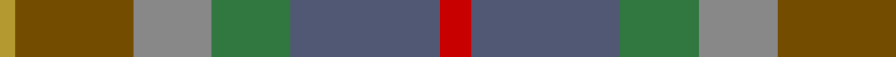

This page is one **sett** — a single exact thread-count. It belongs to the [tartan](/tartans/r4n19g10o10y15ly2/)
(the same proportion at any scale), whose colour order is pattern [RBGRGY](/stripes/rbgrgy/).

Sourced from tartans-authority.  It is a [6 stripe tartan](/stripes/stripes6/).

Original link http://www.tartansauthority.com/tartan-ferret/display/7819/

2 attestations — the source records this cloth was collapsed from (oldest owns this page)

<ul>
<li>November 2008 — Isle of Rona (District) (tartans-authority, <a href="http://www.tartansauthority.com/tartan-ferret/display/7819/">record</a>)</li>
<li>undated — Isle of Rona (register-of-tartans, <a href="https://www.tartanregister.gov.uk/tartanDetails.aspx?ref=5775">record</a>)</li>
</ul>

## Register references

External register numbers recorded for this tartan.

- Scottish Register of Tartans: [5775](https://www.tartanregister.gov.uk/tartanDetails.aspx?ref=5775)
- Scottish Tartans Authority (ITI): 7819

## Thread count
R/8 N38 G20 Na20 T30 DO/4

## Palette

Palette: <strong>Tartan Register</strong> <small style="color:#888">(2 of 6 colours)</small>
<table><thead><tr><th>Colour</th><th>Threads</th><th>Shade</th><th>Base</th><th>OKLCh</th></tr></thead><tbody><tr><td>R/</td><td style="text-align:right;font-variant-numeric:tabular-nums">8</td><td><code style="background-color:#C80000;">#C80000</code> <small style="color:#888">#C80000</small></td><td>R <code style="background-color:#CC0000;">#CC0000</code></td><td><small style="color:#888">oklch(52.3% 0.215 29.2)</small></td></tr><tr><td>N</td><td style="text-align:right;font-variant-numeric:tabular-nums">38</td><td><code style="background-color:#505874;">#505874</code> <small style="color:#888">#505874</small></td><td>B <code style="background-color:#2A418A;">#2A418A</code></td><td><small style="color:#888">oklch(46.5% 0.047 272.1)</small></td></tr><tr><td>G</td><td style="text-align:right;font-variant-numeric:tabular-nums">20</td><td><code style="background-color:#307840;">#307840</code> <small style="color:#888">#307840</small></td><td>G <code style="background-color:#006100;">#006100</code></td><td><small style="color:#888">oklch(51.2% 0.113 148.4)</small></td></tr><tr><td>Na</td><td style="text-align:right;font-variant-numeric:tabular-nums">20</td><td><code style="background-color:#888888;">#888888</code> <small style="color:#888">#888888</small></td><td>R <code style="background-color:#CC0000;">#CC0000</code></td><td><small style="color:#888">oklch(62.7% 0.000 89.9)</small></td></tr><tr><td>T</td><td style="text-align:right;font-variant-numeric:tabular-nums">30</td><td><code style="background-color:#744C00;">#744C00</code> <small style="color:#888">#744C00</small></td><td>G <code style="background-color:#006100;">#006100</code></td><td><small style="color:#888">oklch(45.0% 0.095 74.4)</small></td></tr><tr><td>DO/</td><td style="text-align:right;font-variant-numeric:tabular-nums">4</td><td><code style="background-color:#B49830;">#B49830</code> <small style="color:#888">#B49830</small></td><td>Y <code style="background-color:#F2BF00;">#F2BF00</code></td><td><small style="color:#888">oklch(68.6% 0.123 93.5)</small></td></tr></tbody></table>

# Sample pattern

## Nearest tartans

The nearest existing variants by ΔTartan distance, with this tartan at the top so the swatches line up against it.

ΔTartan

Tartan

Sett

—

<a href="/ttd/edit/#slug=r4n19g10o10y15ly2~x2">Isle of Rona (District)</a> <a class="nn-out" href="/setts/s6/r4n19g10o10y15ly2~x2/" title="open its dictionary page">↗</a>

1.78

<a href="/ttd/edit/#slug=lo4o24dy19w3y23n13dy3o13dy3~x2">Teallach (Personal)</a> <a class="nn-out" href="/setts/s9/lo4o24dy19w3y23n13dy3o13dy3~x2/" title="open its dictionary page">↗</a>

1.80

<a href="/ttd/edit/#slug=lo5n2o14dy9dg8n3o3n3o3n3dg19ly3~x2">Meath Irish County Tartan Tartan Number: 2269. Earliest known date: 1996 One of a series of Irish District tartans designed by Polly Wittering of the House of Edgar, with colours reminiscent of the Country with soft warm colours dominating. See products available Copyright © Blair Urquhart, Comrie, 2015</a> <a class="nn-out" href="/setts/s12/lo5n2o14dy9dg8n3o3n3o3n3dg19ly3~x2/" title="open its dictionary page">↗</a>

1.82

<a href="/ttd/edit/#slug=b30o6dy16dp8dg10dp14dg24lo4dy10dp3dy28">Greyfriars</a> <a class="nn-out" href="/setts/s11/b30o6dy16dp8dg10dp14dg24lo4dy10dp3dy28/" title="open its dictionary page">↗</a>

1.85

<a href="/ttd/edit/#slug=r3o23y8g6y8t6y10t12y3~x2">Lawrence's Seven Pillars of Khaki</a> <a class="nn-out" href="/setts/s9/r3o23y8g6y8t6y10t12y3~x2/" title="open its dictionary page">↗</a>

1.89

<a href="/ttd/edit/#slug=r11dg1r3y7dg7dy5o3~x4">Caledonian Maple (Fashion)</a> <a class="nn-out" href="/setts/s7/r11dg1r3y7dg7dy5o3~x4/" title="open its dictionary page">↗</a>

1.90

<a href="/ttd/edit/#slug=dr6do26dt28g26dt8y3~x2">House of Bruar (Corporate)</a> <a class="nn-out" href="/setts/s6/dr6do26dt28g26dt8y3~x2/" title="open its dictionary page">↗</a>

1.95

<a href="/ttd/edit/#slug=dr2lo12dr3lo3dr12y12n12y12y1ly2~x2">Auld Scotland</a> <a class="nn-out" href="/setts/s10/dr2lo12dr3lo3dr12y12n12y12y1ly2~x2/" title="open its dictionary page">↗</a>

2.02

<a href="/ttd/edit/#slug=k3t11y15dg5y10dg14dg14lo2~x2">Brocliande (Fashion))</a> <a class="nn-out" href="/setts/s8/k3t11y15dg5y10dg14dg14lo2~x2/" title="open its dictionary page">↗</a>

2.03

<a href="/ttd/edit/#slug=n5t4n22k15y22o4y4~x2">Cairngorm #2</a> <a class="nn-out" href="/setts/s7/n5t4n22k15y22o4y4~x2/" title="open its dictionary page">↗</a>

2.06

<a href="/ttd/edit/#slug=k3g11dg15dg5dg10dg14dg14ly2~x2">Brocéliande (Restricted)</a> <a class="nn-out" href="/setts/s8/k3g11dg15dg5dg10dg14dg14ly2~x2/" title="open its dictionary page">↗</a>

## Neighbour map

Every grey dot is one of 14299 variants placed by the first two principal components of the ΔTartan feature space (44% of its variance). Red is this tartan; blue dots are its nearest — click one to open its page.

<svg viewBox="0 0 640 380" role="img" style="max-width:100%;height:auto;border:1px solid #e0e0e0;border-radius:4px;display:block" xmlns="http://www.w3.org/2000/svg"><image href="/nn/cloud.v1.png" width="640" height="380"/><a href="/setts/s9/lo4o24dy19w3y23n13dy3o13dy3~x2/"><circle cx="126.2" cy="203.0" r="4" fill="#3465a4"><title>Teallach (Personal)</title></circle></a><a href="/setts/s12/lo5n2o14dy9dg8n3o3n3o3n3dg19ly3~x2/"><circle cx="211.1" cy="194.2" r="4" fill="#3465a4"><title>Meath Irish County Tartan Tartan Number: 2269. Earliest known date: 1996 One of a series of Irish District tartans designed by Polly Wittering of the House of Edgar, with colours reminiscent of the Country with soft warm colours dominating. See products available Copyright © Blair Urquhart, Comrie, 2015</title></circle></a><a href="/setts/s11/b30o6dy16dp8dg10dp14dg24lo4dy10dp3dy28/"><circle cx="212.9" cy="231.1" r="4" fill="#3465a4"><title>Greyfriars</title></circle></a><a href="/setts/s9/r3o23y8g6y8t6y10t12y3~x2/"><circle cx="256.6" cy="261.3" r="4" fill="#3465a4"><title>Lawrence's Seven Pillars of Khaki</title></circle></a><a href="/setts/s7/r11dg1r3y7dg7dy5o3~x4/"><circle cx="241.5" cy="250.5" r="4" fill="#3465a4"><title>Caledonian Maple (Fashion)</title></circle></a><a href="/setts/s6/dr6do26dt28g26dt8y3~x2/"><circle cx="251.6" cy="272.8" r="4" fill="#3465a4"><title>House of Bruar (Corporate)</title></circle></a><a href="/setts/s10/dr2lo12dr3lo3dr12y12n12y12y1ly2~x2/"><circle cx="129.5" cy="189.1" r="4" fill="#3465a4"><title>Auld Scotland</title></circle></a><a href="/setts/s8/k3t11y15dg5y10dg14dg14lo2~x2/"><circle cx="144.7" cy="249.2" r="4" fill="#3465a4"><title>Brocliande (Fashion))</title></circle></a><a href="/setts/s7/n5t4n22k15y22o4y4~x2/"><circle cx="218.4" cy="268.9" r="4" fill="#3465a4"><title>Cairngorm #2</title></circle></a><a href="/setts/s8/k3g11dg15dg5dg10dg14dg14ly2~x2/"><circle cx="176.6" cy="273.6" r="4" fill="#3465a4"><title>Brocéliande (Restricted)</title></circle></a><circle cx="191.3" cy="252.9" r="5" fill="#c00000"/></svg>

ID: /setts/s6/r4n19g10o10y15ly2~x2/
