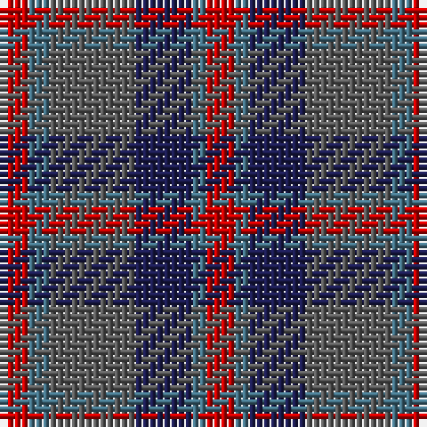

In pattern [RBBBBR](/stripes/rbbbbr/).

This was sourced from tartans-authority.  It is a [6 stripe tartan](/stripes/stripes6/).

Original link http://www.tartansauthority.com/tartan-ferret/display/8057/

## Thread count
R/4 B3 N12 DB8 B2 R/4

## Palette
Each colour and its ΔE from the base-6 reference it is a variant of.

| Colour | Shade | Base | ΔE (OKLab) |
|---|---|---|---|
| B | <code style="background-color:#447084;">#447084</code> `#447084` | B <code style="background-color:#2A418A;">#2A418A</code> | 0.15 |
| DB | <code style="background-color:#1C1C50;">#1C1C50</code> `#1C1C50` | B <code style="background-color:#2A418A;">#2A418A</code> | 0.14 |
| N | <code style="background-color:#5C5C5C;">#5C5C5C</code> `#5C5C5C` | B <code style="background-color:#2A418A;">#2A418A</code> | 0.15 |
| R | <code style="background-color:#C80000;">#C80000</code> `#C80000` | R <code style="background-color:#CC0000;">#CC0000</code> | 0.01 |

# Sample pattern

## Nearest tartans

The nearest existing variants by ΔTartan distance.

1. [Crook](/setts/s9/k4m14b2y16m3k3m3b12y4~x2/) — ΔT 1.18
1. [Little's Chauffeur Drive](/setts/s6/db1n8w1db4m8w1~x6/) — ΔT 1.21
1. [Orban-Prentice (Personal)](/setts/s7/dg25db4r24db21dy25db4dg3~x2/) — ΔT 1.21
1. [Unamed Riding cloak 1745](/setts/s5/r1dy8r2db8t1~x2/) — ΔT 1.27
1. [St. Edmunds (School)](/setts/s6/r4b3t11db8b2r4/) — ΔT 1.33
1. [Dorward/Dogwood](/setts/s7/dy7r3dy9g15db19dy14r4~x2/) — ΔT 1.35
1. [Callum (Buchan) (Name)](/setts/s5/n7r1dt6r8lr1~x8/) — ΔT 1.35
1. [Edinburgh International Conference Centre, The](/setts/s6/dy4dt20dy3k20o24dt3~x2/) — ΔT 1.37
1. [Pople (Name)](/setts/s5/k1r9n8y8w1~x2/) — ΔT 1.37
1. [Breon (Jersey Shore, Pennsylvania) (Personal)](/setts/s5/t25dg25k6dp10r6~x2/) — ΔT 1.42

## Neighbour map

Every grey dot is one of 14299 variants placed by the first two principal components of the ΔTartan feature space (44% of its variance). Red is this tartan; blue dots are its nearest — click one to open its page.

<svg viewBox="0 0 640 380" role="img" style="max-width:100%;height:auto;border:1px solid #e0e0e0;border-radius:4px;display:block" xmlns="http://www.w3.org/2000/svg"><image href="/nn/cloud.v1.png" width="640" height="380"/><a href="/setts/s9/k4m14b2y16m3k3m3b12y4~x2/"><circle cx="201.4" cy="225.0" r="4" fill="#3465a4"><title>Crook</title></circle></a><a href="/setts/s6/db1n8w1db4m8w1~x6/"><circle cx="208.4" cy="228.8" r="4" fill="#3465a4"><title>Little's Chauffeur Drive</title></circle></a><a href="/setts/s7/dg25db4r24db21dy25db4dg3~x2/"><circle cx="170.4" cy="244.0" r="4" fill="#3465a4"><title>Orban-Prentice (Personal)</title></circle></a><a href="/setts/s5/r1dy8r2db8t1~x2/"><circle cx="274.0" cy="253.0" r="4" fill="#3465a4"><title>Unamed Riding cloak 1745</title></circle></a><a href="/setts/s6/r4b3t11db8b2r4/"><circle cx="157.6" cy="260.7" r="4" fill="#3465a4"><title>St. Edmunds (School)</title></circle></a><a href="/setts/s7/dy7r3dy9g15db19dy14r4~x2/"><circle cx="229.6" cy="279.8" r="4" fill="#3465a4"><title>Dorward/Dogwood</title></circle></a><a href="/setts/s5/n7r1dt6r8lr1~x8/"><circle cx="258.5" cy="263.0" r="4" fill="#3465a4"><title>Callum (Buchan) (Name)</title></circle></a><a href="/setts/s6/dy4dt20dy3k20o24dt3~x2/"><circle cx="217.7" cy="255.7" r="4" fill="#3465a4"><title>Edinburgh International Conference Centre, The</title></circle></a><a href="/setts/s5/k1r9n8y8w1~x2/"><circle cx="201.0" cy="236.6" r="4" fill="#3465a4"><title>Pople (Name)</title></circle></a><a href="/setts/s5/t25dg25k6dp10r6~x2/"><circle cx="163.8" cy="281.7" r="4" fill="#3465a4"><title>Breon (Jersey Shore, Pennsylvania) (Personal)</title></circle></a><circle cx="197.5" cy="265.4" r="5" fill="#c00000"/></svg>

ID: /setts/s6/r4n3n12db8n2r4/
