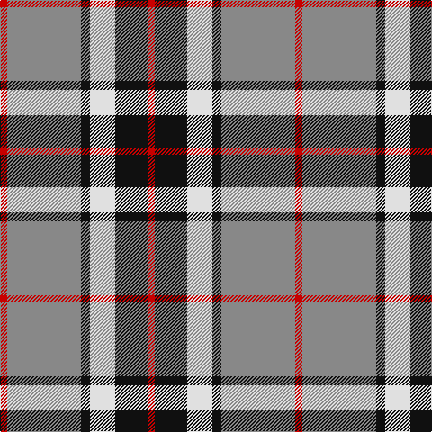

This page is one **sett** — a single exact thread-count. It belongs to the [tartan](/tartans/r4n41k5ln14k18r4/)
(the same proportion at any scale), whose colour order is pattern [RKWKRR](/stripes/rkwkrr/).

Sourced from tartans-authority.  It is a [6 stripe tartan](/stripes/stripes6/).

Original link http://www.tartansauthority.com/tartan-ferret/display/8063/

## Thread count
R/8 N82 K10 LN28 K36 R/8

## Palette
Each colour and the base-6 reference it is a variant of.

| Colour | Shade | Base |
|---|---|---|
| K | <code style="background-color:#101010;">#101010</code> `oklch(17.3% 0.000 89.9)` <small>#101010</small> | K <code style="background-color:#000000;">#000000</code> |
| LN | <code style="background-color:#E0E0E0;">#E0E0E0</code> `oklch(90.7% 0.000 89.9)` <small>#E0E0E0</small> | W <code style="background-color:#F7F7F7;">#F7F7F7</code> |
| N | <code style="background-color:#888888;">#888888</code> `oklch(62.7% 0.000 89.9)` <small>#888888</small> | R <code style="background-color:#CC0000;">#CC0000</code> |
| R | <code style="background-color:#C80000;">#C80000</code> `oklch(52.3% 0.215 29.2)` <small>#C80000</small> | R <code style="background-color:#CC0000;">#CC0000</code> |

# Sample pattern

## Nearest tartans

The nearest existing variants by ΔTartan distance, with this tartan at the top so the swatches line up against it.

ΔTartan

Tartan

Sett

—

<a href="/ttd/edit/#slug=r4o41k5w14k18r4~x2">Downside (Corporate)</a> <a class="nn-out" href="/setts/s6/r4o41k5w14k18r4~x2/" title="open its dictionary page">↗</a>

0.75

<a href="/ttd/edit/#slug=r12ly3w14dt10ly2dt24r2~x2">Yusra (Malay) (Personal)</a> <a class="nn-out" href="/setts/s7/r12ly3w14dt10ly2dt24r2~x2/" title="open its dictionary page">↗</a>

0.80

<a href="/ttd/edit/#slug=r2o20k5w10k10r2~x2">Thompson Grey Family Tartan Tartan Number: 1611. Earliest known date: pre 2003 Designed for Lord Thomson of Fleet in 1958 based on a sample in the Moy Hall collection dating from the mid 19th century. The tartan is also suitable for MacTavishs and Thompsons, who claim descent from the Clan MacIntosh. See products available Copyright © Blair Urquhart, Comrie, 2015</a> <a class="nn-out" href="/setts/s6/r2o20k5w10k10r2~x2/" title="open its dictionary page">↗</a>

0.81

<a href="/ttd/edit/#slug=r4lo30k6w13k13w3~x2">Thomson Camel</a> <a class="nn-out" href="/setts/s6/r4lo30k6w13k13w3~x2/" title="open its dictionary page">↗</a>

0.91

<a href="/ttd/edit/#slug=r4ly30k6w13k13w3~x2">Thomson, Camel (Fashion)</a> <a class="nn-out" href="/setts/s6/r4ly30k6w13k13w3~x2/" title="open its dictionary page">↗</a>

0.94

<a href="/ttd/edit/#slug=k4lb4k4o15r2~x4">Oban Grey (Fashion)</a> <a class="nn-out" href="/setts/s5/k4lb4k4o15r2~x4/" title="open its dictionary page">↗</a>

0.95

<a href="/ttd/edit/#slug=r2lo20k5w10k10w2~x2">Thompson Camel Clan Tartan Tartan Number: 2421. Earliest known date: 1967 Designed by Scotty Thompson. It it a simple colour variation on the usual blue Thompson, but is often confused with the Burberry Check. See products available Copyright © Blair Urquhart, Comrie, 2015</a> <a class="nn-out" href="/setts/s6/r2lo20k5w10k10w2~x2/" title="open its dictionary page">↗</a>

0.95

<a href="/ttd/edit/#slug=r9w5t57k5t9r29k18w9">Yale College of Wrexham (Corporate)</a> <a class="nn-out" href="/setts/s8/r9w5t57k5t9r29k18w9/" title="open its dictionary page">↗</a>

0.96

<a href="/ttd/edit/#slug=k6w6k6lo21r2~x4">Burberry Check Corporate Tartan Tartan Number: 1239. Earliest known date: 1984 Nothing See products available Copyright © Blair Urquhart, Comrie, 2015</a> <a class="nn-out" href="/setts/s5/k6w6k6lo21r2~x4/" title="open its dictionary page">↗</a>

1.03

<a href="/ttd/edit/#slug=r4o30k6w13k13w3~x2">Thom(p)son camel</a> <a class="nn-out" href="/setts/s6/r4o30k6w13k13w3~x2/" title="open its dictionary page">↗</a>

1.06

<a href="/ttd/edit/#slug=lo9k32g6lb20lo3lb9k5~x2">Black &amp; White Golf (Corporate)</a> <a class="nn-out" href="/setts/s7/lo9k32g6lb20lo3lb9k5~x2/" title="open its dictionary page">↗</a>

## Neighbour map

Every grey dot is one of 14299 variants placed by the first two principal components of the ΔTartan feature space (44% of its variance). Red is this tartan; blue dots are its nearest — click one to open its page.

<svg viewBox="0 0 640 380" role="img" style="max-width:100%;height:auto;border:1px solid #e0e0e0;border-radius:4px;display:block" xmlns="http://www.w3.org/2000/svg"><image href="/nn/cloud.v1.png" width="640" height="380"/><a href="/setts/s7/r12ly3w14dt10ly2dt24r2~x2/"><circle cx="230.1" cy="180.5" r="4" fill="#3465a4"><title>Yusra (Malay) (Personal)</title></circle></a><a href="/setts/s6/r2o20k5w10k10r2~x2/"><circle cx="174.6" cy="192.3" r="4" fill="#3465a4"><title>Thompson Grey Family Tartan Tartan Number: 1611. Earliest known date: pre 2003 Designed for Lord Thomson of Fleet in 1958 based on a sample in the Moy Hall collection dating from the mid 19th century. The tartan is also suitable for MacTavishs and Thompsons, who claim descent from the Clan MacIntosh. See products available Copyright © Blair Urquhart, Comrie, 2015</title></circle></a><a href="/setts/s6/r4lo30k6w13k13w3~x2/"><circle cx="190.6" cy="186.9" r="4" fill="#3465a4"><title>Thomson Camel</title></circle></a><a href="/setts/s6/r4ly30k6w13k13w3~x2/"><circle cx="185.9" cy="183.4" r="4" fill="#3465a4"><title>Thomson, Camel (Fashion)</title></circle></a><a href="/setts/s5/k4lb4k4o15r2~x4/"><circle cx="242.6" cy="217.8" r="4" fill="#3465a4"><title>Oban Grey (Fashion)</title></circle></a><a href="/setts/s6/r2lo20k5w10k10w2~x2/"><circle cx="176.4" cy="189.9" r="4" fill="#3465a4"><title>Thompson Camel Clan Tartan Tartan Number: 2421. Earliest known date: 1967 Designed by Scotty Thompson. It it a simple colour variation on the usual blue Thompson, but is often confused with the Burberry Check. See products available Copyright © Blair Urquhart, Comrie, 2015</title></circle></a><a href="/setts/s8/r9w5t57k5t9r29k18w9/"><circle cx="226.0" cy="167.0" r="4" fill="#3465a4"><title>Yale College of Wrexham (Corporate)</title></circle></a><a href="/setts/s5/k6w6k6lo21r2~x4/"><circle cx="244.9" cy="197.7" r="4" fill="#3465a4"><title>Burberry Check Corporate Tartan Tartan Number: 1239. Earliest known date: 1984 Nothing See products available Copyright © Blair Urquhart, Comrie, 2015</title></circle></a><a href="/setts/s6/r4o30k6w13k13w3~x2/"><circle cx="185.0" cy="187.3" r="4" fill="#3465a4"><title>Thom(p)son camel</title></circle></a><a href="/setts/s7/lo9k32g6lb20lo3lb9k5~x2/"><circle cx="190.2" cy="179.7" r="4" fill="#3465a4"><title>Black &amp; White Golf (Corporate)</title></circle></a><circle cx="224.3" cy="181.7" r="5" fill="#c00000"/></svg>

ID: /setts/s6/r4o41k5w14k18r4~x2/
