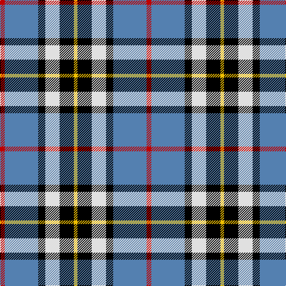

This page is one **sett** — a single exact thread-count. It belongs to the [tartan](/tartans/r4t28k6w12k12ly3/)
(the same proportion at any scale), whose colour order is pattern [RBKWKY](/stripes/rbkwky/).

Sourced from weddslist.  It is a [6 stripe tartan](/stripes/stripes6/).

Original link http://www.weddslist.com/cgi-bin/tartans/pg.pl?source=sts

## Also known as

This cloth is also recorded under:

- MacTavish / Thomson, dress
- Thomson Dress

3 attestations — the source records this cloth was collapsed from (oldest owns this page)

<ul>
<li>undated — MacTavish / Thom(p)son, dress (weddslist, <a href="http://www.weddslist.com/cgi-bin/tartans/pg.pl?source=sts">record</a>)</li>
<li>undated — MacTavish Dress Family Tartan Tartan Number: 1383. Earliest known date: 1958 Designed for Lord Thomson of Fleet in 1958 based on a sample in the Moy Hall collection dating from the mid 19th century. Designed by John Bain & Alfred Bottomley of MacArthurs of Hamilton (now at Biggar 2002). Alfred was owner of MacArthurs and John was a director and one of the leading designers in Scotland. The design work on this and the Thomson Htg was for Lord Thomson of Fleet - via Kinloch Anderson of Edinburgh. The tartan is also suitable for MacTavishs and Thomsons, who claim descent from the Clan MacIntosh, regardless of spelling. John Bain 10 Oct 2002, remembers Lord Thomson visiting the mill to discuss the designs. See products available Copyright © Blair Urquhart, Comrie, 2015 (house-of-tartan, <a href="http://www.house-of-tartan.scotland.net/house/TartanViewjs.asp?colr=Def&tnam=1383">record</a>)</li>
<li>undated — Thomson Dress Family Tartan Tartan Number: 2094. Earliest known date: 1958 Designed for Lord Thomson of Fleet in 1958 based on a sample in the Moy Hall collection dating from the mid 19th century. The tartan is also suitable for MacTavishs and Thompsons, who claim descent from the Clan MacIntosh. See products available Copyright © Blair Urquhart, Comrie, 2015 (house-of-tartan, <a href="http://www.house-of-tartan.scotland.net/house/TartanViewjs.asp?colr=Def&tnam=2094">record</a>)</li>
</ul>

## Thread count
R/8 B56 K12 LN24 K24 Y/6

## Palette

Palette: <strong>Tartan Register</strong> <small style="color:#888">(2 of 5 colours)</small>
<table><thead><tr><th>Colour</th><th>Threads</th><th>Shade</th><th>Base</th><th>OKLCh</th></tr></thead><tbody><tr><td>R/</td><td style="text-align:right;font-variant-numeric:tabular-nums">8</td><td><code style="background-color:#C00000;">#C00000</code> <small style="color:#888">#C00000</small></td><td>R <code style="background-color:#CC0000;">#CC0000</code></td><td><small style="color:#888">oklch(50.7% 0.208 29.2)</small></td></tr><tr><td>B</td><td style="text-align:right;font-variant-numeric:tabular-nums">56</td><td><code style="background-color:#5480B0;">#5480B0</code> <small style="color:#888">#5480B0</small></td><td>B <code style="background-color:#2A418A;">#2A418A</code></td><td><small style="color:#888">oklch(58.8% 0.089 251.5)</small></td></tr><tr><td>K</td><td style="text-align:right;font-variant-numeric:tabular-nums">12</td><td><code style="background-color:#000000;">#000000</code> <small style="color:#888">#000000</small></td><td>K <code style="background-color:#000000;">#000000</code></td><td><small style="color:#888">oklch(0.0% 0.000 0.0)</small></td></tr><tr><td>LN</td><td style="text-align:right;font-variant-numeric:tabular-nums">24</td><td><code style="background-color:#E0E0E0;">#E0E0E0</code> <small style="color:#888">#E0E0E0</small></td><td>W <code style="background-color:#F7F7F7;">#F7F7F7</code></td><td><small style="color:#888">oklch(90.7% 0.000 89.9)</small></td></tr><tr><td>K</td><td style="text-align:right;font-variant-numeric:tabular-nums">24</td><td><code style="background-color:#000000;">#000000</code> <small style="color:#888">#000000</small></td><td>K <code style="background-color:#000000;">#000000</code></td><td><small style="color:#888">oklch(0.0% 0.000 0.0)</small></td></tr><tr><td>Y/</td><td style="text-align:right;font-variant-numeric:tabular-nums">6</td><td><code style="background-color:#F0C000;">#F0C000</code> <small style="color:#888">#F0C000</small></td><td>Y <code style="background-color:#F2BF00;">#F2BF00</code></td><td><small style="color:#888">oklch(82.7% 0.169 90.5)</small></td></tr></tbody></table>

# Sample pattern

## Nearest tartans

The nearest existing variants by ΔTartan distance, with this tartan at the top so the swatches line up against it.

ΔTartan

Tartan

Sett

—

<a href="/ttd/edit/#slug=r4t28k6w12k12ly3~x2">MacTavish / Thom(p)son, dress</a> <a class="nn-out" href="/setts/s6/r4t28k6w12k12ly3~x2/" title="open its dictionary page">↗</a>

0.66

<a href="/ttd/edit/#slug=w6db24k7o11k2ly6~x2">Clunie (Name)</a> <a class="nn-out" href="/setts/s6/w6db24k7o11k2ly6~x2/" title="open its dictionary page">↗</a>

0.72

<a href="/ttd/edit/#slug=r1b10k2w4k4ly1~x6">Thomson Dress (Blue)</a> <a class="nn-out" href="/setts/s6/r1b10k2w4k4ly1~x6/" title="open its dictionary page">↗</a>

0.83

<a href="/ttd/edit/#slug=r4t28k6lb12k12lo3~x2">MacTavish Dress</a> <a class="nn-out" href="/setts/s6/r4t28k6lb12k12lo3~x2/" title="open its dictionary page">↗</a>

0.93

<a href="/ttd/edit/#slug=r5w2db20ly2k16w18k2w5~x2">Ailsa, Craig</a> <a class="nn-out" href="/setts/s8/r5w2db20ly2k16w18k2w5~x2/" title="open its dictionary page">↗</a>

1.03

<a href="/ttd/edit/#slug=lb5k26ly4lb24dp8k3r4~x2">Pengelly, The Cornish (Name)</a> <a class="nn-out" href="/setts/s7/lb5k26ly4lb24dp8k3r4~x2/" title="open its dictionary page">↗</a>

1.03

<a href="/ttd/edit/#slug=db18w3db3w3r3w3k5ly12~x2">Kile (Red line) (Personal)</a> <a class="nn-out" href="/setts/s8/db18w3db3w3r3w3k5ly12~x2/" title="open its dictionary page">↗</a>

1.06

<a href="/ttd/edit/#slug=r15t98db72ly25db8w15">Afternoon Tea / Earl Grey</a> <a class="nn-out" href="/setts/s6/r15t98db72ly25db8w15/" title="open its dictionary page">↗</a>

1.07

<a href="/ttd/edit/#slug=db49ly12r12ly12dg32w8db3">Kuznetsov (2014)</a> <a class="nn-out" href="/setts/s7/db49ly12r12ly12dg32w8db3/" title="open its dictionary page">↗</a>

1.08

<a href="/ttd/edit/#slug=k4t3p11g14w2~x2">Wellington, No 229</a> <a class="nn-out" href="/setts/s5/k4t3p11g14w2~x2/" title="open its dictionary page">↗</a>

1.09

<a href="/ttd/edit/#slug=g6db11lb8k4lb8k27lb4r4~x2">Kervegant, Suzanne (Personal)</a> <a class="nn-out" href="/setts/s8/g6db11lb8k4lb8k27lb4r4~x2/" title="open its dictionary page">↗</a>

## Neighbour map

Every grey dot is one of 14359 variants placed by the first two principal components of the ΔTartan feature space (44% of its variance). Red is this tartan; blue dots are its nearest — click one to open its page.

<svg viewBox="0 0 640 380" role="img" style="max-width:100%;height:auto;border:1px solid #e0e0e0;border-radius:4px;display:block" xmlns="http://www.w3.org/2000/svg"><image href="/nn/cloud.v1.png" width="640" height="380"/><a href="/setts/s6/w6db24k7o11k2ly6~x2/"><circle cx="154.2" cy="177.5" r="4" fill="#3465a4"><title>Clunie (Name)</title></circle></a><a href="/setts/s6/r1b10k2w4k4ly1~x6/"><circle cx="179.4" cy="179.3" r="4" fill="#3465a4"><title>Thomson Dress (Blue)</title></circle></a><a href="/setts/s6/r4t28k6lb12k12lo3~x2/"><circle cx="167.8" cy="188.3" r="4" fill="#3465a4"><title>MacTavish Dress</title></circle></a><a href="/setts/s8/r5w2db20ly2k16w18k2w5~x2/"><circle cx="116.3" cy="155.2" r="4" fill="#3465a4"><title>Ailsa, Craig</title></circle></a><a href="/setts/s7/lb5k26ly4lb24dp8k3r4~x2/"><circle cx="151.8" cy="163.3" r="4" fill="#3465a4"><title>Pengelly, The Cornish (Name)</title></circle></a><a href="/setts/s8/db18w3db3w3r3w3k5ly12~x2/"><circle cx="120.9" cy="172.5" r="4" fill="#3465a4"><title>Kile (Red line) (Personal)</title></circle></a><a href="/setts/s6/r15t98db72ly25db8w15/"><circle cx="185.4" cy="169.2" r="4" fill="#3465a4"><title>Afternoon Tea / Earl Grey</title></circle></a><a href="/setts/s7/db49ly12r12ly12dg32w8db3/"><circle cx="156.5" cy="153.3" r="4" fill="#3465a4"><title>Kuznetsov (2014)</title></circle></a><a href="/setts/s5/k4t3p11g14w2~x2/"><circle cx="145.5" cy="214.1" r="4" fill="#3465a4"><title>Wellington, No 229</title></circle></a><a href="/setts/s8/g6db11lb8k4lb8k27lb4r4~x2/"><circle cx="144.9" cy="185.8" r="4" fill="#3465a4"><title>Kervegant, Suzanne (Personal)</title></circle></a><circle cx="147.7" cy="179.1" r="5" fill="#c00000"/></svg>

ID: /setts/s6/r4t28k6w12k12ly3~x2/
