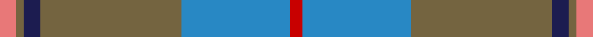
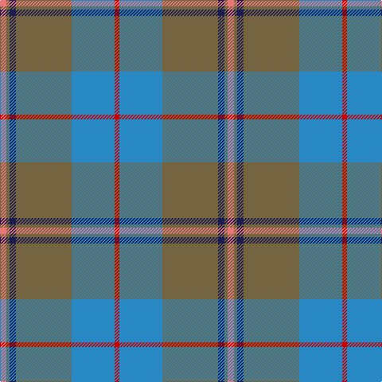

This page is one **sett** — a single exact thread-count. It belongs to the [tartan](/tartans/lr4lt2db4lt35b27r3/)
(the same proportion at any scale), whose colour order is pattern [RBGBGR](/stripes/rbgbgr/).

Sourced from tartans-authority.  It is a [6 stripe tartan](/stripes/stripes6/).

Original link http://www.tartansauthority.com/tartan-ferret/display/7360/

2 attestations — the source records this cloth was collapsed from (oldest owns this page)

<ul>
<li>pre 2007 — Royal Deeside (District) (tartans-authority, <a href="http://www.tartansauthority.com/tartan-ferret/display/7360/">record</a>)</li>
<li>undated — Royal Deeside (register-of-tartans, <a href="https://www.tartanregister.gov.uk/tartanDetails.aspx?ref=5470">record</a>)</li>
</ul>

## Register references

External register numbers recorded for this tartan.

- Scottish Register of Tartans: [5470](https://www.tartanregister.gov.uk/tartanDetails.aspx?ref=5470)
- Scottish Tartans Authority (ITI): 7360

## Thread count
LR/8 LT4 DB8 LT70 B54 R/6

## Palette
Each colour and the base-6 reference it is a variant of.

| Colour | Shade | Base |
|---|---|---|
| B | <code style="background-color:#2888C4;">#2888C4</code> `oklch(60.1% 0.125 241.5)` <small>#2888C4</small> | B <code style="background-color:#2A418A;">#2A418A</code> |
| DB | <code style="background-color:#1C1C50;">#1C1C50</code> `oklch(26.2% 0.093 277.9)` <small>#1C1C50</small> | B <code style="background-color:#2A418A;">#2A418A</code> |
| LR | <code style="background-color:#E87878;">#E87878</code> `oklch(70.0% 0.139 21.2)` <small>#E87878</small> | R <code style="background-color:#CC0000;">#CC0000</code> |
| LT | <code style="background-color:#746440;">#746440</code> `oklch(51.0% 0.056 86.5)` <small>#746440</small> | G <code style="background-color:#006100;">#006100</code> |
| R | <code style="background-color:#C80000;">#C80000</code> `oklch(52.3% 0.215 29.2)` <small>#C80000</small> | R <code style="background-color:#CC0000;">#CC0000</code> |

# Sample pattern

## Nearest tartans

The nearest existing variants by ΔTartan distance, with this tartan at the top so the swatches line up against it.

ΔTartan

Tartan

Sett

—

<a href="/ttd/edit/#slug=r4y2db4y35t27r3~x2">Royal Deeside (District)</a> <a class="nn-out" href="/setts/s6/r4y2db4y35t27r3~x2/" title="open its dictionary page">↗</a>

0.95

<a href="/ttd/edit/#slug=r1g4lo1g3r4n15w1~x4">Bressuire (District)</a> <a class="nn-out" href="/setts/s7/r1g4lo1g3r4n15w1~x4/" title="open its dictionary page">↗</a>

1.03

<a href="/ttd/edit/#slug=lp4dy2dp4dy35n27r3~x2">Deeside, Royal</a> <a class="nn-out" href="/setts/s6/lp4dy2dp4dy35n27r3~x2/" title="open its dictionary page">↗</a>

1.10

<a href="/ttd/edit/#slug=o3lr4o4do4o18do3n36w3~x2">Hebridean Granite Fashion Tartan Tartan Number: 6821. Earliest known date: 2005 For a new House of Edgar collection. Intended to emulate the gray morning suit perhaps. See products available Copyright © Blair Urquhart, Comrie, 2015</a> <a class="nn-out" href="/setts/s8/o3lr4o4do4o18do3n36w3~x2/" title="open its dictionary page">↗</a>

1.25

<a href="/ttd/edit/#slug=r2lo13b8lo3b33lg3b8lg13m2~x2">Burt #1 (Name)</a> <a class="nn-out" href="/setts/s9/r2lo13b8lo3b33lg3b8lg13m2~x2/" title="open its dictionary page">↗</a>

1.29

<a href="/ttd/edit/#slug=o3lr4o4k4o18k3n36w3~x2">Hebridean Granite (Fashion)</a> <a class="nn-out" href="/setts/s8/o3lr4o4k4o18k3n36w3~x2/" title="open its dictionary page">↗</a>

1.36

<a href="/ttd/edit/#slug=o59t28ly5dg3w4ly5~x2">Dundhuin Gold</a> <a class="nn-out" href="/setts/s6/o59t28ly5dg3w4ly5~x2/" title="open its dictionary page">↗</a>

1.37

<a href="/ttd/edit/#slug=n4o4n4k4n18k3do38w3~x2">Scotch Mist</a> <a class="nn-out" href="/setts/s8/n4o4n4k4n18k3do38w3~x2/" title="open its dictionary page">↗</a>

1.37

<a href="/ttd/edit/#slug=db12t6g30db9r8lo1~x2">Wright, Anne (Personal)</a> <a class="nn-out" href="/setts/s6/db12t6g30db9r8lo1~x2/" title="open its dictionary page">↗</a>

1.39

<a href="/ttd/edit/#slug=t4r1ly1t12do4y10ly1r3~x4">Hawaii (District)</a> <a class="nn-out" href="/setts/s8/t4r1ly1t12do4y10ly1r3~x4/" title="open its dictionary page">↗</a>

1.41

<a href="/ttd/edit/#slug=dp3n24n10n2g11n8w3~x2">Hesco</a> <a class="nn-out" href="/setts/s7/dp3n24n10n2g11n8w3~x2/" title="open its dictionary page">↗</a>

## Neighbour map

Every grey dot is one of 14299 variants placed by the first two principal components of the ΔTartan feature space (44% of its variance). Red is this tartan; blue dots are its nearest — click one to open its page.

<svg viewBox="0 0 640 380" role="img" style="max-width:100%;height:auto;border:1px solid #e0e0e0;border-radius:4px;display:block" xmlns="http://www.w3.org/2000/svg"><image href="/nn/cloud.v1.png" width="640" height="380"/><a href="/setts/s7/r1g4lo1g3r4n15w1~x4/"><circle cx="332.7" cy="183.3" r="4" fill="#3465a4"><title>Bressuire (District)</title></circle></a><a href="/setts/s6/lp4dy2dp4dy35n27r3~x2/"><circle cx="337.9" cy="188.3" r="4" fill="#3465a4"><title>Deeside, Royal</title></circle></a><a href="/setts/s8/o3lr4o4do4o18do3n36w3~x2/"><circle cx="303.0" cy="173.3" r="4" fill="#3465a4"><title>Hebridean Granite Fashion Tartan Tartan Number: 6821. Earliest known date: 2005 For a new House of Edgar collection. Intended to emulate the gray morning suit perhaps. See products available Copyright © Blair Urquhart, Comrie, 2015</title></circle></a><a href="/setts/s9/r2lo13b8lo3b33lg3b8lg13m2~x2/"><circle cx="371.4" cy="183.7" r="4" fill="#3465a4"><title>Burt #1 (Name)</title></circle></a><a href="/setts/s8/o3lr4o4k4o18k3n36w3~x2/"><circle cx="291.6" cy="166.8" r="4" fill="#3465a4"><title>Hebridean Granite (Fashion)</title></circle></a><a href="/setts/s6/o59t28ly5dg3w4ly5~x2/"><circle cx="374.7" cy="160.3" r="4" fill="#3465a4"><title>Dundhuin Gold</title></circle></a><a href="/setts/s8/n4o4n4k4n18k3do38w3~x2/"><circle cx="329.9" cy="186.1" r="4" fill="#3465a4"><title>Scotch Mist</title></circle></a><a href="/setts/s6/db12t6g30db9r8lo1~x2/"><circle cx="320.2" cy="193.0" r="4" fill="#3465a4"><title>Wright, Anne (Personal)</title></circle></a><a href="/setts/s8/t4r1ly1t12do4y10ly1r3~x4/"><circle cx="249.8" cy="190.8" r="4" fill="#3465a4"><title>Hawaii (District)</title></circle></a><a href="/setts/s7/dp3n24n10n2g11n8w3~x2/"><circle cx="324.2" cy="217.5" r="4" fill="#3465a4"><title>Hesco</title></circle></a><circle cx="341.8" cy="186.8" r="5" fill="#c00000"/></svg>

ID: /setts/s6/r4y2db4y35t27r3~x2/
