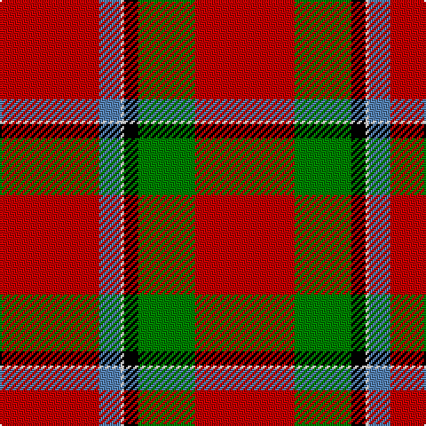

In pattern [RBWKGR](/patterns/rbwkgr/).

This was sourced from weddslist.  It is a [6 stripes tartan](/stripes/stripes6/).

Original link http://www.weddslist.com/cgi-bin/tartans/pg.pl?source=sts

## Thread count
R/56 B12 LN2 K8 G32 R/56

## Palette
Each colour and its ΔE from the base-6 reference it is a variant of.

| Colour | Shade | Base | ΔE (OKLab) |
|---|---|---|---|
| B | <code style="background-color:#5480B0;">#5480B0</code> `#5480B0` | B <code style="background-color:#2A418A;">#2A418A</code> | 0.19 |
| G | <code style="background-color:#008000;">#008000</code> `#008000` | G <code style="background-color:#006100;">#006100</code> | 0.10 |
| K | <code style="background-color:#000000;">#000000</code> `#000000` | K <code style="background-color:#000000;">#000000</code> | 0.00 |
| LN | <code style="background-color:#E0E0E0;">#E0E0E0</code> `#E0E0E0` | W <code style="background-color:#F7F7F7;">#F7F7F7</code> | 0.07 |
| R | <code style="background-color:#C00000;">#C00000</code> `#C00000` | R <code style="background-color:#CC0000;">#CC0000</code> | 0.03 |

# Sample pattern

## Nearest tartans

The nearest existing variants by ΔTartan distance.

1. [Sinclair (Logan)](/setts/s6/r56g32k8w2b12r56-b202060-g006818-k101010-rc80000-we0e0e0/) — ΔT 0.45
1. [Kinnaird (Name)](/setts/s6/g30k20r60b4r40w2-b780078-g006818-k101010-rb00000-we0e0e0/) — ΔT 0.86
1. [Sinclair Dress](/setts/s6/r56g32k8y2b12r56-b4367ae-g11450d-k000000-raa0000-yaaaaaa/) — ΔT 0.91
1. [Sinclair](/setts/s6/r30g12k5w2b6r30-b5480b0-g008000-k000000-rc00000-we0e0e0/) — ΔT 1.05
1. [Sinclair Clan Tartan Tartan Number: 1437. Earliest known date: 1815 Lyon Court record multiplied by four. A minor variation on the Cockburn specimen (1810-15) which also appears in a painting of Alexander 13th Earl of Caithness who lived between 1790 and 1858. See products available Copyright © Blair Urquhart, Comrie, 2015](/setts/s6/r30g12k5w2b6r30-b5c8ca8-g006818-k101010-rc80000-we0e0e0/) — ΔT 1.17
1. [Sinclair](/setts/s6/r60g24k10y4b12r60-b4367ae-g11450d-k000000-raa0000-yaaaaaa/) — ΔT 1.30
1. [Sinclair](/setts/s6/r30g12k5y2b6r30-b4367ae-g11450d-k000000-raa0000-yaaaaaa/) — ΔT 1.30
1. [MacKinnon #4](/setts/s7/k2r36g24r4g24r36w2-g005020-k101010-rdc0000-we0e0e0/) — ΔT 1.30
1. [Greig (Personal)](/setts/s6/r120k4w6g40r20g40-g003820-k101010-rc80000-we0e0e0/) — ΔT 1.30
1. [AON](/setts/s6/r20b40r20g20r100y4-b202060-g285800-rc80000-ye8c000/) — ΔT 1.31

## Neighbour map

Every grey dot is one of 15726 variants placed by the first two principal components of the ΔTartan feature space (44% of its variance). Red is this tartan; blue dots are its nearest — click one to open its page.

<svg viewBox="0 0 640 380" role="img" style="max-width:100%;height:auto;border:1px solid #e0e0e0;border-radius:4px;display:block" xmlns="http://www.w3.org/2000/svg"><image href="/nn/cloud.v1.png" width="640" height="380"/><a href="/setts/s6/r56g32k8w2b12r56-b202060-g006818-k101010-rc80000-we0e0e0/"><circle cx="417.3" cy="157.2" r="4" fill="#3465a4"><title>Sinclair (Logan)</title></circle></a><a href="/setts/s6/g30k20r60b4r40w2-b780078-g006818-k101010-rb00000-we0e0e0/"><circle cx="398.0" cy="161.2" r="4" fill="#3465a4"><title>Kinnaird (Name)</title></circle></a><a href="/setts/s6/r56g32k8y2b12r56-b4367ae-g11450d-k000000-raa0000-yaaaaaa/"><circle cx="424.8" cy="165.0" r="4" fill="#3465a4"><title>Sinclair Dress</title></circle></a><a href="/setts/s6/r30g12k5w2b6r30-b5480b0-g008000-k000000-rc00000-we0e0e0/"><circle cx="402.9" cy="171.5" r="4" fill="#3465a4"><title>Sinclair</title></circle></a><a href="/setts/s6/r30g12k5w2b6r30-b5c8ca8-g006818-k101010-rc80000-we0e0e0/"><circle cx="419.8" cy="176.9" r="4" fill="#3465a4"><title>Sinclair Clan Tartan Tartan Number: 1437. Earliest known date: 1815 Lyon Court record multiplied by four. A minor variation on the Cockburn specimen (1810-15) which also appears in a painting of Alexander 13th Earl of Caithness who lived between 1790 and 1858. See products available Copyright © Blair Urquhart, Comrie, 2015</title></circle></a><a href="/setts/s6/r60g24k10y4b12r60-b4367ae-g11450d-k000000-raa0000-yaaaaaa/"><circle cx="421.3" cy="183.0" r="4" fill="#3465a4"><title>Sinclair</title></circle></a><a href="/setts/s6/r30g12k5y2b6r30-b4367ae-g11450d-k000000-raa0000-yaaaaaa/"><circle cx="421.3" cy="183.0" r="4" fill="#3465a4"><title>Sinclair</title></circle></a><a href="/setts/s7/k2r36g24r4g24r36w2-g005020-k101010-rdc0000-we0e0e0/"><circle cx="375.3" cy="180.7" r="4" fill="#3465a4"><title>MacKinnon #4</title></circle></a><a href="/setts/s6/r120k4w6g40r20g40-g003820-k101010-rc80000-we0e0e0/"><circle cx="420.0" cy="151.7" r="4" fill="#3465a4"><title>Greig (Personal)</title></circle></a><a href="/setts/s6/r20b40r20g20r100y4-b202060-g285800-rc80000-ye8c000/"><circle cx="455.6" cy="166.8" r="4" fill="#3465a4"><title>AON</title></circle></a><circle cx="405.2" cy="153.2" r="5" fill="#c00000"/></svg>

ID: /setts/s6/r56g32k8w2b12r56-b5480b0-g008000-k000000-rc00000-we0e0e0/
