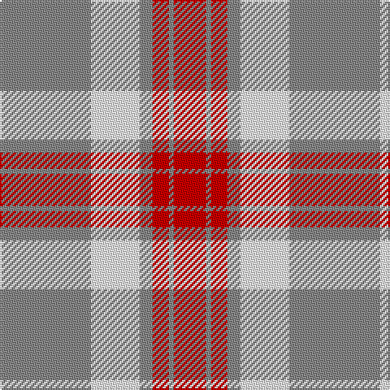

In pattern [RRRRWR](/patterns/rrrrwr/).

This was sourced from tartans-authority.  It is a [6 stripes tartan](/stripes/stripes6/).

Original link http://www.tartansauthority.com/tartan-ferret/display/11204/

## Thread count
N/56 W30 N8 R10 N3 R/20

## Palette
Each colour and its ΔE from the base-6 reference it is a variant of.

| Colour | Shade | Base | ΔE (OKLab) |
|---|---|---|---|
| N | <code style="background-color:#888888;">#888888</code> `#888888` | R <code style="background-color:#C80000;">#C80000</code> | 0.24 |
| R | <code style="background-color:#C80000;">#C80000</code> `#C80000` | R <code style="background-color:#C80000;">#C80000</code> | 0.00 |
| W | <code style="background-color:#FCFCFC;">#FCFCFC</code> `#FCFCFC` | W <code style="background-color:#F4F4F0;">#F4F4F0</code> | 0.03 |

# Sample pattern

## Nearest tartans

The nearest existing variants by ΔTartan distance.

1. [Walsh, Michael Edward (Personal)](/setts/s6/y56w30y8r10y3r20-rc80000-wffffff-ya0a0a0/) — ΔT 0.39
1. [O'Connor Dress](/setts/s5/g20r20w44r4g4-g604000-re87878-w98c8e8/) — ΔT 1.18
1. [Malaysian Unknown (Artefact)](/setts/s5/w90r4g18w4r60-g006818-r880000-we8ccb8/) — ΔT 1.30
1. [Lister (Misty Mountain)](/setts/s7/b16y58b16ya6b16y16ya6-b5d321f-yccbaaf-yae0a126/) — ΔT 1.35
1. [Buchanan #5](/setts/s6/k4w56r26w4r26w4-k101010-r960028-we0e0e0/) — ΔT 1.53
1. [Ailsa, Pink (Dance)](/setts/s6/r16w6r56w64k6w8-k101010-re87878-wf0e0c8/) — ΔT 1.62
1. [Buchanan 4](/setts/s6/k4w56r26w4r26w4-k000000-r900030-we0e0e0/) — ΔT 1.63
1. [Masai Shuka 24 (Artefact)](/setts/s4/b60w8r80w12-b2888c4-rc80000-we0e0e0/) — ΔT 1.63
1. [O'Neill Pipe Band 1970 (Corporate)](/setts/s8/g4w16ga48w12ga24w48g4w4-g289c18-ga604000-wc0c0c0/) — ΔT 1.65
1. [O'Neill Pipe Band 1999/ Oliver dress](/setts/s9/w8g4w8r24w40g24w8r4w8-g289c18-rc80028-we0e0e0/) — ΔT 1.69

## Neighbour map

Every grey dot is one of 15726 variants placed by the first two principal components of the ΔTartan feature space (44% of its variance). Red is this tartan; blue dots are its nearest — click one to open its page.

<svg viewBox="0 0 640 380" role="img" style="max-width:100%;height:auto;border:1px solid #e0e0e0;border-radius:4px;display:block" xmlns="http://www.w3.org/2000/svg"><image href="/nn/cloud.v1.png" width="640" height="380"/><a href="/setts/s6/y56w30y8r10y3r20-rc80000-wffffff-ya0a0a0/"><circle cx="321.2" cy="183.3" r="4" fill="#3465a4"><title>Walsh, Michael Edward (Personal)</title></circle></a><a href="/setts/s5/g20r20w44r4g4-g604000-re87878-w98c8e8/"><circle cx="272.9" cy="218.3" r="4" fill="#3465a4"><title>O'Connor Dress</title></circle></a><a href="/setts/s5/w90r4g18w4r60-g006818-r880000-we8ccb8/"><circle cx="336.3" cy="167.3" r="4" fill="#3465a4"><title>Malaysian Unknown (Artefact)</title></circle></a><a href="/setts/s7/b16y58b16ya6b16y16ya6-b5d321f-yccbaaf-yae0a126/"><circle cx="312.8" cy="202.0" r="4" fill="#3465a4"><title>Lister (Misty Mountain)</title></circle></a><a href="/setts/s6/k4w56r26w4r26w4-k101010-r960028-we0e0e0/"><circle cx="323.9" cy="174.9" r="4" fill="#3465a4"><title>Buchanan #5</title></circle></a><a href="/setts/s6/r16w6r56w64k6w8-k101010-re87878-wf0e0c8/"><circle cx="342.2" cy="199.1" r="4" fill="#3465a4"><title>Ailsa, Pink (Dance)</title></circle></a><a href="/setts/s6/k4w56r26w4r26w4-k000000-r900030-we0e0e0/"><circle cx="320.4" cy="174.2" r="4" fill="#3465a4"><title>Buchanan 4</title></circle></a><a href="/setts/s4/b60w8r80w12-b2888c4-rc80000-we0e0e0/"><circle cx="302.0" cy="232.0" r="4" fill="#3465a4"><title>Masai Shuka 24 (Artefact)</title></circle></a><a href="/setts/s8/g4w16ga48w12ga24w48g4w4-g289c18-ga604000-wc0c0c0/"><circle cx="303.8" cy="192.4" r="4" fill="#3465a4"><title>O'Neill Pipe Band 1970 (Corporate)</title></circle></a><a href="/setts/s9/w8g4w8r24w40g24w8r4w8-g289c18-rc80028-we0e0e0/"><circle cx="287.6" cy="186.4" r="4" fill="#3465a4"><title>O'Neill Pipe Band 1999/ Oliver dress</title></circle></a><circle cx="319.0" cy="184.2" r="5" fill="#c00000"/></svg>

ID: /setts/s6/r56w30r8ra10r3ra20-r888888-rac80000-wfcfcfc/
