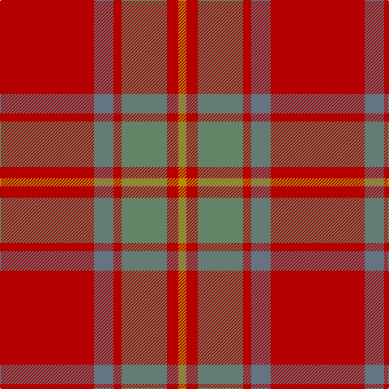

In pattern [RBRGRY](/stripes/rbrgry/).

This was sourced from tartans-authority.  It is a [6 stripe tartan](/stripes/stripes6/).

Original link http://www.tartansauthority.com/tartan-ferret/display/8123/

## Thread count
R/116 B24 R10 N56 R14 DY/10

## Palette
Each colour and the base-6 reference it is a variant of.

| Colour | Shade | Base |
|---|---|---|
| B | <code style="background-color:#647480;">#647480</code> `oklch(55.0% 0.027 240.4)` <small>#647480</small> | B <code style="background-color:#2A418A;">#2A418A</code> |
| DY | <code style="background-color:#BC8C00;">#BC8C00</code> `oklch(66.8% 0.137 84.1)` <small>#BC8C00</small> | Y <code style="background-color:#F2BF00;">#F2BF00</code> |
| N | <code style="background-color:#648468;">#648468</code> `oklch(58.1% 0.056 148.2)` <small>#648468</small> | G <code style="background-color:#006100;">#006100</code> |
| R | <code style="background-color:#B40000;">#B40000</code> `oklch(48.3% 0.198 29.2)` <small>#B40000</small> | R <code style="background-color:#CC0000;">#CC0000</code> |

# Sample pattern

## Nearest tartans

The nearest existing variants by ΔTartan distance, with this tartan at the top so the swatches line up against it.

ΔTartan

Tartan

Sett

—

<a href="/ttd/edit/#slug=r58n12r5y28r7lo5~x2">Cairn O'Mount (Personal)</a> <a class="nn-out" href="/setts/s6/r58n12r5y28r7lo5~x2/" title="open its dictionary page">↗</a>

1.18

<a href="/ttd/edit/#slug=r12n2lr1n2r3dg8r3n1~x2">Chisholm</a> <a class="nn-out" href="/setts/s8/r12n2lr1n2r3dg8r3n1~x2/" title="open its dictionary page">↗</a>

1.18

<a href="/ttd/edit/#slug=r12n2lr1n2r3dg8r3n1">Chisholm</a> <a class="nn-out" href="/setts/s8/r12n2lr1n2r3dg8r3n1/" title="open its dictionary page">↗</a>

1.33

<a href="/ttd/edit/#slug=r37o9r3g9o3~x2">Glen Shee</a> <a class="nn-out" href="/setts/s5/r37o9r3g9o3~x2/" title="open its dictionary page">↗</a>

1.39

<a href="/ttd/edit/#slug=r3o28do5o5do33o5do5o28lo3~x2">MacIver of Strathendry Htg (Personal</a> <a class="nn-out" href="/setts/s9/r3o28do5o5do33o5do5o28lo3~x2/" title="open its dictionary page">↗</a>

1.46

<a href="/ttd/edit/#slug=r29g2r2g2r6lo21~x4">Maguire, Black (Name)</a> <a class="nn-out" href="/setts/s6/r29g2r2g2r6lo21~x4/" title="open its dictionary page">↗</a>

1.47

<a href="/ttd/edit/#slug=m37dy9m3g9dy3~x2">Glen Shee Trade Tartan Tartan Number: 1662. Earliest known date: pre 2003 May have been obtained from a hand made design procured in the Highlands for The Highland Society of London. See products available Copyright © Blair Urquhart, Comrie, 2015</a> <a class="nn-out" href="/setts/s5/m37dy9m3g9dy3~x2/" title="open its dictionary page">↗</a>

1.57

<a href="/ttd/edit/#slug=db2r22dy11y2dy11db2~x2">Cetoloni</a> <a class="nn-out" href="/setts/s6/db2r22dy11y2dy11db2~x2/" title="open its dictionary page">↗</a>

1.69

<a href="/ttd/edit/#slug=r30y3db5y21r3y21db2~x2">Scottish Piping Soc. of London (Corp</a> <a class="nn-out" href="/setts/s7/r30y3db5y21r3y21db2~x2/" title="open its dictionary page">↗</a>

1.71

<a href="/ttd/edit/#slug=r3y19ly3y19r3y3r21t3~x2">Burnett of Powis (Personal)</a> <a class="nn-out" href="/setts/s8/r3y19ly3y19r3y3r21t3~x2/" title="open its dictionary page">↗</a>

1.79

<a href="/ttd/edit/#slug=r12g1r1o8r2o1r1db3r1o1r12g1r1g4~x2">MacColl</a> <a class="nn-out" href="/setts/s14/r12g1r1o8r2o1r1db3r1o1r12g1r1g4~x2/" title="open its dictionary page">↗</a>

## Neighbour map

Every grey dot is one of 14299 variants placed by the first two principal components of the ΔTartan feature space (44% of its variance). Red is this tartan; blue dots are its nearest — click one to open its page.

<svg viewBox="0 0 640 380" role="img" style="max-width:100%;height:auto;border:1px solid #e0e0e0;border-radius:4px;display:block" xmlns="http://www.w3.org/2000/svg"><image href="/nn/cloud.v1.png" width="640" height="380"/><a href="/setts/s8/r12n2lr1n2r3dg8r3n1~x2/"><circle cx="377.1" cy="207.0" r="4" fill="#3465a4"><title>Chisholm</title></circle></a><a href="/setts/s8/r12n2lr1n2r3dg8r3n1/"><circle cx="377.1" cy="207.0" r="4" fill="#3465a4"><title>Chisholm</title></circle></a><a href="/setts/s5/r37o9r3g9o3~x2/"><circle cx="488.1" cy="239.7" r="4" fill="#3465a4"><title>Glen Shee</title></circle></a><a href="/setts/s9/r3o28do5o5do33o5do5o28lo3~x2/"><circle cx="420.6" cy="217.3" r="4" fill="#3465a4"><title>MacIver of Strathendry Htg (Personal</title></circle></a><a href="/setts/s6/r29g2r2g2r6lo21~x4/"><circle cx="454.0" cy="206.2" r="4" fill="#3465a4"><title>Maguire, Black (Name)</title></circle></a><a href="/setts/s5/m37dy9m3g9dy3~x2/"><circle cx="494.9" cy="241.4" r="4" fill="#3465a4"><title>Glen Shee Trade Tartan Tartan Number: 1662. Earliest known date: pre 2003 May have been obtained from a hand made design procured in the Highlands for The Highland Society of London. See products available Copyright © Blair Urquhart, Comrie, 2015</title></circle></a><a href="/setts/s6/db2r22dy11y2dy11db2~x2/"><circle cx="354.2" cy="233.1" r="4" fill="#3465a4"><title>Cetoloni</title></circle></a><a href="/setts/s7/r30y3db5y21r3y21db2~x2/"><circle cx="390.2" cy="219.0" r="4" fill="#3465a4"><title>Scottish Piping Soc. of London (Corp</title></circle></a><a href="/setts/s8/r3y19ly3y19r3y3r21t3~x2/"><circle cx="352.2" cy="225.5" r="4" fill="#3465a4"><title>Burnett of Powis (Personal)</title></circle></a><a href="/setts/s14/r12g1r1o8r2o1r1db3r1o1r12g1r1g4~x2/"><circle cx="412.9" cy="166.4" r="4" fill="#3465a4"><title>MacColl</title></circle></a><circle cx="427.7" cy="215.5" r="5" fill="#c00000"/></svg>

ID: /setts/s6/r58n12r5y28r7lo5~x2/
