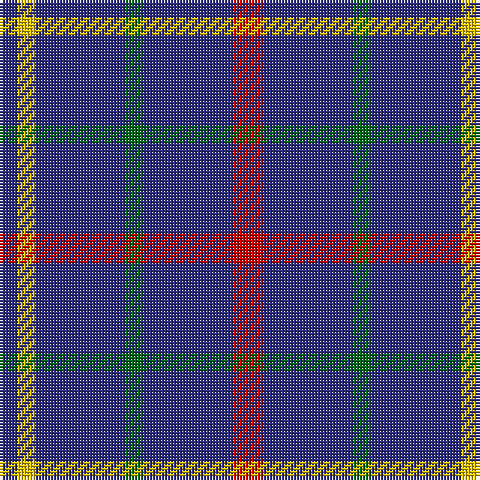

In pattern [BYBGBR](/patterns/bybgbr/).

This was sourced from register-of-tartans.  It is a [6 stripes tartan](/stripes/stripes6/).

Original link https://www.tartanregister.gov.uk/tartanDetails.aspx?ref=22

## Attestations

This cloth appears in 2 source records; the oldest owns this page.

- 01/01/2003 — Abertay University (Estimated threadcount) (register-of-tartans, [record](https://www.tartanregister.gov.uk/tartanDetails.aspx?ref=22))
- pre 2003 — Abertay University (Corporate) (tartans-authority, [record](http://www.tartansauthority.com/tartan-ferret/display/5990/))

## Thread count
DB/6 Y6 DB30 G6 DB30 R/10

## Palette
Each colour and its ΔE from the base-6 reference it is a variant of.

| Colour | Shade | Base | ΔE (OKLab) |
|---|---|---|---|
| DB | <code style="background-color:#2C2C80;">#2C2C80</code> `#2C2C80` | B <code style="background-color:#2A418A;">#2A418A</code> | 0.06 |
| G | <code style="background-color:#006818;">#006818</code> `#006818` | G <code style="background-color:#006100;">#006100</code> | 0.02 |
| R | <code style="background-color:#C80000;">#C80000</code> `#C80000` | R <code style="background-color:#CC0000;">#CC0000</code> | 0.01 |
| Y | <code style="background-color:#E8C000;">#E8C000</code> `#E8C000` | Y <code style="background-color:#F2BF00;">#F2BF00</code> | 0.02 |

# Sample pattern

## Nearest tartans

The nearest existing variants by ΔTartan distance.

1. [de Grussa (Personal)](/setts/s6/b24w4b24y4r5k4~b1c1c50-k101010-r880000-wf8f8f8-ybc8c00~x2/) — ΔT 1.36
1. [Columba of Iona (School)](/setts/s8/b14r3b14g6b14w4b14y3~b2c2c80-g604000-rb468ac-we0e0e0-ye8c000~x2/) — ΔT 1.42
1. [Louisville Fire & Rescue P&D](/setts/s9/w1b8r3b2r1b2r3b8y1~b2c2c80-rc80000-we0e0e0-ybc8c00~x4/) — ΔT 1.49
1. [De Grussa](/setts/s6/b24w4b24y4r5k4~b191970-k101010-r8b0000-wffffff-yffd700~x2/) — ΔT 1.50
1. [Maud Mary Irish Family Tartan Tartan Number: 268. Earliest known date: pre 1892 Dublin See products available Copyright © Blair Urquhart, Comrie, 2015](/setts/s8/b65k9b21y8b21w8b35r35~b2c2c80-k101010-rc80000-we0e0e0-ye8c000/) — ΔT 1.51
1. [Maud, Mary](/setts/s8/b65k9b21y8b21w8b35r35~b304080-k000000-rc00000-we0e0e0-yf0c000/) — ΔT 1.53
1. [Dollar Academy (1930s) (Corporate)](/setts/s6/b9k9b9k9b42w5~b2c2c80-k101010-we0e0e0~x2/) — ΔT 1.58
1. [Dollar, Academy](/setts/s6/b9k9b9k9b42w5~b304080-k000000-we0e0e0~x2/) — ΔT 1.70
1. [Ochterlonie](/setts/s6/b35y8b21y13b6ya4~b1c0070-yb8b8b8-yabc8c00~x2/) — ΔT 1.78
1. [International Festival of Authors](/setts/s6/b30r5b5ba4b4g12~b59178a-ba009ec7-g00b052-re026a3~x2/) — ΔT 1.78

## Neighbour map

Every grey dot is one of 15726 variants placed by the first two principal components of the ΔTartan feature space (44% of its variance). Red is this tartan; blue dots are its nearest — click one to open its page.

<svg viewBox="0 0 640 380" role="img" style="max-width:100%;height:auto;border:1px solid #e0e0e0;border-radius:4px;display:block" xmlns="http://www.w3.org/2000/svg"><image href="/nn/cloud.v1.png" width="640" height="380"/><a href="/setts/s6/b24w4b24y4r5k4~b1c1c50-k101010-r880000-wf8f8f8-ybc8c00~x2/"><circle cx="375.1" cy="224.1" r="4" fill="#3465a4"><title>de Grussa (Personal)</title></circle></a><a href="/setts/s8/b14r3b14g6b14w4b14y3~b2c2c80-g604000-rb468ac-we0e0e0-ye8c000~x2/"><circle cx="374.4" cy="253.4" r="4" fill="#3465a4"><title>Columba of Iona (School)</title></circle></a><a href="/setts/s9/w1b8r3b2r1b2r3b8y1~b2c2c80-rc80000-we0e0e0-ybc8c00~x4/"><circle cx="380.8" cy="210.2" r="4" fill="#3465a4"><title>Louisville Fire &amp; Rescue P&amp;D</title></circle></a><a href="/setts/s6/b24w4b24y4r5k4~b191970-k101010-r8b0000-wffffff-yffd700~x2/"><circle cx="357.4" cy="218.1" r="4" fill="#3465a4"><title>De Grussa</title></circle></a><a href="/setts/s8/b65k9b21y8b21w8b35r35~b2c2c80-k101010-rc80000-we0e0e0-ye8c000/"><circle cx="349.8" cy="206.9" r="4" fill="#3465a4"><title>Maud Mary Irish Family Tartan Tartan Number: 268. Earliest known date: pre 1892 Dublin See products available Copyright © Blair Urquhart, Comrie, 2015</title></circle></a><a href="/setts/s8/b65k9b21y8b21w8b35r35~b304080-k000000-rc00000-we0e0e0-yf0c000/"><circle cx="348.4" cy="206.6" r="4" fill="#3465a4"><title>Maud, Mary</title></circle></a><a href="/setts/s6/b9k9b9k9b42w5~b2c2c80-k101010-we0e0e0~x2/"><circle cx="446.1" cy="251.1" r="4" fill="#3465a4"><title>Dollar Academy (1930s) (Corporate)</title></circle></a><a href="/setts/s6/b9k9b9k9b42w5~b304080-k000000-we0e0e0~x2/"><circle cx="413.8" cy="239.5" r="4" fill="#3465a4"><title>Dollar, Academy</title></circle></a><a href="/setts/s6/b35y8b21y13b6ya4~b1c0070-yb8b8b8-yabc8c00~x2/"><circle cx="385.3" cy="244.8" r="4" fill="#3465a4"><title>Ochterlonie</title></circle></a><a href="/setts/s6/b30r5b5ba4b4g12~b59178a-ba009ec7-g00b052-re026a3~x2/"><circle cx="347.2" cy="213.6" r="4" fill="#3465a4"><title>International Festival of Authors</title></circle></a><circle cx="399.7" cy="258.5" r="5" fill="#c00000"/></svg>

ID: /setts/s6/r5b15g3b15y3b3~b2c2c80-g006818-rc80000-ye8c000~x2/
