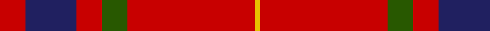
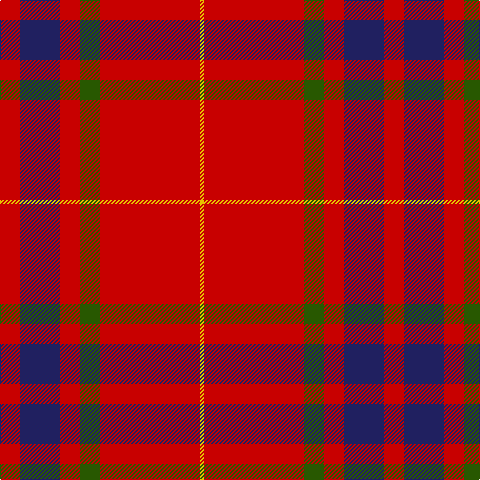

**Bands:** [RBRGRY](/stripes/rbrgry/) · **Stripes:** [R DB R DG R LY](/stripes/stripes6/) R DB R DG R LY

This was sourced from register-of-tartans.  It is a [6 band tartan](/bands/bands6/).

Original link https://www.tartanregister.gov.uk/tartanDetails.aspx?ref=99

## Attestations

This cloth appears in 2 source records; the oldest owns this page.

- 01/03/2001 — AON (register-of-tartans, [record](https://www.tartanregister.gov.uk/tartanDetails.aspx?ref=99))
- pre 2002 — Aon (Corporate) (tartans-authority, [record](http://www.tartansauthority.com/tartan-ferret/display/4012/))

## Register references

External register numbers recorded for this tartan.

- Scottish Register of Tartans: [99](https://www.tartanregister.gov.uk/tartanDetails.aspx?ref=99)
- Scottish Tartans Authority (ITI): 4012
- Scottish Tartans World Register: 2823

## Thread count
R/20 DB40 R20 G20 R100 Y/4

## Palette
Each colour and its ΔE from the base-6 reference it is a variant of.

| Colour | Shade | Base | ΔE (OKLab) |
|---|---|---|---|
| DB | <code style="background-color:#202060;">#202060</code> `#202060` | B <code style="background-color:#2A418A;">#2A418A</code> | 0.11 |
| G | <code style="background-color:#285800;">#285800</code> `#285800` | G <code style="background-color:#006100;">#006100</code> | 0.03 |
| R | <code style="background-color:#C80000;">#C80000</code> `#C80000` | R <code style="background-color:#CC0000;">#CC0000</code> | 0.01 |
| Y | <code style="background-color:#E8C000;">#E8C000</code> `#E8C000` | Y <code style="background-color:#F2BF00;">#F2BF00</code> | 0.02 |

# Sample pattern

## Nearest tartans

The nearest existing variants by ΔTartan distance.

1. [Sinclair (Logan)](/setts/s6/r28g16k4w1db6r28~x2/) — ΔT 1.10
1. [Greig (Personal)](/setts/s6/r60k2w3dg20r10dg20~x2/) — ΔT 1.12
1. [Sinclair Dress](/setts/s6/r28dg16k4lr1b6r28~x2/) — ΔT 1.22
1. [Sinclair](/setts/s6/r30dg12k5lr2b6r30~x2/) — ΔT 1.31
1. [Sinclair](/setts/s6/r30dg12k5lr2b6r30/) — ΔT 1.31
1. [Lovat or Fraser #2](/setts/s6/r80dp19r8dg36r10dp2~x2/) — ΔT 1.32
1. [Unidentified Locket](/setts/s4/db4r50dg25w2~x2/) — ΔT 1.32
1. [Sinclair](/setts/s6/r28g16k4w1t6r28~x2/) — ΔT 1.32
1. [MacKintosh #2](/setts/s6/r68db18r9dg34r9db3~x2/) — ΔT 1.33
1. [Highlands of Wyomissing (Corporate)](/setts/s8/r35lb3r8ly2dg11ly2r8lb3~x2/) — ΔT 1.35

## Neighbour map

Every grey dot is one of 14313 variants placed by the first two principal components of the ΔTartan feature space (44% of its variance). Red is this tartan; blue dots are its nearest — click one to open its page.

<svg viewBox="0 0 640 380" role="img" style="max-width:100%;height:auto;border:1px solid #e0e0e0;border-radius:4px;display:block" xmlns="http://www.w3.org/2000/svg"><image href="/nn/cloud.v1.png" width="640" height="380"/><a href="/setts/s6/r28g16k4w1db6r28~x2/"><circle cx="416.4" cy="156.6" r="4" fill="#3465a4"><title>Sinclair (Logan)</title></circle></a><a href="/setts/s6/r60k2w3dg20r10dg20~x2/"><circle cx="420.0" cy="151.1" r="4" fill="#3465a4"><title>Greig (Personal)</title></circle></a><a href="/setts/s6/r28dg16k4lr1b6r28~x2/"><circle cx="424.4" cy="165.6" r="4" fill="#3465a4"><title>Sinclair Dress</title></circle></a><a href="/setts/s6/r30dg12k5lr2b6r30~x2/"><circle cx="420.1" cy="182.7" r="4" fill="#3465a4"><title>Sinclair</title></circle></a><a href="/setts/s6/r30dg12k5lr2b6r30/"><circle cx="420.1" cy="182.7" r="4" fill="#3465a4"><title>Sinclair</title></circle></a><a href="/setts/s6/r80dp19r8dg36r10dp2~x2/"><circle cx="456.0" cy="152.5" r="4" fill="#3465a4"><title>Lovat or Fraser #2</title></circle></a><a href="/setts/s4/db4r50dg25w2~x2/"><circle cx="415.2" cy="175.2" r="4" fill="#3465a4"><title>Unidentified Locket</title></circle></a><a href="/setts/s6/r28g16k4w1t6r28~x2/"><circle cx="404.4" cy="151.9" r="4" fill="#3465a4"><title>Sinclair</title></circle></a><a href="/setts/s6/r68db18r9dg34r9db3~x2/"><circle cx="413.1" cy="180.7" r="4" fill="#3465a4"><title>MacKintosh #2</title></circle></a><a href="/setts/s8/r35lb3r8ly2dg11ly2r8lb3~x2/"><circle cx="448.7" cy="151.3" r="4" fill="#3465a4"><title>Highlands of Wyomissing (Corporate)</title></circle></a><circle cx="454.3" cy="166.1" r="5" fill="#c00000"/></svg>

ID: /setts/s6/r5db10r5dg5r25ly1~x4/
