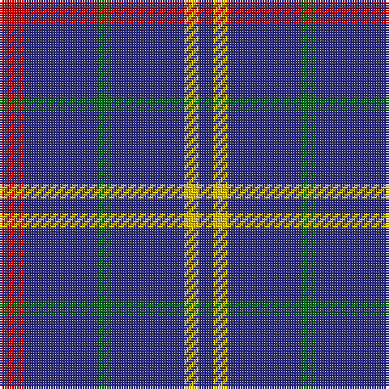

**Bands:** [RBGBYB](/stripes/rbgbyb/) · **Stripes:** [R DB G DB LY DB](/stripes/stripes6/) R DB G DB LY DB

This was sourced from register-of-tartans.  It is a [6 band tartan](/bands/bands6/).

Original link https://www.tartanregister.gov.uk/tartanDetails.aspx?ref=22

## Attestations

This cloth appears in 2 source records; the oldest owns this page.

- 01/01/2003 — Abertay University (Estimated threadcount) (register-of-tartans, [record](https://www.tartanregister.gov.uk/tartanDetails.aspx?ref=22))
- pre 2003 — Abertay University (Corporate) (tartans-authority, [record](http://www.tartansauthority.com/tartan-ferret/display/5990/))

## Register references

External register numbers recorded for this tartan.

- Scottish Register of Tartans: [22](https://www.tartanregister.gov.uk/tartanDetails.aspx?ref=22)
- Scottish Tartans Authority (ITI): 5990

## Thread count
R/10 DB30 G6 DB30 Y6 DB/6

## Palette
Each colour and its ΔE from the base-6 reference it is a variant of.

| Colour | Shade | Base | ΔE (OKLab) |
|---|---|---|---|
| DB | <code style="background-color:#2C2C80;">#2C2C80</code> `#2C2C80` | B <code style="background-color:#2A418A;">#2A418A</code> | 0.06 |
| G | <code style="background-color:#006818;">#006818</code> `#006818` | G <code style="background-color:#006100;">#006100</code> | 0.02 |
| R | <code style="background-color:#C80000;">#C80000</code> `#C80000` | R <code style="background-color:#CC0000;">#CC0000</code> | 0.01 |
| Y | <code style="background-color:#E8C000;">#E8C000</code> `#E8C000` | Y <code style="background-color:#F2BF00;">#F2BF00</code> | 0.02 |

# Sample pattern

## Nearest tartans

The nearest existing variants by ΔTartan distance.

1. [de Grussa (Personal)](/setts/s6/db24w4db24lo4r5k4~x2/) — ΔT 1.36
1. [Columba of Iona (School)](/setts/s8/db14m3db14dy6db14w4db14ly3~x2/) — ΔT 1.42
1. [Louisville Fire & Rescue P&D](/setts/s9/w1db8r3db2r1db2r3db8lo1~x4/) — ΔT 1.49
1. [De Grussa](/setts/s6/db24w4db24ly4r5k4~x2/) — ΔT 1.50
1. [Maud, Mary](/setts/s8/db65k9db21ly8db21w8db35r35/) — ΔT 1.53
1. [Dollar Academy (1930s) (Corporate)](/setts/s6/db9k9db9k9db42w5~x2/) — ΔT 1.59
1. [Ochterlonie](/setts/s6/db35lr8db21lr13db6lo4~x2/) — ΔT 1.78
1. [International Festival of Authors](/setts/s6/dp30m5dp5t4dp4g12~x2/) — ΔT 1.78
1. [Dollar Academy](/setts/s6/db9k9db9k9db42lb5~x2/) — ΔT 1.79
1. [South Australian Pipes & Drums (Corp](/setts/s6/db60ly6db11r25~x2/) — ΔT 1.87

## Neighbour map

Every grey dot is one of 14299 variants placed by the first two principal components of the ΔTartan feature space (44% of its variance). Red is this tartan; blue dots are its nearest — click one to open its page.

<svg viewBox="0 0 640 380" role="img" style="max-width:100%;height:auto;border:1px solid #e0e0e0;border-radius:4px;display:block" xmlns="http://www.w3.org/2000/svg"><image href="/nn/cloud.v1.png" width="640" height="380"/><a href="/setts/s6/db24w4db24lo4r5k4~x2/"><circle cx="377.3" cy="220.5" r="4" fill="#3465a4"><title>de Grussa (Personal)</title></circle></a><a href="/setts/s8/db14m3db14dy6db14w4db14ly3~x2/"><circle cx="376.3" cy="250.8" r="4" fill="#3465a4"><title>Columba of Iona (School)</title></circle></a><a href="/setts/s9/w1db8r3db2r1db2r3db8lo1~x4/"><circle cx="382.3" cy="207.3" r="4" fill="#3465a4"><title>Louisville Fire &amp; Rescue P&amp;D</title></circle></a><a href="/setts/s6/db24w4db24ly4r5k4~x2/"><circle cx="360.0" cy="213.4" r="4" fill="#3465a4"><title>De Grussa</title></circle></a><a href="/setts/s8/db65k9db21ly8db21w8db35r35/"><circle cx="350.1" cy="203.8" r="4" fill="#3465a4"><title>Maud, Mary</title></circle></a><a href="/setts/s6/db9k9db9k9db42w5~x2/"><circle cx="448.5" cy="249.6" r="4" fill="#3465a4"><title>Dollar Academy (1930s) (Corporate)</title></circle></a><a href="/setts/s6/db35lr8db21lr13db6lo4~x2/"><circle cx="388.0" cy="238.8" r="4" fill="#3465a4"><title>Ochterlonie</title></circle></a><a href="/setts/s6/dp30m5dp5t4dp4g12~x2/"><circle cx="349.1" cy="210.4" r="4" fill="#3465a4"><title>International Festival of Authors</title></circle></a><a href="/setts/s6/db9k9db9k9db42lb5~x2/"><circle cx="464.1" cy="257.7" r="4" fill="#3465a4"><title>Dollar Academy</title></circle></a><a href="/setts/s6/db60ly6db11r25~x2/"><circle cx="410.4" cy="214.8" r="4" fill="#3465a4"><title>South Australian Pipes &amp; Drums (Corp</title></circle></a><circle cx="401.5" cy="255.1" r="5" fill="#c00000"/></svg>

ID: /setts/s6/r5db15g3db15ly3db3~x2/
