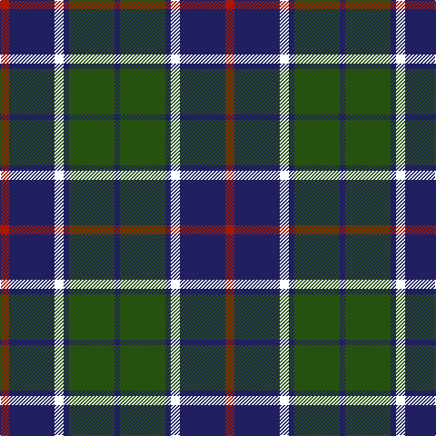

In pattern [BGBWBR](/stripes/bgbwbr/).

This was sourced from register-of-tartans.  It is a [6 stripe tartan](/stripes/stripes6/).

Original link https://www.tartanregister.gov.uk/tartanDetails.aspx?ref=10150

## Register references

External register numbers recorded for this tartan.

- Scottish Register of Tartans: [10150](https://www.tartanregister.gov.uk/tartanDetails.aspx?ref=10150)

## Thread count
DR/10 DB50 W10 DB6 G50 DB/6

## Palette
Each colour and its ΔE from the base-6 reference it is a variant of.

| Colour | Shade | Base | ΔE (OKLab) |
|---|---|---|---|
| DB | <code style="background-color:#202060;">#202060</code> `#202060` | B <code style="background-color:#2A418A;">#2A418A</code> | 0.11 |
| DR | <code style="background-color:#A51805;">#A51805</code> `#A51805` | R <code style="background-color:#CC0000;">#CC0000</code> | 0.08 |
| G | <code style="background-color:#255210;">#255210</code> `#255210` | G <code style="background-color:#006100;">#006100</code> | 0.05 |
| W | <code style="background-color:#FFFFFF;">#FFFFFF</code> `#FFFFFF` | W <code style="background-color:#F7F7F7;">#F7F7F7</code> | 0.02 |

# Sample pattern

## Nearest tartans

The nearest existing variants by ΔTartan distance.

1. [Thayer USA (Name)](/setts/s6/r5db25w5db3g25db3~x2/) — ΔT 0.54
1. [Irving of Bonshaw Tower (Personal)](/setts/s6/r2g3db2g14db14lr2~x2/) — ΔT 0.78
1. [Notre Dame Marching Guard (Corp)](/setts/s6/dr5b35k24b9g9dr5~x2/) — ΔT 0.92
1. [Michaluk (Personal)](/setts/s6/k3b4g20k20g3lo3~x4/) — ΔT 0.94
1. [MacTavish / Thom(p)son, hunting](/setts/s6/t4o28g6t12k12t3~x2/) — ΔT 0.99
1. [Flower of Scotland](/setts/s6/db3g28db3k16db28r3/) — ΔT 1.01
1. [Heritage Tartan, The](/setts/s6/db8r4db24g35lb4g8/) — ΔT 1.02
1. [Donnolly](/setts/s6/db3g21db3o21db35w3~x2/) — ΔT 1.06
1. [All as One (Corporate)](/setts/s5/k11t38r11g11k5~x2/) — ΔT 1.07
1. [Australian Police](/setts/s8/k5w5k5t11k3y17k30t3~x2/) — ΔT 1.08

## Neighbour map

Every grey dot is one of 14299 variants placed by the first two principal components of the ΔTartan feature space (44% of its variance). Red is this tartan; blue dots are its nearest — click one to open its page.

<svg viewBox="0 0 640 380" role="img" style="max-width:100%;height:auto;border:1px solid #e0e0e0;border-radius:4px;display:block" xmlns="http://www.w3.org/2000/svg"><image href="/nn/cloud.v1.png" width="640" height="380"/><a href="/setts/s6/r5db25w5db3g25db3~x2/"><circle cx="251.8" cy="215.9" r="4" fill="#3465a4"><title>Thayer USA (Name)</title></circle></a><a href="/setts/s6/r2g3db2g14db14lr2~x2/"><circle cx="256.3" cy="230.2" r="4" fill="#3465a4"><title>Irving of Bonshaw Tower (Personal)</title></circle></a><a href="/setts/s6/dr5b35k24b9g9dr5~x2/"><circle cx="235.5" cy="234.5" r="4" fill="#3465a4"><title>Notre Dame Marching Guard (Corp)</title></circle></a><a href="/setts/s6/k3b4g20k20g3lo3~x4/"><circle cx="234.0" cy="227.2" r="4" fill="#3465a4"><title>Michaluk (Personal)</title></circle></a><a href="/setts/s6/t4o28g6t12k12t3~x2/"><circle cx="202.5" cy="212.7" r="4" fill="#3465a4"><title>MacTavish / Thom(p)son, hunting</title></circle></a><a href="/setts/s6/db3g28db3k16db28r3/"><circle cx="207.2" cy="216.0" r="4" fill="#3465a4"><title>Flower of Scotland</title></circle></a><a href="/setts/s6/db8r4db24g35lb4g8/"><circle cx="284.9" cy="228.3" r="4" fill="#3465a4"><title>Heritage Tartan, The</title></circle></a><a href="/setts/s6/db3g21db3o21db35w3~x2/"><circle cx="265.1" cy="207.2" r="4" fill="#3465a4"><title>Donnolly</title></circle></a><a href="/setts/s5/k11t38r11g11k5~x2/"><circle cx="228.6" cy="231.3" r="4" fill="#3465a4"><title>All as One (Corporate)</title></circle></a><a href="/setts/s8/k5w5k5t11k3y17k30t3~x2/"><circle cx="258.0" cy="188.9" r="4" fill="#3465a4"><title>Australian Police</title></circle></a><circle cx="250.4" cy="215.6" r="5" fill="#c00000"/></svg>

ID: /setts/s6/r5db25w5db3dg25db3~x2/
