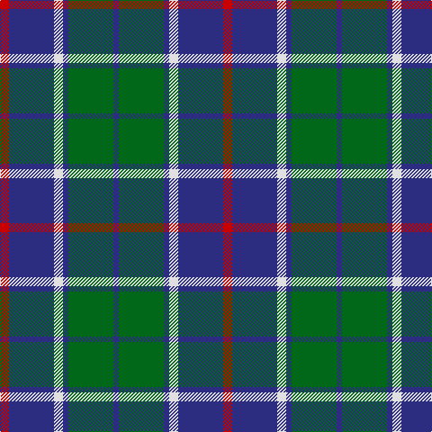

This page is one **sett** — a single exact thread-count. It belongs to the [tartan](/tartans/r5db25w5db3g25db3/)
(the same proportion at any scale), whose colour order is pattern [BGBWBR](/stripes/bgbwbr/).

Sourced from tartans-authority.  It is a [6 stripe tartan](/stripes/stripes6/).

Original link http://www.tartansauthority.com/tartan-ferret/display/10150/

## Register references

External register numbers recorded for this tartan.

- Scottish Register of Tartans: [10150](https://www.tartanregister.gov.uk/tartanDetails?ref=10150)
- Scottish Tartans Authority (ITI): 10150

## Thread count
R/10 DB50 LN10 DB6 G50 DB/6

## Palette

Palette: <strong>Tartan Register</strong>
<table><thead><tr><th>Colour</th><th>Threads</th><th>Shade</th><th>Base</th><th>OKLCh</th></tr></thead><tbody><tr><td>R/</td><td style="text-align:right;font-variant-numeric:tabular-nums">10</td><td><code style="background-color:#C80000;">#C80000</code> <small style="color:#888">#C80000</small></td><td>R <code style="background-color:#CC0000;">#CC0000</code></td><td><small style="color:#888">oklch(52.3% 0.215 29.2)</small></td></tr><tr><td>DB</td><td style="text-align:right;font-variant-numeric:tabular-nums">50</td><td><code style="background-color:#2C2C80;">#2C2C80</code> <small style="color:#888">#2C2C80</small></td><td>B <code style="background-color:#2A418A;">#2A418A</code></td><td><small style="color:#888">oklch(35.0% 0.138 276.6)</small></td></tr><tr><td>LN</td><td style="text-align:right;font-variant-numeric:tabular-nums">10</td><td><code style="background-color:#E0E0E0;">#E0E0E0</code> <small style="color:#888">#E0E0E0</small></td><td>W <code style="background-color:#F7F7F7;">#F7F7F7</code></td><td><small style="color:#888">oklch(90.7% 0.000 89.9)</small></td></tr><tr><td>DB</td><td style="text-align:right;font-variant-numeric:tabular-nums">6</td><td><code style="background-color:#2C2C80;">#2C2C80</code> <small style="color:#888">#2C2C80</small></td><td>B <code style="background-color:#2A418A;">#2A418A</code></td><td><small style="color:#888">oklch(35.0% 0.138 276.6)</small></td></tr><tr><td>G</td><td style="text-align:right;font-variant-numeric:tabular-nums">50</td><td><code style="background-color:#006818;">#006818</code> <small style="color:#888">#006818</small></td><td>G <code style="background-color:#006100;">#006100</code></td><td><small style="color:#888">oklch(45.0% 0.142 145.0)</small></td></tr><tr><td>DB/</td><td style="text-align:right;font-variant-numeric:tabular-nums">6</td><td><code style="background-color:#2C2C80;">#2C2C80</code> <small style="color:#888">#2C2C80</small></td><td>B <code style="background-color:#2A418A;">#2A418A</code></td><td><small style="color:#888">oklch(35.0% 0.138 276.6)</small></td></tr></tbody></table>

# Sample pattern

## Nearest tartans

The nearest existing variants by ΔTartan distance, with this tartan at the top so the swatches line up against it.

ΔTartan

Tartan

Sett

—

<a href="/ttd/edit/#slug=r5db25w5db3g25db3~x2">Thayer USA (Name)</a> <a class="nn-out" href="/setts/s6/r5db25w5db3g25db3~x2/" title="open its dictionary page">↗</a>

0.54

<a href="/ttd/edit/#slug=r5db25w5db3dg25db3~x2">Thayer USA</a> <a class="nn-out" href="/setts/s6/r5db25w5db3dg25db3~x2/" title="open its dictionary page">↗</a>

0.72

<a href="/ttd/edit/#slug=r2g3db2g14db14lr2~x2">Irving of Bonshaw Tower (Personal)</a> <a class="nn-out" href="/setts/s6/r2g3db2g14db14lr2~x2/" title="open its dictionary page">↗</a>

0.77

<a href="/ttd/edit/#slug=dr5b35k24b9g9dr5~x2">Notre Dame Marching Guard (Corp)</a> <a class="nn-out" href="/setts/s6/dr5b35k24b9g9dr5~x2/" title="open its dictionary page">↗</a>

0.83

<a href="/ttd/edit/#slug=k11t38r11g11k5~x2">All as One (Corporate)</a> <a class="nn-out" href="/setts/s5/k11t38r11g11k5~x2/" title="open its dictionary page">↗</a>

0.87

<a href="/ttd/edit/#slug=k3lb10db2g6db18g2~x2">Crombie House Check</a> <a class="nn-out" href="/setts/s6/k3lb10db2g6db18g2~x2/" title="open its dictionary page">↗</a>

0.94

<a href="/ttd/edit/#slug=db8r4db24g35lb4g8">Heritage Tartan, The</a> <a class="nn-out" href="/setts/s6/db8r4db24g35lb4g8/" title="open its dictionary page">↗</a>

0.98

<a href="/ttd/edit/#slug=r2g12db2g8db18w3r2w2~x2">Albuquerque, City of</a> <a class="nn-out" href="/setts/s8/r2g12db2g8db18w3r2w2~x2/" title="open its dictionary page">↗</a>

1.02

<a href="/ttd/edit/#slug=db3g21db3o21db35w3~x2">Donnolly</a> <a class="nn-out" href="/setts/s6/db3g21db3o21db35w3~x2/" title="open its dictionary page">↗</a>

1.03

<a href="/ttd/edit/#slug=w4g28db18r4db18ly3~x2">MacIntyre, Inglis</a> <a class="nn-out" href="/setts/s6/w4g28db18r4db18ly3~x2/" title="open its dictionary page">↗</a>

1.03

<a href="/ttd/edit/#slug=db5w3db36g38ly5g5~x2">St. Andrew Society, Sao Paulo (Corp)</a> <a class="nn-out" href="/setts/s6/db5w3db36g38ly5g5~x2/" title="open its dictionary page">↗</a>

## Neighbour map

Every grey dot is one of 14359 variants placed by the first two principal components of the ΔTartan feature space (44% of its variance). Red is this tartan; blue dots are its nearest — click one to open its page.

<svg viewBox="0 0 640 380" role="img" style="max-width:100%;height:auto;border:1px solid #e0e0e0;border-radius:4px;display:block" xmlns="http://www.w3.org/2000/svg"><image href="/nn/cloud.v1.png" width="640" height="380"/><a href="/setts/s6/r5db25w5db3dg25db3~x2/"><circle cx="250.0" cy="216.7" r="4" fill="#3465a4"><title>Thayer USA</title></circle></a><a href="/setts/s6/r2g3db2g14db14lr2~x2/"><circle cx="256.0" cy="231.4" r="4" fill="#3465a4"><title>Irving of Bonshaw Tower (Personal)</title></circle></a><a href="/setts/s6/dr5b35k24b9g9dr5~x2/"><circle cx="235.3" cy="235.8" r="4" fill="#3465a4"><title>Notre Dame Marching Guard (Corp)</title></circle></a><a href="/setts/s5/k11t38r11g11k5~x2/"><circle cx="228.1" cy="232.5" r="4" fill="#3465a4"><title>All as One (Corporate)</title></circle></a><a href="/setts/s6/k3lb10db2g6db18g2~x2/"><circle cx="226.8" cy="209.6" r="4" fill="#3465a4"><title>Crombie House Check</title></circle></a><a href="/setts/s6/db8r4db24g35lb4g8/"><circle cx="284.6" cy="229.3" r="4" fill="#3465a4"><title>Heritage Tartan, The</title></circle></a><a href="/setts/s8/r2g12db2g8db18w3r2w2~x2/"><circle cx="206.4" cy="191.4" r="4" fill="#3465a4"><title>Albuquerque, City of</title></circle></a><a href="/setts/s6/db3g21db3o21db35w3~x2/"><circle cx="264.6" cy="208.1" r="4" fill="#3465a4"><title>Donnolly</title></circle></a><a href="/setts/s6/w4g28db18r4db18ly3~x2/"><circle cx="223.6" cy="207.3" r="4" fill="#3465a4"><title>MacIntyre, Inglis</title></circle></a><a href="/setts/s6/db5w3db36g38ly5g5~x2/"><circle cx="293.6" cy="202.5" r="4" fill="#3465a4"><title>St. Andrew Society, Sao Paulo (Corp)</title></circle></a><circle cx="251.4" cy="217.0" r="5" fill="#c00000"/></svg>

ID: /setts/s6/r5db25w5db3g25db3~x2/
