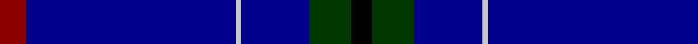

In pattern [KGBWBR](/stripes/kgbwbr/).

This was sourced from register-of-tartans.  It is a [6 stripe tartan](/stripes/stripes6/).

Original link https://www.tartanregister.gov.uk/tartanDetails.aspx?ref=2196

## Register references

External register numbers recorded for this tartan.

- Scottish Register of Tartans: [2196](https://www.tartanregister.gov.uk/tartanDetails.aspx?ref=2196)
- Scottish Tartans Authority (ITI): 4154

## Thread count
DR/10 DB80 N2 DB26 G16 K/8

## Palette
Each colour and its ΔE from the base-6 reference it is a variant of.

| Colour | Shade | Base | ΔE (OKLab) |
|---|---|---|---|
| DB | <code style="background-color:#00008C;">#00008C</code> `#00008C` | B <code style="background-color:#2A418A;">#2A418A</code> | 0.13 |
| DR | <code style="background-color:#8C0000;">#8C0000</code> `#8C0000` | R <code style="background-color:#CC0000;">#CC0000</code> | 0.14 |
| G | <code style="background-color:#003800;">#003800</code> `#003800` | G <code style="background-color:#006100;">#006100</code> | 0.14 |
| K | <code style="background-color:#000000;">#000000</code> `#000000` | K <code style="background-color:#000000;">#000000</code> | 0.00 |
| N | <code style="background-color:#C8C8C8;">#C8C8C8</code> `#C8C8C8` | W <code style="background-color:#F7F7F7;">#F7F7F7</code> | 0.14 |

# Sample pattern

## Nearest tartans

The nearest existing variants by ΔTartan distance.

1. [Royal Agricultural Winter Fair](/setts/s8/db32lb1db1lo2db1r1db4dg16~x4/) — ΔT 1.53
1. [French Freemasons' Pride (Fashion)](/setts/s6/db128r8t41n4t4n4/) — ΔT 1.58
1. [Waugh](/setts/s5/db100y10k5y10r8/) — ΔT 1.68
1. [Scotch Whisky, Heritage](/setts/s8/db73g16db10r8db10k4db10w2/) — ΔT 1.69
1. [Scotch Whisky Heritage Centre](/setts/s8/db73g16db10r8db10k4db10w2~x2/) — ΔT 1.77
1. [French Freemasons' Pride](/setts/s6/db128r8g41n4g4n4/) — ΔT 1.78
1. [Waugh (Name)](/setts/s5/db100t10k5t10r8/) — ΔT 1.79
1. [Michael (John) (Personal)](/setts/s6/g5w1r5k5db43r1~x2/) — ΔT 1.80
1. [Marist School, The](/setts/s8/db29db2db1db1db1db1t8lo1~x4/) — ΔT 1.84
1. [Gibson, Robert (Personal)](/setts/s7/k5db15k5b1k35m1k2~x4/) — ΔT 1.85

## Neighbour map

Every grey dot is one of 14299 variants placed by the first two principal components of the ΔTartan feature space (44% of its variance). Red is this tartan; blue dots are its nearest — click one to open its page.

<svg viewBox="0 0 640 380" role="img" style="max-width:100%;height:auto;border:1px solid #e0e0e0;border-radius:4px;display:block" xmlns="http://www.w3.org/2000/svg"><image href="/nn/cloud.v1.png" width="640" height="380"/><a href="/setts/s8/db32lb1db1lo2db1r1db4dg16~x4/"><circle cx="449.9" cy="140.0" r="4" fill="#3465a4"><title>Royal Agricultural Winter Fair</title></circle></a><a href="/setts/s6/db128r8t41n4t4n4/"><circle cx="481.0" cy="158.9" r="4" fill="#3465a4"><title>French Freemasons' Pride (Fashion)</title></circle></a><a href="/setts/s5/db100y10k5y10r8/"><circle cx="501.3" cy="184.5" r="4" fill="#3465a4"><title>Waugh</title></circle></a><a href="/setts/s8/db73g16db10r8db10k4db10w2/"><circle cx="504.0" cy="132.2" r="4" fill="#3465a4"><title>Scotch Whisky, Heritage</title></circle></a><a href="/setts/s8/db73g16db10r8db10k4db10w2~x2/"><circle cx="541.2" cy="142.5" r="4" fill="#3465a4"><title>Scotch Whisky Heritage Centre</title></circle></a><a href="/setts/s6/db128r8g41n4g4n4/"><circle cx="455.7" cy="150.7" r="4" fill="#3465a4"><title>French Freemasons' Pride</title></circle></a><a href="/setts/s5/db100t10k5t10r8/"><circle cx="512.4" cy="183.4" r="4" fill="#3465a4"><title>Waugh (Name)</title></circle></a><a href="/setts/s6/g5w1r5k5db43r1~x2/"><circle cx="504.7" cy="129.6" r="4" fill="#3465a4"><title>Michael (John) (Personal)</title></circle></a><a href="/setts/s8/db29db2db1db1db1db1t8lo1~x4/"><circle cx="502.5" cy="144.1" r="4" fill="#3465a4"><title>Marist School, The</title></circle></a><a href="/setts/s7/k5db15k5b1k35m1k2~x4/"><circle cx="525.0" cy="167.5" r="4" fill="#3465a4"><title>Gibson, Robert (Personal)</title></circle></a><circle cx="502.6" cy="164.0" r="5" fill="#c00000"/></svg>

ID: /setts/s6/r5db40lb1db13dg8k4~x2/
