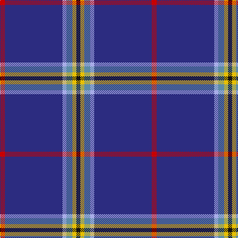

In pattern [KYBWBR](/stripes/kybwbr/).

This was sourced from tartans-authority.  It is a [6 stripe tartan](/stripes/stripes6/).

Original link http://www.tartansauthority.com/tartan-ferret/display/10932/

## Thread count
R/10 DB116 LP8 B12 Y8 K/8

## Palette
Each colour and its ΔE from the base-6 reference it is a variant of.

| Colour | Shade | Base | ΔE (OKLab) |
|---|---|---|---|
| B | <code style="background-color:#5C8CA8;">#5C8CA8</code> `#5C8CA8` | B <code style="background-color:#2A418A;">#2A418A</code> | 0.23 |
| DB | <code style="background-color:#2C2C80;">#2C2C80</code> `#2C2C80` | B <code style="background-color:#2A418A;">#2A418A</code> | 0.06 |
| K | <code style="background-color:#101010;">#101010</code> `#101010` | K <code style="background-color:#000000;">#000000</code> | 0.17 |
| LP | <code style="background-color:#A8ACE8;">#A8ACE8</code> `#A8ACE8` | W <code style="background-color:#F7F7F7;">#F7F7F7</code> | 0.23 |
| R | <code style="background-color:#C80000;">#C80000</code> `#C80000` | R <code style="background-color:#CC0000;">#CC0000</code> | 0.01 |
| Y | <code style="background-color:#E8C000;">#E8C000</code> `#E8C000` | Y <code style="background-color:#F2BF00;">#F2BF00</code> | 0.02 |

# Sample pattern

## Nearest tartans

The nearest existing variants by ΔTartan distance.

1. [Kendle (2013)](/setts/s6/r5db58lr4t6ly4k4~x2/) — ΔT 0.07
1. [Laidlaw's Highland Drovers (Corp)](/setts/s7/db35k10db4w2db3r2ly2~x2/) — ΔT 1.12
1. [Special Air Service](/setts/s5/db26lb6g1r1w2~x2/) — ΔT 1.61
1. [Blue Rust](/setts/s8/db21n2w1n2db1r2db1o6~x4/) — ΔT 1.65
1. [St. Petersburg City (District)](/setts/s8/db60g10db3lb6ly2db9r2w2~x2/) — ΔT 1.68
1. [Blue Rust (Corporate)](/setts/s8/db21n2lr1n2db1r2db1o6~x4/) — ΔT 1.69
1. [Special Air Service](/setts/s5/db26t6dg1o1w2~x2/) — ΔT 1.73
1. [Loretto School](/setts/s8/db4r14dp6r5db12dg8db70m4/) — ΔT 1.75
1. [Lloyd of Astargus](/setts/s6/r2db61k13w2o20lo2~x2/) — ΔT 1.78
1. [Indiana #2](/setts/s8/db50ly4db3ly4db8k2db12w5~x2/) — ΔT 1.85

## Neighbour map

Every grey dot is one of 14299 variants placed by the first two principal components of the ΔTartan feature space (44% of its variance). Red is this tartan; blue dots are its nearest — click one to open its page.

<svg viewBox="0 0 640 380" role="img" style="max-width:100%;height:auto;border:1px solid #e0e0e0;border-radius:4px;display:block" xmlns="http://www.w3.org/2000/svg"><image href="/nn/cloud.v1.png" width="640" height="380"/><a href="/setts/s6/r5db58lr4t6ly4k4~x2/"><circle cx="420.7" cy="139.3" r="4" fill="#3465a4"><title>Kendle (2013)</title></circle></a><a href="/setts/s7/db35k10db4w2db3r2ly2~x2/"><circle cx="452.9" cy="153.5" r="4" fill="#3465a4"><title>Laidlaw's Highland Drovers (Corp)</title></circle></a><a href="/setts/s5/db26lb6g1r1w2~x2/"><circle cx="439.9" cy="137.1" r="4" fill="#3465a4"><title>Special Air Service</title></circle></a><a href="/setts/s8/db21n2w1n2db1r2db1o6~x4/"><circle cx="383.4" cy="133.4" r="4" fill="#3465a4"><title>Blue Rust</title></circle></a><a href="/setts/s8/db60g10db3lb6ly2db9r2w2~x2/"><circle cx="479.2" cy="97.4" r="4" fill="#3465a4"><title>St. Petersburg City (District)</title></circle></a><a href="/setts/s8/db21n2lr1n2db1r2db1o6~x4/"><circle cx="396.2" cy="140.0" r="4" fill="#3465a4"><title>Blue Rust (Corporate)</title></circle></a><a href="/setts/s5/db26t6dg1o1w2~x2/"><circle cx="453.6" cy="149.0" r="4" fill="#3465a4"><title>Special Air Service</title></circle></a><a href="/setts/s8/db4r14dp6r5db12dg8db70m4/"><circle cx="411.4" cy="137.7" r="4" fill="#3465a4"><title>Loretto School</title></circle></a><a href="/setts/s6/r2db61k13w2o20lo2~x2/"><circle cx="371.5" cy="125.4" r="4" fill="#3465a4"><title>Lloyd of Astargus</title></circle></a><a href="/setts/s8/db50ly4db3ly4db8k2db12w5~x2/"><circle cx="412.6" cy="123.7" r="4" fill="#3465a4"><title>Indiana #2</title></circle></a><circle cx="420.3" cy="139.1" r="5" fill="#c00000"/></svg>

ID: /setts/s6/r5db58lb4t6ly4k4~x2/
