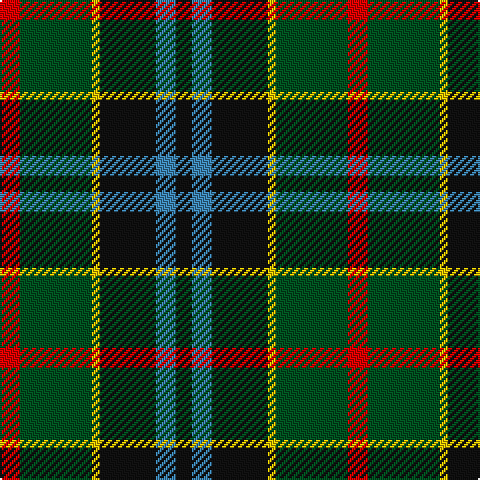

This page is one **sett** — a single exact thread-count. It belongs to the [tartan](/tartans/r5dg18ly2k14t5k4/)
(the same proportion at any scale), whose colour order is pattern [KBKYGR](/stripes/kbkygr/).

Sourced from register-of-tartans.  It is a [6 stripe tartan](/stripes/stripes6/).

Original link https://www.tartanregister.gov.uk/tartanDetails.aspx?ref=4333

## Also known as

This cloth is also recorded under:

- Dahlonega
- Unnamed, No 79

## Register references

External register numbers recorded for this tartan.

- Scottish Register of Tartans: [4333](https://www.tartanregister.gov.uk/tartanDetails.aspx?ref=4333)
- Scottish Tartans World Register: 1057

## Thread count
R/10 G36 Y4 K28 B10 K/8

## Palette

Palette: <strong>Tartan Register</strong>
<table><thead><tr><th>Colour</th><th>Threads</th><th>Shade</th><th>Base</th><th>OKLCh</th></tr></thead><tbody><tr><td>R/</td><td style="text-align:right;font-variant-numeric:tabular-nums">10</td><td><code style="background-color:#DC0000;">#DC0000</code> <small style="color:#888">#DC0000</small></td><td>R <code style="background-color:#CC0000;">#CC0000</code></td><td><small style="color:#888">oklch(56.2% 0.230 29.2)</small></td></tr><tr><td>G</td><td style="text-align:right;font-variant-numeric:tabular-nums">36</td><td><code style="background-color:#005020;">#005020</code> <small style="color:#888">#005020</small></td><td>G <code style="background-color:#006100;">#006100</code></td><td><small style="color:#888">oklch(37.7% 0.105 149.6)</small></td></tr><tr><td>Y</td><td style="text-align:right;font-variant-numeric:tabular-nums">4</td><td><code style="background-color:#E8C000;">#E8C000</code> <small style="color:#888">#E8C000</small></td><td>Y <code style="background-color:#F2BF00;">#F2BF00</code></td><td><small style="color:#888">oklch(81.9% 0.168 93.7)</small></td></tr><tr><td>K</td><td style="text-align:right;font-variant-numeric:tabular-nums">28</td><td><code style="background-color:#101010;">#101010</code> <small style="color:#888">#101010</small></td><td>K <code style="background-color:#000000;">#000000</code></td><td><small style="color:#888">oklch(17.3% 0.000 89.9)</small></td></tr><tr><td>B</td><td style="text-align:right;font-variant-numeric:tabular-nums">10</td><td><code style="background-color:#3C82AF;">#3C82AF</code> <small style="color:#888">#3C82AF</small></td><td>B <code style="background-color:#2A418A;">#2A418A</code></td><td><small style="color:#888">oklch(58.1% 0.099 239.8)</small></td></tr><tr><td>K/</td><td style="text-align:right;font-variant-numeric:tabular-nums">8</td><td><code style="background-color:#101010;">#101010</code> <small style="color:#888">#101010</small></td><td>K <code style="background-color:#000000;">#000000</code></td><td><small style="color:#888">oklch(17.3% 0.000 89.9)</small></td></tr></tbody></table>

# Sample pattern

## Nearest tartans

The nearest existing variants by ΔTartan distance, with this tartan at the top so the swatches line up against it.

ΔTartan

Tartan

Sett

—

<a href="/ttd/edit/#slug=r5dg18ly2k14t5k4~x2">Unidentified No 79</a> <a class="nn-out" href="/setts/s6/r5dg18ly2k14t5k4~x2/" title="open its dictionary page">↗</a>

0.74

<a href="/ttd/edit/#slug=db18r3k9r3g23ly3~x2">Royal College of Physicians (Corp)</a> <a class="nn-out" href="/setts/s6/db18r3k9r3g23ly3~x2/" title="open its dictionary page">↗</a>

0.91

<a href="/ttd/edit/#slug=r2k8lo1k8g8t8r2~x4">Brodie Hunting</a> <a class="nn-out" href="/setts/s7/r2k8lo1k8g8t8r2~x4/" title="open its dictionary page">↗</a>

0.92

<a href="/ttd/edit/#slug=db27g5ly8k20ly3g15r3~x2">Nelson Mandela (Personal)</a> <a class="nn-out" href="/setts/s7/db27g5ly8k20ly3g15r3~x2/" title="open its dictionary page">↗</a>

0.94

<a href="/ttd/edit/#slug=r10db6g24db24r6ly3">Canine All Dogs (Fashion)</a> <a class="nn-out" href="/setts/s6/r10db6g24db24r6ly3/" title="open its dictionary page">↗</a>

0.94

<a href="/ttd/edit/#slug=k1g8w1k8db8r1~x4">Leslie Hunting</a> <a class="nn-out" href="/setts/s6/k1g8w1k8db8r1~x4/" title="open its dictionary page">↗</a>

0.95

<a href="/ttd/edit/#slug=k4w1g10k10db10r2~x4">Rose Hunting</a> <a class="nn-out" href="/setts/s6/k4w1g10k10db10r2~x4/" title="open its dictionary page">↗</a>

0.95

<a href="/ttd/edit/#slug=dg24k5dg6r6dg6k20b20w2~x2">Dunfermline Bank of Scotland (Corp)</a> <a class="nn-out" href="/setts/s8/dg24k5dg6r6dg6k20b20w2~x2/" title="open its dictionary page">↗</a>

0.95

<a href="/ttd/edit/#slug=k18db12k5g4r6g12k2lo4~x2">MacLeish</a> <a class="nn-out" href="/setts/s8/k18db12k5g4r6g12k2lo4~x2/" title="open its dictionary page">↗</a>

0.98

<a href="/ttd/edit/#slug=k4w1g10k10db10r2~x2">Rose Hunting Clan Tartan Tartan Number: 1226. Earliest known date: 1831 First recorded in James Logan's, 'The Scottish Gael' in 1831. See products available Copyright © Blair Urquhart, Comrie, 2015</a> <a class="nn-out" href="/setts/s6/k4w1g10k10db10r2~x2/" title="open its dictionary page">↗</a>

1.00

<a href="/ttd/edit/#slug=k7db11k3db11dy11g22db3~x2">Scottish Odyssey Commemorative Tartan Tartan Number: 4071. Earliest known date: 01/01/2002 The Scottish Odyssey tartan from Lochcarron is a 'celebration of the wonderful experiences to be gained' from a visit to Scotland and some of the most spectacularly contrasting landscapes to be seen in Europe. See products available Copyright © Blair Urquhart, Comrie, 2015</a> <a class="nn-out" href="/setts/s7/k7db11k3db11dy11g22db3~x2/" title="open its dictionary page">↗</a>

## Neighbour map

Every grey dot is one of 14299 variants placed by the first two principal components of the ΔTartan feature space (44% of its variance). Red is this tartan; blue dots are its nearest — click one to open its page.

<svg viewBox="0 0 640 380" role="img" style="max-width:100%;height:auto;border:1px solid #e0e0e0;border-radius:4px;display:block" xmlns="http://www.w3.org/2000/svg"><image href="/nn/cloud.v1.png" width="640" height="380"/><a href="/setts/s6/db18r3k9r3g23ly3~x2/"><circle cx="168.7" cy="210.9" r="4" fill="#3465a4"><title>Royal College of Physicians (Corp)</title></circle></a><a href="/setts/s7/r2k8lo1k8g8t8r2~x4/"><circle cx="155.6" cy="218.0" r="4" fill="#3465a4"><title>Brodie Hunting</title></circle></a><a href="/setts/s7/db27g5ly8k20ly3g15r3~x2/"><circle cx="121.4" cy="196.0" r="4" fill="#3465a4"><title>Nelson Mandela (Personal)</title></circle></a><a href="/setts/s6/r10db6g24db24r6ly3/"><circle cx="142.2" cy="214.1" r="4" fill="#3465a4"><title>Canine All Dogs (Fashion)</title></circle></a><a href="/setts/s6/k1g8w1k8db8r1~x4/"><circle cx="160.6" cy="221.4" r="4" fill="#3465a4"><title>Leslie Hunting</title></circle></a><a href="/setts/s6/k4w1g10k10db10r2~x4/"><circle cx="166.4" cy="223.2" r="4" fill="#3465a4"><title>Rose Hunting</title></circle></a><a href="/setts/s8/dg24k5dg6r6dg6k20b20w2~x2/"><circle cx="182.1" cy="193.7" r="4" fill="#3465a4"><title>Dunfermline Bank of Scotland (Corp)</title></circle></a><a href="/setts/s8/k18db12k5g4r6g12k2lo4~x2/"><circle cx="156.5" cy="209.9" r="4" fill="#3465a4"><title>MacLeish</title></circle></a><a href="/setts/s6/k4w1g10k10db10r2~x2/"><circle cx="170.6" cy="225.3" r="4" fill="#3465a4"><title>Rose Hunting Clan Tartan Tartan Number: 1226. Earliest known date: 1831 First recorded in James Logan's, 'The Scottish Gael' in 1831. See products available Copyright © Blair Urquhart, Comrie, 2015</title></circle></a><a href="/setts/s7/k7db11k3db11dy11g22db3~x2/"><circle cx="127.9" cy="223.8" r="4" fill="#3465a4"><title>Scottish Odyssey Commemorative Tartan Tartan Number: 4071. Earliest known date: 01/01/2002 The Scottish Odyssey tartan from Lochcarron is a 'celebration of the wonderful experiences to be gained' from a visit to Scotland and some of the most spectacularly contrasting landscapes to be seen in Europe. See products available Copyright © Blair Urquhart, Comrie, 2015</title></circle></a><circle cx="171.0" cy="212.9" r="5" fill="#c00000"/></svg>

ID: /setts/s6/r5dg18ly2k14t5k4~x2/
