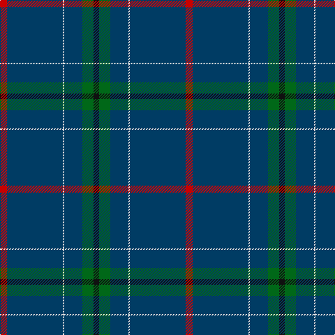

This page is one **sett** — a single exact thread-count. It belongs to the [tartan](/tartans/r5dt40w1dt13g8k4/)
(the same proportion at any scale), whose colour order is pattern [KGBWBR](/stripes/kgbwbr/).

Sourced from register-of-tartans.  It is a [6 stripe tartan](/stripes/stripes6/).

Original link https://www.tartanregister.gov.uk/tartanDetails.aspx?ref=2199

2 attestations — the source records this cloth was collapsed from (oldest owns this page)

<ul>
<li>01/05/1997 — London Scottish Rugby Club (register-of-tartans, <a href="https://www.tartanregister.gov.uk/tartanDetails.aspx?ref=2199">record</a>)</li>
<li>May 1998 — London Scottish Rugby Club (Corp) (tartans-authority, <a href="http://www.tartansauthority.com/tartan-ferret/display/2360/">record</a>)</li>
</ul>

## Register references

External register numbers recorded for this tartan.

- Scottish Register of Tartans: [2199](https://www.tartanregister.gov.uk/tartanDetails.aspx?ref=2199)
- Scottish Tartans Authority (ITI): 2360
- Scottish Tartans World Register: 2360

## Thread count
R/10 DB80 LN2 DB26 G16 K/8

## Palette

Palette: <strong>Tartan Register</strong>
<table><thead><tr><th>Colour</th><th>Threads</th><th>Shade</th><th>Base</th><th>OKLCh</th></tr></thead><tbody><tr><td>R/</td><td style="text-align:right;font-variant-numeric:tabular-nums">10</td><td><code style="background-color:#C80000;">#C80000</code> <small style="color:#888">#C80000</small></td><td>R <code style="background-color:#CC0000;">#CC0000</code></td><td><small style="color:#888">oklch(52.3% 0.215 29.2)</small></td></tr><tr><td>DB</td><td style="text-align:right;font-variant-numeric:tabular-nums">80</td><td><code style="background-color:#003C64;">#003C64</code> <small style="color:#888">#003C64</small></td><td>B <code style="background-color:#2A418A;">#2A418A</code></td><td><small style="color:#888">oklch(34.5% 0.089 246.0)</small></td></tr><tr><td>LN</td><td style="text-align:right;font-variant-numeric:tabular-nums">2</td><td><code style="background-color:#E0E0E0;">#E0E0E0</code> <small style="color:#888">#E0E0E0</small></td><td>W <code style="background-color:#F7F7F7;">#F7F7F7</code></td><td><small style="color:#888">oklch(90.7% 0.000 89.9)</small></td></tr><tr><td>DB</td><td style="text-align:right;font-variant-numeric:tabular-nums">26</td><td><code style="background-color:#003C64;">#003C64</code> <small style="color:#888">#003C64</small></td><td>B <code style="background-color:#2A418A;">#2A418A</code></td><td><small style="color:#888">oklch(34.5% 0.089 246.0)</small></td></tr><tr><td>G</td><td style="text-align:right;font-variant-numeric:tabular-nums">16</td><td><code style="background-color:#006818;">#006818</code> <small style="color:#888">#006818</small></td><td>G <code style="background-color:#006100;">#006100</code></td><td><small style="color:#888">oklch(45.0% 0.142 145.0)</small></td></tr><tr><td>K/</td><td style="text-align:right;font-variant-numeric:tabular-nums">8</td><td><code style="background-color:#101010;">#101010</code> <small style="color:#888">#101010</small></td><td>K <code style="background-color:#000000;">#000000</code></td><td><small style="color:#888">oklch(17.3% 0.000 89.9)</small></td></tr></tbody></table>

# Sample pattern

## Nearest tartans

The nearest existing variants by ΔTartan distance, with this tartan at the top so the swatches line up against it.

ΔTartan

Tartan

Sett

—

<a href="/ttd/edit/#slug=r5dt40w1dt13g8k4~x2">London Scottish Rugby Club</a> <a class="nn-out" href="/setts/s6/r5dt40w1dt13g8k4~x2/" title="open its dictionary page">↗</a>

1.39

<a href="/ttd/edit/#slug=dt18w2k1w4dg13dt40r2~x2">Puxty-Dunne</a> <a class="nn-out" href="/setts/s7/dt18w2k1w4dg13dt40r2~x2/" title="open its dictionary page">↗</a>

1.41

<a href="/setts/s6/n65ki2n4k2n10r24~x2/">Norsemen, The</a>

1.43

<a href="/ttd/edit/#slug=g8dt13w1dt40r5dt40w1dt13g8k4~x2">London Scottish Rugby Club Corporate Sport Tartan Tartan Number: 2360. Earliest known date: May 1998 For the use of staff and club members. Blue should be almost blue/black. See products available Copyright © Blair Urquhart, Comrie, 2015</a> <a class="nn-out" href="/setts/s10/g8dt13w1dt40r5dt40w1dt13g8k4~x2/" title="open its dictionary page">↗</a>

1.44

<a href="/ttd/edit/#slug=db73g16db10r8db10k4db10w2~x2">Scotch Whisky Heritage Centre</a> <a class="nn-out" href="/setts/s8/db73g16db10r8db10k4db10w2~x2/" title="open its dictionary page">↗</a>

1.52

<a href="/ttd/edit/#slug=do4t48do21t14lo3t6do1ly3~x2">Munster Ancestry</a> <a class="nn-out" href="/setts/s8/do4t48do21t14lo3t6do1ly3~x2/" title="open its dictionary page">↗</a>

1.55

<a href="/ttd/edit/#slug=dt58o3y16r3lo2y7dt29r3o2~x2">Aberdeen Mither Kirk (St Nicholas)</a> <a class="nn-out" href="/setts/s9/dt58o3y16r3lo2y7dt29r3o2~x2/" title="open its dictionary page">↗</a>

1.68

<a href="/ttd/edit/#slug=k50db2k13w1k13db5dg15r2~x2">Center</a> <a class="nn-out" href="/setts/s8/k50db2k13w1k13db5dg15r2~x2/" title="open its dictionary page">↗</a>

1.72

<a href="/ttd/edit/#slug=db40g8k1ly2k1g8db5~x4">Salvation Army, Hunting</a> <a class="nn-out" href="/setts/s7/db40g8k1ly2k1g8db5~x4/" title="open its dictionary page">↗</a>

1.73

<a href="/ttd/edit/#slug=w2db45g9r1n9ri1~x2">Wilton (Name)</a> <a class="nn-out" href="/setts/s6/w2db45g9r1n9ri1~x2/" title="open its dictionary page">↗</a>

1.74

<a href="/ttd/edit/#slug=n15k55w1dp5r2ly1~x2">Venters (Edinburgh)</a> <a class="nn-out" href="/setts/s6/n15k55w1dp5r2ly1~x2/" title="open its dictionary page">↗</a>

## Neighbour map

Every grey dot is one of 14359 variants placed by the first two principal components of the ΔTartan feature space (44% of its variance). Red is this tartan; blue dots are its nearest — click one to open its page.

<svg viewBox="0 0 640 380" role="img" style="max-width:100%;height:auto;border:1px solid #e0e0e0;border-radius:4px;display:block" xmlns="http://www.w3.org/2000/svg"><image href="/nn/cloud.v1.png" width="640" height="380"/><a href="/setts/s7/dt18w2k1w4dg13dt40r2~x2/"><circle cx="503.3" cy="152.9" r="4" fill="#3465a4"><title>Puxty-Dunne</title></circle></a><a href="/setts/s6/n65ki2n4k2n10r24~x2/"><circle cx="551.6" cy="177.2" r="4" fill="#3465a4"><title>Norsemen, The</title></circle></a><a href="/setts/s10/g8dt13w1dt40r5dt40w1dt13g8k4~x2/"><circle cx="567.2" cy="164.2" r="4" fill="#3465a4"><title>London Scottish Rugby Club Corporate Sport Tartan Tartan Number: 2360. Earliest known date: May 1998 For the use of staff and club members. Blue should be almost blue/black. See products available Copyright © Blair Urquhart, Comrie, 2015</title></circle></a><a href="/setts/s8/db73g16db10r8db10k4db10w2~x2/"><circle cx="540.4" cy="142.6" r="4" fill="#3465a4"><title>Scotch Whisky Heritage Centre</title></circle></a><a href="/setts/s8/do4t48do21t14lo3t6do1ly3~x2/"><circle cx="503.7" cy="156.8" r="4" fill="#3465a4"><title>Munster Ancestry</title></circle></a><a href="/setts/s9/dt58o3y16r3lo2y7dt29r3o2~x2/"><circle cx="515.2" cy="165.1" r="4" fill="#3465a4"><title>Aberdeen Mither Kirk (St Nicholas)</title></circle></a><a href="/setts/s8/k50db2k13w1k13db5dg15r2~x2/"><circle cx="548.7" cy="151.0" r="4" fill="#3465a4"><title>Center</title></circle></a><a href="/setts/s7/db40g8k1ly2k1g8db5~x4/"><circle cx="486.5" cy="143.3" r="4" fill="#3465a4"><title>Salvation Army, Hunting</title></circle></a><a href="/setts/s6/w2db45g9r1n9ri1~x2/"><circle cx="453.9" cy="121.7" r="4" fill="#3465a4"><title>Wilton (Name)</title></circle></a><a href="/setts/s6/n15k55w1dp5r2ly1~x2/"><circle cx="502.9" cy="129.6" r="4" fill="#3465a4"><title>Venters (Edinburgh)</title></circle></a><circle cx="524.1" cy="170.6" r="5" fill="#c00000"/></svg>

ID: /setts/s6/r5dt40w1dt13g8k4~x2/
