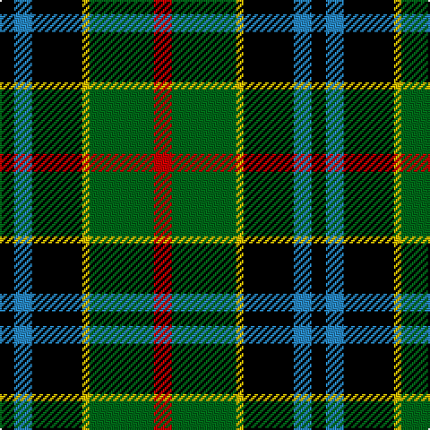

This page is one **sett** — a single exact thread-count. It belongs to the [tartan](/tartans/r5g18ly2k14t5k4/)
(the same proportion at any scale), whose colour order is pattern [KBKYGR](/stripes/kbkygr/).

Sourced from tartans-authority.  It is a [6 stripe tartan](/stripes/stripes6/).

Original link http://www.tartansauthority.com/tartan-ferret/display/7882/

## Also known as

This cloth is also recorded under:

- Dahlonega
- Unnamed, No 79

2 attestations — the source records this cloth was collapsed from (oldest owns this page)

<ul>
<li>1870 — Dahlonega (District) (tartans-authority, <a href="http://www.tartansauthority.com/tartan-ferret/display/7882/">record</a>)</li>
<li>undated — Unnamed, No 79 (weddslist, <a href="http://www.weddslist.com/cgi-bin/tartans/pg.pl?source=sts">record</a>)</li>
</ul>

## Thread count
R/10 G36 Y4 K28 B10 K/8

## Palette

Palette: <strong>Tartan Register</strong>
<table><thead><tr><th>Colour</th><th>Threads</th><th>Shade</th><th>Base</th><th>OKLCh</th></tr></thead><tbody><tr><td>R/</td><td style="text-align:right;font-variant-numeric:tabular-nums">10</td><td><code style="background-color:#C80000;">#C80000</code> <small style="color:#888">#C80000</small></td><td>R <code style="background-color:#CC0000;">#CC0000</code></td><td><small style="color:#888">oklch(52.3% 0.215 29.2)</small></td></tr><tr><td>G</td><td style="text-align:right;font-variant-numeric:tabular-nums">36</td><td><code style="background-color:#006818;">#006818</code> <small style="color:#888">#006818</small></td><td>G <code style="background-color:#006100;">#006100</code></td><td><small style="color:#888">oklch(45.0% 0.142 145.0)</small></td></tr><tr><td>Y</td><td style="text-align:right;font-variant-numeric:tabular-nums">4</td><td><code style="background-color:#E8C000;">#E8C000</code> <small style="color:#888">#E8C000</small></td><td>Y <code style="background-color:#F2BF00;">#F2BF00</code></td><td><small style="color:#888">oklch(81.9% 0.168 93.7)</small></td></tr><tr><td>K</td><td style="text-align:right;font-variant-numeric:tabular-nums">28</td><td><code style="background-color:#000000;">#000000</code> <small style="color:#888">#000000</small></td><td>K <code style="background-color:#000000;">#000000</code></td><td><small style="color:#888">oklch(0.0% 0.000 0.0)</small></td></tr><tr><td>B</td><td style="text-align:right;font-variant-numeric:tabular-nums">10</td><td><code style="background-color:#2888C4;">#2888C4</code> <small style="color:#888">#2888C4</small></td><td>B <code style="background-color:#2A418A;">#2A418A</code></td><td><small style="color:#888">oklch(60.1% 0.125 241.5)</small></td></tr><tr><td>K/</td><td style="text-align:right;font-variant-numeric:tabular-nums">8</td><td><code style="background-color:#000000;">#000000</code> <small style="color:#888">#000000</small></td><td>K <code style="background-color:#000000;">#000000</code></td><td><small style="color:#888">oklch(0.0% 0.000 0.0)</small></td></tr></tbody></table>

# Sample pattern

## Nearest tartans

The nearest existing variants by ΔTartan distance, with this tartan at the top so the swatches line up against it.

ΔTartan

Tartan

Sett

—

<a href="/ttd/edit/#slug=r5g18ly2k14t5k4~x2">Dahlonega (District)</a> <a class="nn-out" href="/setts/s6/r5g18ly2k14t5k4~x2/" title="open its dictionary page">↗</a>

0.68

<a href="/ttd/edit/#slug=k2g11ly1k8db9r2~x4">Forsyth</a> <a class="nn-out" href="/setts/s6/k2g11ly1k8db9r2~x4/" title="open its dictionary page">↗</a>

0.73

<a href="/ttd/edit/#slug=w1db8k9g9k1ly1~x4">MacNeil 4</a> <a class="nn-out" href="/setts/s6/w1db8k9g9k1ly1~x4/" title="open its dictionary page">↗</a>

0.75

<a href="/ttd/edit/#slug=r4g16k16db4g3db12ly2~x2">Junior Chamber International</a> <a class="nn-out" href="/setts/s7/r4g16k16db4g3db12ly2~x2/" title="open its dictionary page">↗</a>

0.81

<a href="/ttd/edit/#slug=r10db24r4k30g36db5">MacWilliam</a> <a class="nn-out" href="/setts/s6/r10db24r4k30g36db5/" title="open its dictionary page">↗</a>

0.84

<a href="/ttd/edit/#slug=r2db8k8w1g8k1~x2">Leslie, hunting</a> <a class="nn-out" href="/setts/s6/r2db8k8w1g8k1~x2/" title="open its dictionary page">↗</a>

0.87

<a href="/ttd/edit/#slug=g17ly2k14r2db9r2db10~x2">MacDonald, (Flora.. )</a> <a class="nn-out" href="/setts/s7/g17ly2k14r2db9r2db10~x2/" title="open its dictionary page">↗</a>

0.89

<a href="/ttd/edit/#slug=w1db12k12g12k5ly1~x4">MacNeil 5</a> <a class="nn-out" href="/setts/s6/w1db12k12g12k5ly1~x4/" title="open its dictionary page">↗</a>

0.89

<a href="/ttd/edit/#slug=k2g11ly1k8b9r2~x4">Forsyth (1795)</a> <a class="nn-out" href="/setts/s6/k2g11ly1k8b9r2~x4/" title="open its dictionary page">↗</a>

0.90

<a href="/ttd/edit/#slug=k2g12k12r1db12w2~x2">Russell, or Mitchell or Hunter or Galbraith</a> <a class="nn-out" href="/setts/s6/k2g12k12r1db12w2~x2/" title="open its dictionary page">↗</a>

0.94

<a href="/ttd/edit/#slug=r3k2g15k10db20ly2~x2">MacLeod of Assynt</a> <a class="nn-out" href="/setts/s6/r3k2g15k10db20ly2~x2/" title="open its dictionary page">↗</a>

## Neighbour map

Every grey dot is one of 14299 variants placed by the first two principal components of the ΔTartan feature space (44% of its variance). Red is this tartan; blue dots are its nearest — click one to open its page.

<svg viewBox="0 0 640 380" role="img" style="max-width:100%;height:auto;border:1px solid #e0e0e0;border-radius:4px;display:block" xmlns="http://www.w3.org/2000/svg"><image href="/nn/cloud.v1.png" width="640" height="380"/><a href="/setts/s6/k2g11ly1k8db9r2~x4/"><circle cx="127.4" cy="197.0" r="4" fill="#3465a4"><title>Forsyth</title></circle></a><a href="/setts/s6/w1db8k9g9k1ly1~x4/"><circle cx="129.1" cy="196.5" r="4" fill="#3465a4"><title>MacNeil 4</title></circle></a><a href="/setts/s7/r4g16k16db4g3db12ly2~x2/"><circle cx="109.6" cy="200.9" r="4" fill="#3465a4"><title>Junior Chamber International</title></circle></a><a href="/setts/s6/r10db24r4k30g36db5/"><circle cx="109.5" cy="206.2" r="4" fill="#3465a4"><title>MacWilliam</title></circle></a><a href="/setts/s6/r2db8k8w1g8k1~x2/"><circle cx="107.6" cy="206.5" r="4" fill="#3465a4"><title>Leslie, hunting</title></circle></a><a href="/setts/s7/g17ly2k14r2db9r2db10~x2/"><circle cx="116.7" cy="199.0" r="4" fill="#3465a4"><title>MacDonald, (Flora.. )</title></circle></a><a href="/setts/s6/w1db12k12g12k5ly1~x4/"><circle cx="157.8" cy="198.6" r="4" fill="#3465a4"><title>MacNeil 5</title></circle></a><a href="/setts/s6/k2g11ly1k8b9r2~x4/"><circle cx="121.2" cy="195.1" r="4" fill="#3465a4"><title>Forsyth (1795)</title></circle></a><a href="/setts/s6/k2g12k12r1db12w2~x2/"><circle cx="136.7" cy="190.3" r="4" fill="#3465a4"><title>Russell, or Mitchell or Hunter or Galbraith</title></circle></a><a href="/setts/s6/r3k2g15k10db20ly2~x2/"><circle cx="154.2" cy="193.1" r="4" fill="#3465a4"><title>MacLeod of Assynt</title></circle></a><circle cx="140.5" cy="200.8" r="5" fill="#c00000"/></svg>

ID: /setts/s6/r5g18ly2k14t5k4~x2/
