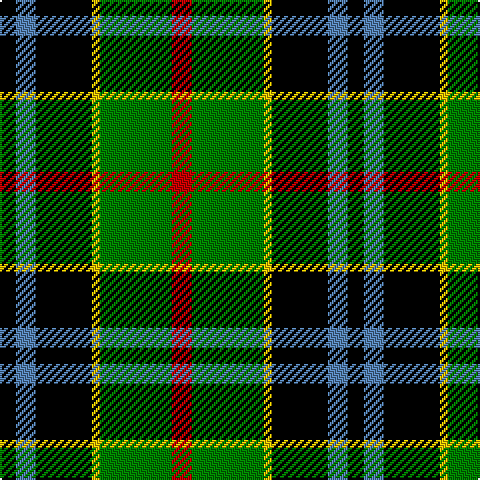

In pattern [KBKYGR](/patterns/kbkygr/).

This was sourced from weddslist.  It is a [6 stripes tartan](/stripes/stripes6/).

Original link http://www.weddslist.com/cgi-bin/tartans/pg.pl?source=sts

## Thread count
K/8 B10 K28 Y4 G36 R/10

## Palette
Each colour and its ΔE from the base-6 reference it is a variant of.

| Colour | Shade | Base | ΔE (OKLab) |
|---|---|---|---|
| B | <code style="background-color:#5480B0;">#5480B0</code> `#5480B0` | B <code style="background-color:#2A418A;">#2A418A</code> | 0.19 |
| G | <code style="background-color:#008000;">#008000</code> `#008000` | G <code style="background-color:#006100;">#006100</code> | 0.10 |
| K | <code style="background-color:#000000;">#000000</code> `#000000` | K <code style="background-color:#000000;">#000000</code> | 0.00 |
| R | <code style="background-color:#C00000;">#C00000</code> `#C00000` | R <code style="background-color:#CC0000;">#CC0000</code> | 0.03 |
| Y | <code style="background-color:#F0C000;">#F0C000</code> `#F0C000` | Y <code style="background-color:#F2BF00;">#F2BF00</code> | 0.00 |

# Sample pattern

## Nearest tartans

The nearest existing variants by ΔTartan distance.

1. [Dahlonega (District)](/setts/s6/r5g18y2k14b5k4x2~b2888c4-g006818-k000000-rc80000-ye8c000/) — ΔT 0.37
1. [Forsyth](/setts/s6/k2g11y1k8b9r2x4~b304080-g008000-k000000-rc00000-yf0c000/) — ΔT 0.87
1. [Junior Chamber International](/setts/s7/r4g16k16b4g3b12y2x2~b304080-g008000-k000000-rc00000-yf0c000/) — ΔT 0.90
1. [MacNeil 4](/setts/s6/w1b8k9g9k1y1x4~b304080-g008000-k000000-we0e0e0-yf0c000/) — ΔT 0.92
1. [Sanix Modern](/setts/s5/r2b16k11g19y2x2~b304080-g30a010-k000000-rc00000-yf0c000/) — ΔT 0.95
1. [Forsyth (1795)](/setts/s6/k2g11y1k8b9r2x4~b1474b4-g007800-k000000-rc80000-ye8c000/) — ΔT 0.96
1. [MacWilliam](/setts/s6/r10b24r4k30g36ba5~b304080-ba000050-g008000-k000000-rc00000/) — ΔT 1.02
1. [MacFadzean, MacPhedran](/setts/s7/g3b12w1k12g13r2g2x2~b304080-g008000-k000000-rc00000-we0e0e0/) — ΔT 1.04
1. [MacDonald, (Flora.. )](/setts/s7/g17y2k14r2b9r2b10x2~b304080-g008000-k000000-rc00000-yf0c000/) — ΔT 1.06
1. [MacPhadran](/setts/s7/g3b12y1k12g13r2g2x2~b304080-g008000-k000000-rc00000-yb0b0b0/) — ΔT 1.06

## Neighbour map

Every grey dot is one of 15726 variants placed by the first two principal components of the ΔTartan feature space (44% of its variance). Red is this tartan; blue dots are its nearest — click one to open its page.

<svg viewBox="0 0 640 380" role="img" style="max-width:100%;height:auto;border:1px solid #e0e0e0;border-radius:4px;display:block" xmlns="http://www.w3.org/2000/svg"><image href="/nn/cloud.v1.png" width="640" height="380"/><a href="/setts/s6/r5g18y2k14b5k4x2~b2888c4-g006818-k000000-rc80000-ye8c000/"><circle cx="136.9" cy="201.7" r="4" fill="#3465a4"><title>Dahlonega (District)</title></circle></a><a href="/setts/s6/k2g11y1k8b9r2x4~b304080-g008000-k000000-rc00000-yf0c000/"><circle cx="123.5" cy="196.7" r="4" fill="#3465a4"><title>Forsyth</title></circle></a><a href="/setts/s7/r4g16k16b4g3b12y2x2~b304080-g008000-k000000-rc00000-yf0c000/"><circle cx="105.8" cy="200.4" r="4" fill="#3465a4"><title>Junior Chamber International</title></circle></a><a href="/setts/s6/w1b8k9g9k1y1x4~b304080-g008000-k000000-we0e0e0-yf0c000/"><circle cx="125.0" cy="196.6" r="4" fill="#3465a4"><title>MacNeil 4</title></circle></a><a href="/setts/s5/r2b16k11g19y2x2~b304080-g30a010-k000000-rc00000-yf0c000/"><circle cx="132.3" cy="207.3" r="4" fill="#3465a4"><title>Sanix Modern</title></circle></a><a href="/setts/s6/k2g11y1k8b9r2x4~b1474b4-g007800-k000000-rc80000-ye8c000/"><circle cx="117.1" cy="195.0" r="4" fill="#3465a4"><title>Forsyth (1795)</title></circle></a><a href="/setts/s6/r10b24r4k30g36ba5~b304080-ba000050-g008000-k000000-rc00000/"><circle cx="105.9" cy="205.6" r="4" fill="#3465a4"><title>MacWilliam</title></circle></a><a href="/setts/s7/g3b12w1k12g13r2g2x2~b304080-g008000-k000000-rc00000-we0e0e0/"><circle cx="163.0" cy="178.7" r="4" fill="#3465a4"><title>MacFadzean, MacPhedran</title></circle></a><a href="/setts/s7/g17y2k14r2b9r2b10x2~b304080-g008000-k000000-rc00000-yf0c000/"><circle cx="112.9" cy="198.4" r="4" fill="#3465a4"><title>MacDonald, (Flora.. )</title></circle></a><a href="/setts/s7/g3b12y1k12g13r2g2x2~b304080-g008000-k000000-rc00000-yb0b0b0/"><circle cx="165.1" cy="179.7" r="4" fill="#3465a4"><title>MacPhadran</title></circle></a><circle cx="132.2" cy="199.4" r="5" fill="#c00000"/></svg>

ID: /setts/s6/r5g18y2k14b5k4x2~b5480b0-g008000-k000000-rc00000-yf0c000/
