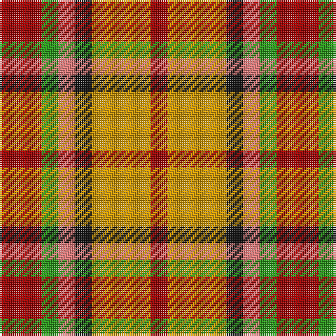

In pattern [RGRKYR](/stripes/rgrkyr/).

This was sourced from register-of-tartans.  It is a [6 stripe tartan](/stripes/stripes6/).

Original link https://www.tartanregister.gov.uk/tartanDetails.aspx?ref=4458

## Attestations

This cloth appears in 2 source records; the oldest owns this page.

- 01/01/1991 — Victoria, City of (British Columbia) (register-of-tartans, [record](https://www.tartanregister.gov.uk/tartanDetails.aspx?ref=4458))
- 1991 — Victoria, City of (Fashion) (tartans-authority, [record](http://www.tartansauthority.com/tartan-ferret/display/4344/))

## Register references

External register numbers recorded for this tartan.

- Scottish Register of Tartans: [4458](https://www.tartanregister.gov.uk/tartanDetails.aspx?ref=4458)
- Scottish Tartans Authority (ITI): 4344

## Thread count
DRa/20 G8 LR8 K8 DY28 DRa/8

## Palette
Each colour and its ΔE from the base-6 reference it is a variant of.

| Colour | Shade | Base | ΔE (OKLab) |
|---|---|---|---|
| DR | <code style="background-color:#880000;">#880000</code> `#880000` | R <code style="background-color:#CC0000;">#CC0000</code> | 0.15 |
| DRa | <code style="background-color:#A00000;">#A00000</code> `#A00000` | R <code style="background-color:#CC0000;">#CC0000</code> | 0.09 |
| DY | <code style="background-color:#D09800;">#D09800</code> `#D09800` | Y <code style="background-color:#F2BF00;">#F2BF00</code> | 0.12 |
| G | <code style="background-color:#289C18;">#289C18</code> `#289C18` | G <code style="background-color:#006100;">#006100</code> | 0.19 |
| K | <code style="background-color:#101010;">#101010</code> `#101010` | K <code style="background-color:#000000;">#000000</code> | 0.17 |
| LR | <code style="background-color:#E87878;">#E87878</code> `#E87878` | R <code style="background-color:#CC0000;">#CC0000</code> | 0.19 |
| R | <code style="background-color:#C80000;">#C80000</code> `#C80000` | R <code style="background-color:#CC0000;">#CC0000</code> | 0.01 |

# Sample pattern

## Nearest tartans

The nearest existing variants by ΔTartan distance.

1. [Blackie](/setts/s8/g9ly2g9w5r9t2r9t2~x2/) — ΔT 1.35
1. [Aboyne II (Fashion)](/setts/s6/r2ly1r5k4g5w1~x4/) — ΔT 1.41
1. [Tinkler (Corporate)](/setts/s9/g2lo9do6r3do2r3do2r10w2~x4/) — ΔT 1.60
1. [Jardine of Castlemilk](/setts/s9/r8dy33ly33k33r8db8ly33db8r8/) — ΔT 1.67
1. [Tinkler, Andrew (Stobart Group)](/setts/s9/g2ly9dy6o3dy2o3dy2o10w2~x4/) — ΔT 1.70
1. [Glasgows, Miles Better](/setts/s10/ly12y4n4ly4n4r4n15y15r15ly8~x2/) — ΔT 1.72
1. [Londonderry](/setts/s7/r6k2g12lo8r5k2g3~x4/) — ΔT 1.77
1. [Manx Mannin Plaid](/setts/s4/w1r5dy5ly1~x4/) — ΔT 1.78
1. [Inspiration](/setts/s5/r5db12ly11n21ly5~x2/) — ΔT 1.79
1. [Jardine, of Castlemilk](/setts/s9/r8o33ly33k33r8db8ly33db8r8/) — ΔT 1.84

## Neighbour map

Every grey dot is one of 14299 variants placed by the first two principal components of the ΔTartan feature space (44% of its variance). Red is this tartan; blue dots are its nearest — click one to open its page.

<svg viewBox="0 0 640 380" role="img" style="max-width:100%;height:auto;border:1px solid #e0e0e0;border-radius:4px;display:block" xmlns="http://www.w3.org/2000/svg"><image href="/nn/cloud.v1.png" width="640" height="380"/><a href="/setts/s8/g9ly2g9w5r9t2r9t2~x2/"><circle cx="114.9" cy="218.2" r="4" fill="#3465a4"><title>Blackie</title></circle></a><a href="/setts/s6/r2ly1r5k4g5w1~x4/"><circle cx="113.6" cy="221.6" r="4" fill="#3465a4"><title>Aboyne II (Fashion)</title></circle></a><a href="/setts/s9/g2lo9do6r3do2r3do2r10w2~x4/"><circle cx="159.6" cy="205.4" r="4" fill="#3465a4"><title>Tinkler (Corporate)</title></circle></a><a href="/setts/s9/r8dy33ly33k33r8db8ly33db8r8/"><circle cx="78.4" cy="195.5" r="4" fill="#3465a4"><title>Jardine of Castlemilk</title></circle></a><a href="/setts/s9/g2ly9dy6o3dy2o3dy2o10w2~x4/"><circle cx="163.5" cy="210.6" r="4" fill="#3465a4"><title>Tinkler, Andrew (Stobart Group)</title></circle></a><a href="/setts/s10/ly12y4n4ly4n4r4n15y15r15ly8~x2/"><circle cx="91.5" cy="234.1" r="4" fill="#3465a4"><title>Glasgows, Miles Better</title></circle></a><a href="/setts/s7/r6k2g12lo8r5k2g3~x4/"><circle cx="148.9" cy="224.4" r="4" fill="#3465a4"><title>Londonderry</title></circle></a><a href="/setts/s4/w1r5dy5ly1~x4/"><circle cx="210.4" cy="246.9" r="4" fill="#3465a4"><title>Manx Mannin Plaid</title></circle></a><a href="/setts/s5/r5db12ly11n21ly5~x2/"><circle cx="95.1" cy="239.9" r="4" fill="#3465a4"><title>Inspiration</title></circle></a><a href="/setts/s9/r8o33ly33k33r8db8ly33db8r8/"><circle cx="71.5" cy="192.0" r="4" fill="#3465a4"><title>Jardine, of Castlemilk</title></circle></a><circle cx="108.4" cy="235.1" r="5" fill="#c00000"/></svg>

ID: /setts/s6/r5g2r2k2lo7r2~x4/
