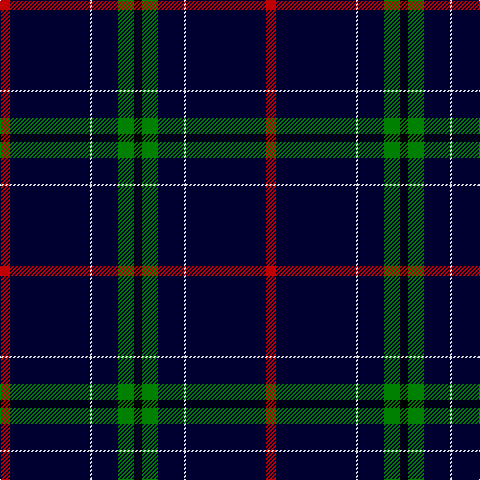

In pattern [KGKWKR](/stripes/kgkwkr/).

This was sourced from weddslist.  It is a [6 stripe tartan](/stripes/stripes6/).

Original link http://www.weddslist.com/cgi-bin/tartans/pg.pl?source=sts

## Thread count
R/10 DB80 LN2 DB26 G16 K/8

## Palette
Each colour and the base-6 reference it is a variant of.

| Colour | Shade | Base |
|---|---|---|
| DB | <code style="background-color:#000030;">#000030</code> `oklch(14.0% 0.097 264.1)` <small>#000030</small> | K <code style="background-color:#000000;">#000000</code> |
| G | <code style="background-color:#008000;">#008000</code> `oklch(52.0% 0.177 142.5)` <small>#008000</small> | G <code style="background-color:#006100;">#006100</code> |
| K | <code style="background-color:#000000;">#000000</code> `oklch(0.0% 0.000 0.0)` <small>#000000</small> | K <code style="background-color:#000000;">#000000</code> |
| LN | <code style="background-color:#E0E0E0;">#E0E0E0</code> `oklch(90.7% 0.000 89.9)` <small>#E0E0E0</small> | W <code style="background-color:#F7F7F7;">#F7F7F7</code> |
| R | <code style="background-color:#C00000;">#C00000</code> `oklch(50.7% 0.208 29.2)` <small>#C00000</small> | R <code style="background-color:#CC0000;">#CC0000</code> |

# Sample pattern

## Nearest tartans

The nearest existing variants by ΔTartan distance, with this tartan at the top so the swatches line up against it.

ΔTartan

Tartan

Sett

—

<a href="/ttd/edit/#slug=r5k40w1k13g8k4~x2">London Scottish Rugby Club</a> <a class="nn-out" href="/setts/s6/r5k40w1k13g8k4~x2/" title="open its dictionary page">↗</a>

1.18

<a href="/ttd/edit/#slug=k64y12n6k15o1y5lr1~x2">McCann of Castlecraig (Personal)</a> <a class="nn-out" href="/setts/s7/k64y12n6k15o1y5lr1~x2/" title="open its dictionary page">↗</a>

1.19

<a href="/ttd/edit/#slug=db73g16db10r8db10k4db10w2">Scotch Whisky, Heritage</a> <a class="nn-out" href="/setts/s8/db73g16db10r8db10k4db10w2/" title="open its dictionary page">↗</a>

1.46

<a href="/ttd/edit/#slug=k5db15k5b1k35m1k2~x4">Gibson, Robert (Personal)</a> <a class="nn-out" href="/setts/s7/k5db15k5b1k35m1k2~x4/" title="open its dictionary page">↗</a>

1.57

<a href="/ttd/edit/#slug=db26t6dg1o1w2~x2">Special Air Service</a> <a class="nn-out" href="/setts/s5/db26t6dg1o1w2~x2/" title="open its dictionary page">↗</a>

1.58

<a href="/ttd/edit/#slug=db75k4r25db6k6w2~x2">Hong Kong St Andrew's Society</a> <a class="nn-out" href="/setts/s6/db75k4r25db6k6w2~x2/" title="open its dictionary page">↗</a>

1.63

<a href="/ttd/edit/#slug=t6k6t6db3w1k39ly3k3~x2">Washington County Sheriff’s Office (Oregon)</a> <a class="nn-out" href="/setts/s8/t6k6t6db3w1k39ly3k3~x2/" title="open its dictionary page">↗</a>

1.63

<a href="/ttd/edit/#slug=k5lo1dg7r1k45r5lo3k4lo3~x2">Brooks Brothers Signature (Corporate</a> <a class="nn-out" href="/setts/s9/k5lo1dg7r1k45r5lo3k4lo3~x2/" title="open its dictionary page">↗</a>

1.66

<a href="/ttd/edit/#slug=db10t2k2db1k6t1k45lo2~x2">Marine Harvest (Scotland)</a> <a class="nn-out" href="/setts/s8/db10t2k2db1k6t1k45lo2~x2/" title="open its dictionary page">↗</a>

1.68

<a href="/ttd/edit/#slug=k50b2k13w1k13b5g15r2~x2">Center (Name)</a> <a class="nn-out" href="/setts/s8/k50b2k13w1k13b5g15r2~x2/" title="open its dictionary page">↗</a>

1.70

<a href="/ttd/edit/#slug=w3dt9ly1lb3dp9lb1dt40dp2~x2">Parkin</a> <a class="nn-out" href="/setts/s8/w3dt9ly1lb3dp9lb1dt40dp2~x2/" title="open its dictionary page">↗</a>

## Neighbour map

Every grey dot is one of 14299 variants placed by the first two principal components of the ΔTartan feature space (44% of its variance). Red is this tartan; blue dots are its nearest — click one to open its page.

<svg viewBox="0 0 640 380" role="img" style="max-width:100%;height:auto;border:1px solid #e0e0e0;border-radius:4px;display:block" xmlns="http://www.w3.org/2000/svg"><image href="/nn/cloud.v1.png" width="640" height="380"/><a href="/setts/s7/k64y12n6k15o1y5lr1~x2/"><circle cx="535.7" cy="132.6" r="4" fill="#3465a4"><title>McCann of Castlecraig (Personal)</title></circle></a><a href="/setts/s8/db73g16db10r8db10k4db10w2/"><circle cx="504.0" cy="132.2" r="4" fill="#3465a4"><title>Scotch Whisky, Heritage</title></circle></a><a href="/setts/s7/k5db15k5b1k35m1k2~x4/"><circle cx="525.0" cy="167.5" r="4" fill="#3465a4"><title>Gibson, Robert (Personal)</title></circle></a><a href="/setts/s5/db26t6dg1o1w2~x2/"><circle cx="453.6" cy="149.0" r="4" fill="#3465a4"><title>Special Air Service</title></circle></a><a href="/setts/s6/db75k4r25db6k6w2~x2/"><circle cx="458.4" cy="142.1" r="4" fill="#3465a4"><title>Hong Kong St Andrew's Society</title></circle></a><a href="/setts/s8/t6k6t6db3w1k39ly3k3~x2/"><circle cx="447.3" cy="105.5" r="4" fill="#3465a4"><title>Washington County Sheriff’s Office (Oregon)</title></circle></a><a href="/setts/s9/k5lo1dg7r1k45r5lo3k4lo3~x2/"><circle cx="509.7" cy="120.0" r="4" fill="#3465a4"><title>Brooks Brothers Signature (Corporate</title></circle></a><a href="/setts/s8/db10t2k2db1k6t1k45lo2~x2/"><circle cx="551.3" cy="125.6" r="4" fill="#3465a4"><title>Marine Harvest (Scotland)</title></circle></a><a href="/setts/s8/k50b2k13w1k13b5g15r2~x2/"><circle cx="515.1" cy="133.1" r="4" fill="#3465a4"><title>Center (Name)</title></circle></a><a href="/setts/s8/w3dt9ly1lb3dp9lb1dt40dp2~x2/"><circle cx="474.3" cy="109.5" r="4" fill="#3465a4"><title>Parkin</title></circle></a><circle cx="476.9" cy="149.8" r="5" fill="#c00000"/></svg>

ID: /setts/s6/r5k40w1k13g8k4~x2/
