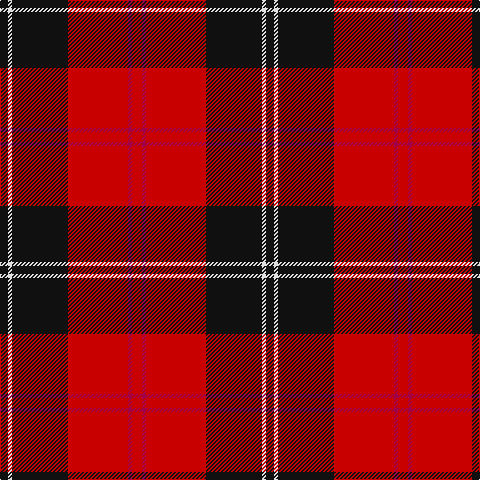

In pattern [KWKRRR](/patterns/kwkrrr/).

This was sourced from house-of-tartan.  It is a [6 stripes tartan](/stripes/stripes6/).

Original link http://www.house-of-tartan.scotland.net/house/TartanViewjs.asp?colr=Def&tnam=1238

## Thread count
K/8 LN4 K56 Ra60 R4 Ra/10

## Palette
Each colour and its ΔE from the base-6 reference it is a variant of.

| Colour | Shade | Base | ΔE (OKLab) |
|---|---|---|---|
| K | <code style="background-color:#101010;">#101010</code> `#101010` | K <code style="background-color:#000000;">#000000</code> | 0.17 |
| LN | <code style="background-color:#E0E0E0;">#E0E0E0</code> `#E0E0E0` | W <code style="background-color:#F7F7F7;">#F7F7F7</code> | 0.07 |
| R | <code style="background-color:#A00048;">#A00048</code> `#A00048` | R <code style="background-color:#CC0000;">#CC0000</code> | 0.12 |
| Ra | <code style="background-color:#C80000;">#C80000</code> `#C80000` | R <code style="background-color:#CC0000;">#CC0000</code> | 0.01 |

# Sample pattern

## Nearest tartans

The nearest existing variants by ΔTartan distance.

1. [Cetoloni (Personal)](/setts/s6/b1r12k6y1k6b1~b2c2c80-k101010-rc80000-ye8c000~x4/) — ΔT 0.85
1. [Dunbar #2](/setts/s6/k4r26k4w2k13y4~k101010-rdc0000-we0e0e0-ye8c000~x2/) — ΔT 0.95
1. [Monmouth College](/setts/s6/k4r33k24w3k4r3~k101010-rc80000-we0e0e0~x2/) — ΔT 0.99
1. [Cunningham #2](/setts/s7/k3r2k30r28k2r2w3~k101010-rc80000-we0e0e0~x2/) — ΔT 1.06
1. [Brodie (Clan)](/setts/s6/k2r16k8y1k8r2~k101010-rc80000-yd8b000~x4/) — ΔT 1.06
1. [MacPherson Red Cluny](/setts/s7/r6k3r29k23w4k7y3~k101010-rdc0000-we0e0e0-ye8c000~x2/) — ΔT 1.09
1. [Dunbar](/setts/s6/k4r26k4w2k13y4~k000000-rc00000-we0e0e0-yf0c000~x2/) — ΔT 1.09
1. [Ramsay (Red)](/setts/s6/k4w1k28r30b1r3~b440044-k101010-rc80000-wf8f8f8~x2/) — ΔT 1.11
1. [MacIver Clan Tartan Tartan Number: 1855. Earliest known date: 1906 Kith and Kin lists MacIvers in Argyll associated with Campbell, in Ross and Lewis with MacKenzie, and in Perthshire with Robertson. H. Whyte introduced tartans for many clan septs in his book, 'The Tartans of the Clans and Septs of Scotland' published by W & A.K. Johnston, Edinburgh, in 1906. There is no 'hunting' MacIver though the 'MacArthur' is sometimes mistakenly worn as such. If a hunting version were devised it would probably retain the yellow and white stripes unlike the MacArthur which has no white. See products available Copyright © Blair Urquhart, Comrie, 2015](/setts/s9/w1r9k2r2k12r2k2r9y1~k101010-rc80000-we0e0e0-ye8c000~x4/) — ΔT 1.12
1. [Templar Grand Priory USA](/setts/s4/b3k32r27w2~b2c2c80-k101010-rc80000-we0e0e0~x2/) — ΔT 1.13

## Neighbour map

Every grey dot is one of 15726 variants placed by the first two principal components of the ΔTartan feature space (44% of its variance). Red is this tartan; blue dots are its nearest — click one to open its page.

<svg viewBox="0 0 640 380" role="img" style="max-width:100%;height:auto;border:1px solid #e0e0e0;border-radius:4px;display:block" xmlns="http://www.w3.org/2000/svg"><image href="/nn/cloud.v1.png" width="640" height="380"/><a href="/setts/s6/b1r12k6y1k6b1~b2c2c80-k101010-rc80000-ye8c000~x4/"><circle cx="272.4" cy="191.3" r="4" fill="#3465a4"><title>Cetoloni (Personal)</title></circle></a><a href="/setts/s6/k4r26k4w2k13y4~k101010-rdc0000-we0e0e0-ye8c000~x2/"><circle cx="281.0" cy="172.1" r="4" fill="#3465a4"><title>Dunbar #2</title></circle></a><a href="/setts/s6/k4r33k24w3k4r3~k101010-rc80000-we0e0e0~x2/"><circle cx="334.8" cy="200.0" r="4" fill="#3465a4"><title>Monmouth College</title></circle></a><a href="/setts/s7/k3r2k30r28k2r2w3~k101010-rc80000-we0e0e0~x2/"><circle cx="350.0" cy="172.6" r="4" fill="#3465a4"><title>Cunningham #2</title></circle></a><a href="/setts/s6/k2r16k8y1k8r2~k101010-rc80000-yd8b000~x4/"><circle cx="340.6" cy="204.2" r="4" fill="#3465a4"><title>Brodie (Clan)</title></circle></a><a href="/setts/s7/r6k3r29k23w4k7y3~k101010-rdc0000-we0e0e0-ye8c000~x2/"><circle cx="260.7" cy="180.6" r="4" fill="#3465a4"><title>MacPherson Red Cluny</title></circle></a><a href="/setts/s6/k4r26k4w2k13y4~k000000-rc00000-we0e0e0-yf0c000~x2/"><circle cx="271.4" cy="174.4" r="4" fill="#3465a4"><title>Dunbar</title></circle></a><a href="/setts/s6/k4w1k28r30b1r3~b440044-k101010-rc80000-wf8f8f8~x2/"><circle cx="367.1" cy="145.6" r="4" fill="#3465a4"><title>Ramsay (Red)</title></circle></a><a href="/setts/s9/w1r9k2r2k12r2k2r9y1~k101010-rc80000-we0e0e0-ye8c000~x4/"><circle cx="321.1" cy="170.7" r="4" fill="#3465a4"><title>MacIver Clan Tartan Tartan Number: 1855. Earliest known date: 1906 Kith and Kin lists MacIvers in Argyll associated with Campbell, in Ross and Lewis with MacKenzie, and in Perthshire with Robertson. H. Whyte introduced tartans for many clan septs in his book, 'The Tartans of the Clans and Septs of Scotland' published by W &amp; A.K. Johnston, Edinburgh, in 1906. There is no 'hunting' MacIver though the 'MacArthur' is sometimes mistakenly worn as such. If a hunting version were devised it would probably retain the yellow and white stripes unlike the MacArthur which has no white. See products available Copyright © Blair Urquhart, Comrie, 2015</title></circle></a><a href="/setts/s4/b3k32r27w2~b2c2c80-k101010-rc80000-we0e0e0~x2/"><circle cx="314.6" cy="204.6" r="4" fill="#3465a4"><title>Templar Grand Priory USA</title></circle></a><circle cx="325.0" cy="173.8" r="5" fill="#c00000"/></svg>

ID: /setts/s6/r5ra2r30k28w2k4~k101010-rc80000-raa00048-we0e0e0~x2/
