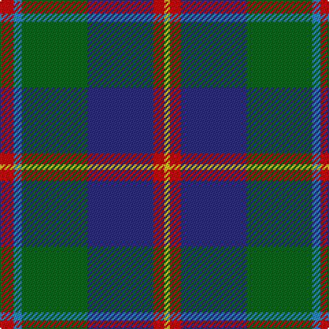

In pattern [RBGBRY](/stripes/rbgbry/).

This was sourced from register-of-tartans.  It is a [6 stripe tartan](/stripes/stripes6/).

Original link https://www.tartanregister.gov.uk/tartanDetails.aspx?ref=10030

## Register references

External register numbers recorded for this tartan.

- Scottish Register of Tartans: [10030](https://www.tartanregister.gov.uk/tartanDetails.aspx?ref=10030)

## Thread count
R/10 B6 G48 DB48 R8 Y/4

## Palette
Each colour and the base-6 reference it is a variant of.

| Colour | Shade | Base |
|---|---|---|
| B | <code style="background-color:#2888C4;">#2888C4</code> `oklch(60.1% 0.125 241.5)` <small>#2888C4</small> | B <code style="background-color:#2A418A;">#2A418A</code> |
| DB | <code style="background-color:#2C2C80;">#2C2C80</code> `oklch(35.0% 0.138 276.6)` <small>#2C2C80</small> | B <code style="background-color:#2A418A;">#2A418A</code> |
| G | <code style="background-color:#006818;">#006818</code> `oklch(45.0% 0.142 145.0)` <small>#006818</small> | G <code style="background-color:#006100;">#006100</code> |
| R | <code style="background-color:#C80000;">#C80000</code> `oklch(52.3% 0.215 29.2)` <small>#C80000</small> | R <code style="background-color:#CC0000;">#CC0000</code> |
| Y | <code style="background-color:#E8C000;">#E8C000</code> `oklch(81.9% 0.168 93.7)` <small>#E8C000</small> | Y <code style="background-color:#F2BF00;">#F2BF00</code> |

# Sample pattern

## Nearest tartans

The nearest existing variants by ΔTartan distance.

1. [Heckenberg Htg (Personal)](/setts/s7/db3g13t1r3t1db10ly1~x2/) — ΔT 0.51
1. [Turnbull Hunting](/setts/s5/r7ly3dg28db28w3~x2/) — ΔT 0.75
1. [Afternoon Tea / Darjeeling](/setts/s6/w15dg98dt72r25dt8ly15/) — ΔT 0.75
1. [Afternoon Tea / Black Tea](/setts/s6/m15dt8y25dt72n98w15/) — ΔT 0.77
1. [Turnbull Hunting (Name)](/setts/s5/r2ly1g10db10w1~x6/) — ΔT 0.79
1. [State Seal of Washington (Fashion)](/setts/s7/b5dy28lb5k20lo5b47lo4~x2/) — ΔT 0.81
1. [DeLoughery (Personal)](/setts/s6/db20k6lo4db3g20w2~x2/) — ΔT 0.82
1. [MacFadzean/MacPhedran](/setts/s7/g3db12w1k12g13r2g2~x4/) — ΔT 0.84
1. [Afternoon Tea / Darjeeling](/setts/s6/w15y98db72r25db8ly15/) — ΔT 0.87
1. [MacThomas Clan Tartan Tartan Number: 407. Earliest known date: 1975 Designed by David Thomas - former director of the Strathmore Woollen Co. in Forfar who still (in 2011) weave this tartan. Adopted by Clan Society in 1975, and registered with Lord Lyon in 1979. See products available Copyright © Blair Urquhart, Comrie, 2015](/setts/s7/db3m2db22k11g24lp2g3~x2/) — ΔT 0.90

## Neighbour map

Every grey dot is one of 14299 variants placed by the first two principal components of the ΔTartan feature space (44% of its variance). Red is this tartan; blue dots are its nearest — click one to open its page.

<svg viewBox="0 0 640 380" role="img" style="max-width:100%;height:auto;border:1px solid #e0e0e0;border-radius:4px;display:block" xmlns="http://www.w3.org/2000/svg"><image href="/nn/cloud.v1.png" width="640" height="380"/><a href="/setts/s7/db3g13t1r3t1db10ly1~x2/"><circle cx="236.5" cy="178.7" r="4" fill="#3465a4"><title>Heckenberg Htg (Personal)</title></circle></a><a href="/setts/s5/r7ly3dg28db28w3~x2/"><circle cx="224.8" cy="218.4" r="4" fill="#3465a4"><title>Turnbull Hunting</title></circle></a><a href="/setts/s6/w15dg98dt72r25dt8ly15/"><circle cx="206.2" cy="187.6" r="4" fill="#3465a4"><title>Afternoon Tea / Darjeeling</title></circle></a><a href="/setts/s6/m15dt8y25dt72n98w15/"><circle cx="211.7" cy="182.8" r="4" fill="#3465a4"><title>Afternoon Tea / Black Tea</title></circle></a><a href="/setts/s5/r2ly1g10db10w1~x6/"><circle cx="220.9" cy="202.5" r="4" fill="#3465a4"><title>Turnbull Hunting (Name)</title></circle></a><a href="/setts/s7/b5dy28lb5k20lo5b47lo4~x2/"><circle cx="219.0" cy="176.9" r="4" fill="#3465a4"><title>State Seal of Washington (Fashion)</title></circle></a><a href="/setts/s6/db20k6lo4db3g20w2~x2/"><circle cx="206.8" cy="203.1" r="4" fill="#3465a4"><title>DeLoughery (Personal)</title></circle></a><a href="/setts/s7/g3db12w1k12g13r2g2~x4/"><circle cx="193.9" cy="187.3" r="4" fill="#3465a4"><title>MacFadzean/MacPhedran</title></circle></a><a href="/setts/s6/w15y98db72r25db8ly15/"><circle cx="203.2" cy="180.3" r="4" fill="#3465a4"><title>Afternoon Tea / Darjeeling</title></circle></a><a href="/setts/s7/db3m2db22k11g24lp2g3~x2/"><circle cx="233.8" cy="194.8" r="4" fill="#3465a4"><title>MacThomas Clan Tartan Tartan Number: 407. Earliest known date: 1975 Designed by David Thomas - former director of the Strathmore Woollen Co. in Forfar who still (in 2011) weave this tartan. Adopted by Clan Society in 1975, and registered with Lord Lyon in 1979. See products available Copyright © Blair Urquhart, Comrie, 2015</title></circle></a><circle cx="218.8" cy="188.2" r="5" fill="#c00000"/></svg>

ID: /setts/s6/r5t3g24db24r4ly2~x2/
