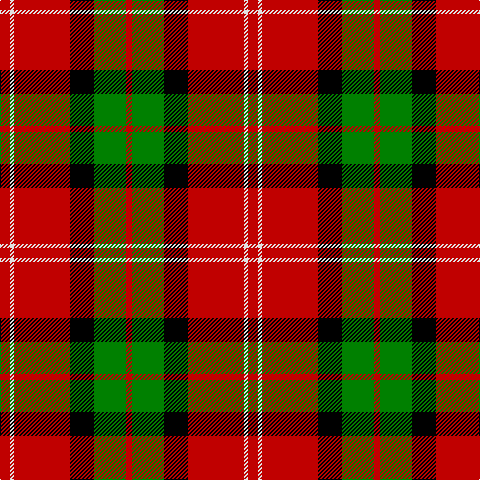

This page is one **sett** — a single exact thread-count. It belongs to the [tartan](/tartans/r5w2r28k12g16r3/)
(the same proportion at any scale), whose colour order is pattern [RGKRWR](/stripes/rgkrwr/).

Sourced from weddslist.  It is a [6 stripe tartan](/stripes/stripes6/).

Original link http://www.weddslist.com/cgi-bin/tartans/pg.pl?source=sts

## Also known as

This cloth is also recorded under:

- Nisbet

3 attestations — the source records this cloth was collapsed from (oldest owns this page)

<ul>
<li>undated — MacKintosh 6 (weddslist, <a href="http://www.weddslist.com/cgi-bin/tartans/pg.pl?source=sts">record</a>)</li>
<li>undated — Nisbet (weddslist, <a href="http://www.weddslist.com/cgi-bin/tartans/pg.pl?source=sts">record</a>)</li>
<li>undated — Nisbet Family Tartan Tartan Number: 2115. Earliest known date: 1842 This is the sett that appears in the Vestiarium Scoticum as Mackintosh. There is no connection between the names, historically, to explain the position and it is interesting to note the similarity with the Dunbar tartan which also originates in the Vestiarium. The Nisbets came from the old barony of Nisbet in the parish of Edrom, Berwickshire, as early as 1160. See products available Copyright © Blair Urquhart, Comrie, 2015 (house-of-tartan, <a href="http://www.house-of-tartan.scotland.net/house/TartanViewjs.asp?colr=Def&tnam=2115">record</a>)</li>
</ul>

## Thread count
R/10 LN4 R56 K24 G32 R/6

## Palette

Palette: <strong>Tartan Register</strong> <small style="color:#888">(2 of 4 colours)</small>
<table><thead><tr><th>Colour</th><th>Threads</th><th>Shade</th><th>Base</th><th>OKLCh</th></tr></thead><tbody><tr><td>R/</td><td style="text-align:right;font-variant-numeric:tabular-nums">10</td><td><code style="background-color:#C00000;">#C00000</code> <small style="color:#888">#C00000</small></td><td>R <code style="background-color:#CC0000;">#CC0000</code></td><td><small style="color:#888">oklch(50.7% 0.208 29.2)</small></td></tr><tr><td>LN</td><td style="text-align:right;font-variant-numeric:tabular-nums">4</td><td><code style="background-color:#E0E0E0;">#E0E0E0</code> <small style="color:#888">#E0E0E0</small></td><td>W <code style="background-color:#F7F7F7;">#F7F7F7</code></td><td><small style="color:#888">oklch(90.7% 0.000 89.9)</small></td></tr><tr><td>R</td><td style="text-align:right;font-variant-numeric:tabular-nums">56</td><td><code style="background-color:#C00000;">#C00000</code> <small style="color:#888">#C00000</small></td><td>R <code style="background-color:#CC0000;">#CC0000</code></td><td><small style="color:#888">oklch(50.7% 0.208 29.2)</small></td></tr><tr><td>K</td><td style="text-align:right;font-variant-numeric:tabular-nums">24</td><td><code style="background-color:#000000;">#000000</code> <small style="color:#888">#000000</small></td><td>K <code style="background-color:#000000;">#000000</code></td><td><small style="color:#888">oklch(0.0% 0.000 0.0)</small></td></tr><tr><td>G</td><td style="text-align:right;font-variant-numeric:tabular-nums">32</td><td><code style="background-color:#008000;">#008000</code> <small style="color:#888">#008000</small></td><td>G <code style="background-color:#006100;">#006100</code></td><td><small style="color:#888">oklch(52.0% 0.177 142.5)</small></td></tr><tr><td>R/</td><td style="text-align:right;font-variant-numeric:tabular-nums">6</td><td><code style="background-color:#C00000;">#C00000</code> <small style="color:#888">#C00000</small></td><td>R <code style="background-color:#CC0000;">#CC0000</code></td><td><small style="color:#888">oklch(50.7% 0.208 29.2)</small></td></tr></tbody></table>

# Sample pattern

## Nearest tartans

The nearest existing variants by ΔTartan distance, with this tartan at the top so the swatches line up against it.

ΔTartan

Tartan

Sett

—

<a href="/ttd/edit/#slug=r5w2r28k12g16r3~x2">MacKintosh 6</a> <a class="nn-out" href="/setts/s6/r5w2r28k12g16r3~x2/" title="open its dictionary page">↗</a>

0.77

<a href="/ttd/edit/#slug=r5w2r28k12dg16r3~x2">MacKintosh #4</a> <a class="nn-out" href="/setts/s6/r5w2r28k12dg16r3~x2/" title="open its dictionary page">↗</a>

0.78

<a href="/ttd/edit/#slug=r4k2r24k6db6g16r3~x2">MacDuff</a> <a class="nn-out" href="/setts/s7/r4k2r24k6db6g16r3~x2/" title="open its dictionary page">↗</a>

0.89

<a href="/ttd/edit/#slug=k2r16dg6r3dg8lb1">MacAulay</a> <a class="nn-out" href="/setts/s6/k2r16dg6r3dg8lb1/" title="open its dictionary page">↗</a>

0.99

<a href="/ttd/edit/#slug=k4r26k4w2k13ly4~x2">Dunbar #2</a> <a class="nn-out" href="/setts/s6/k4r26k4w2k13ly4~x2/" title="open its dictionary page">↗</a>

1.03

<a href="/ttd/edit/#slug=r25k7r3g13t1k2~x4">MacPhail</a> <a class="nn-out" href="/setts/s6/r25k7r3g13t1k2~x4/" title="open its dictionary page">↗</a>

1.05

<a href="/ttd/edit/#slug=r52k32g22r16ly3r16">Sturrock</a> <a class="nn-out" href="/setts/s6/r52k32g22r16ly3r16/" title="open its dictionary page">↗</a>

1.06

<a href="/ttd/edit/#slug=r36lt9k12g17r10k3r10~x2">MacDuff #6</a> <a class="nn-out" href="/setts/s7/r36lt9k12g17r10k3r10~x2/" title="open its dictionary page">↗</a>

1.07

<a href="/ttd/edit/#slug=r80k52w7o12">Oklahoma State University (Corporate</a> <a class="nn-out" href="/setts/s4/r80k52w7o12/" title="open its dictionary page">↗</a>

1.15

<a href="/ttd/edit/#slug=k2r16g6r3g8w1~x2">MacAulay</a> <a class="nn-out" href="/setts/s6/k2r16g6r3g8w1~x2/" title="open its dictionary page">↗</a>

1.15

<a href="/ttd/edit/#slug=o80k52w7oi12">Oklahoma State University</a> <a class="nn-out" href="/setts/s4/o80k52w7oi12/" title="open its dictionary page">↗</a>

## Neighbour map

Every grey dot is one of 14359 variants placed by the first two principal components of the ΔTartan feature space (44% of its variance). Red is this tartan; blue dots are its nearest — click one to open its page.

<svg viewBox="0 0 640 380" role="img" style="max-width:100%;height:auto;border:1px solid #e0e0e0;border-radius:4px;display:block" xmlns="http://www.w3.org/2000/svg"><image href="/nn/cloud.v1.png" width="640" height="380"/><a href="/setts/s6/r5w2r28k12dg16r3~x2/"><circle cx="300.2" cy="181.9" r="4" fill="#3465a4"><title>MacKintosh #4</title></circle></a><a href="/setts/s7/r4k2r24k6db6g16r3~x2/"><circle cx="260.4" cy="179.2" r="4" fill="#3465a4"><title>MacDuff</title></circle></a><a href="/setts/s6/k2r16dg6r3dg8lb1/"><circle cx="321.2" cy="184.4" r="4" fill="#3465a4"><title>MacAulay</title></circle></a><a href="/setts/s6/k4r26k4w2k13ly4~x2/"><circle cx="280.3" cy="166.4" r="4" fill="#3465a4"><title>Dunbar #2</title></circle></a><a href="/setts/s6/r25k7r3g13t1k2~x4/"><circle cx="324.7" cy="148.5" r="4" fill="#3465a4"><title>MacPhail</title></circle></a><a href="/setts/s6/r52k32g22r16ly3r16/"><circle cx="309.8" cy="187.5" r="4" fill="#3465a4"><title>Sturrock</title></circle></a><a href="/setts/s7/r36lt9k12g17r10k3r10~x2/"><circle cx="291.5" cy="191.0" r="4" fill="#3465a4"><title>MacDuff #6</title></circle></a><a href="/setts/s4/r80k52w7o12/"><circle cx="288.5" cy="206.8" r="4" fill="#3465a4"><title>Oklahoma State University (Corporate</title></circle></a><a href="/setts/s6/k2r16g6r3g8w1~x2/"><circle cx="314.2" cy="181.7" r="4" fill="#3465a4"><title>MacAulay</title></circle></a><a href="/setts/s4/o80k52w7oi12/"><circle cx="263.5" cy="200.1" r="4" fill="#3465a4"><title>Oklahoma State University</title></circle></a><circle cx="282.9" cy="178.5" r="5" fill="#c00000"/></svg>

ID: /setts/s6/r5w2r28k12g16r3~x2/
