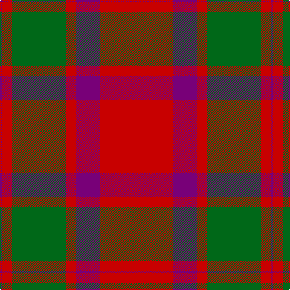

**Bands:** [BRGRBR](/stripes/brgrbr/) · **Stripes:** [DP R G R DP R](/stripes/stripes6/) DP R G R DP R

This was sourced from house-of-tartan.  It is a [6 band tartan](/bands/bands6/).

Original link http://www.house-of-tartan.scotland.net/house/TartanViewjs.asp?colr=Def&tnam=526

## Variants

Other setts woven to the same stripe pattern.

- [Caledonian - 1819 (Fashion?)](/setts/s6/r60dp20r8g45r8dp2/)

## Thread count
P/4 R16 G90 R16 P40 R/120

## Palette
Each colour and its ΔE from the base-6 reference it is a variant of.

| Colour | Shade | Base | ΔE (OKLab) |
|---|---|---|---|
| G | <code style="background-color:#006818;">#006818</code> `#006818` | G <code style="background-color:#006100;">#006100</code> | 0.02 |
| P | <code style="background-color:#780078;">#780078</code> `#780078` | B <code style="background-color:#2A418A;">#2A418A</code> | 0.17 |
| R | <code style="background-color:#C80000;">#C80000</code> `#C80000` | R <code style="background-color:#CC0000;">#CC0000</code> | 0.01 |

# Sample pattern

## Nearest tartans

The nearest existing variants by ΔTartan distance.

1. [Caledonian](/setts/s6/r60p20r8g45r8p2~x2/) — ΔT 0.34
1. [Caledonian - 1819 (Fashion?)](/setts/s6/r60dp20r8g45r8dp2/) — ΔT 0.40
1. [MacKintosh](/setts/s6/r70db20r10g40r10db3/) — ΔT 0.72
1. [Caledonian](/setts/s6/r60dp20r8dg45r8dp2~x2/) — ΔT 0.73
1. [MacKintosh 3](/setts/s6/r68db18r9g34r9db3~x2/) — ΔT 0.93
1. [Robertson](/setts/s6/r2dg20r2db8r36dg1~x2/) — ΔT 0.97
1. [MacKintosh #2](/setts/s6/r68db18r9dg34r9db3~x2/) — ΔT 1.03
1. [MacKintosh 1](/setts/s6/r22db5r2g11r3db1~x2/) — ΔT 1.04
1. [Franklin Museum Unidentified 2](/setts/s8/r5g20r25db1r25db20r5db1~x4/) — ΔT 1.08
1. [Lovat, or Fraser](/setts/s9/p1r7g22r23p1r23p22r7p1~x2/) — ΔT 1.14

## Neighbour map

Every grey dot is one of 14313 variants placed by the first two principal components of the ΔTartan feature space (44% of its variance). Red is this tartan; blue dots are its nearest — click one to open its page.

<svg viewBox="0 0 640 380" role="img" style="max-width:100%;height:auto;border:1px solid #e0e0e0;border-radius:4px;display:block" xmlns="http://www.w3.org/2000/svg"><image href="/nn/cloud.v1.png" width="640" height="380"/><a href="/setts/s6/r60p20r8g45r8p2~x2/"><circle cx="380.4" cy="178.7" r="4" fill="#3465a4"><title>Caledonian</title></circle></a><a href="/setts/s6/r60dp20r8g45r8dp2/"><circle cx="379.1" cy="179.1" r="4" fill="#3465a4"><title>Caledonian - 1819 (Fashion?)</title></circle></a><a href="/setts/s6/r70db20r10g40r10db3/"><circle cx="401.6" cy="187.9" r="4" fill="#3465a4"><title>MacKintosh</title></circle></a><a href="/setts/s6/r60dp20r8dg45r8dp2~x2/"><circle cx="370.6" cy="172.0" r="4" fill="#3465a4"><title>Caledonian</title></circle></a><a href="/setts/s6/r68db18r9g34r9db3~x2/"><circle cx="419.5" cy="188.0" r="4" fill="#3465a4"><title>MacKintosh 3</title></circle></a><a href="/setts/s6/r2dg20r2db8r36dg1~x2/"><circle cx="425.3" cy="154.2" r="4" fill="#3465a4"><title>Robertson</title></circle></a><a href="/setts/s6/r68db18r9dg34r9db3~x2/"><circle cx="413.1" cy="180.7" r="4" fill="#3465a4"><title>MacKintosh #2</title></circle></a><a href="/setts/s6/r22db5r2g11r3db1~x2/"><circle cx="425.4" cy="185.4" r="4" fill="#3465a4"><title>MacKintosh 1</title></circle></a><a href="/setts/s8/r5g20r25db1r25db20r5db1~x4/"><circle cx="381.5" cy="180.7" r="4" fill="#3465a4"><title>Franklin Museum Unidentified 2</title></circle></a><a href="/setts/s9/p1r7g22r23p1r23p22r7p1~x2/"><circle cx="380.6" cy="179.1" r="4" fill="#3465a4"><title>Lovat, or Fraser</title></circle></a><circle cx="387.8" cy="181.6" r="5" fill="#c00000"/></svg>

ID: /setts/s6/r60dp20r8g45r8dp2~x2/
