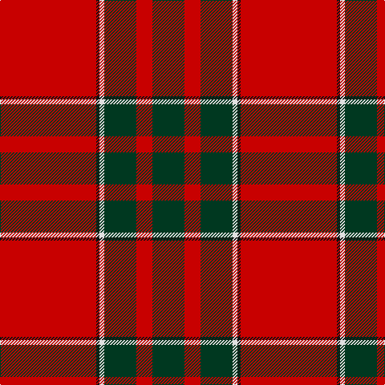

This page is one **sett** — a single exact thread-count. It belongs to the [tartan](/tartans/r60k2ln3dg20r10dg20/)
(the same proportion at any scale), whose colour order is pattern [GRGWKR](/stripes/grgwkr/).

Sourced from register-of-tartans.  It is a [6 stripe tartan](/stripes/stripes6/).

Original link https://www.tartanregister.gov.uk/tartanDetails.aspx?ref=1534

2 attestations — the source records this cloth was collapsed from (oldest owns this page)

<ul>
<li>12/12/2000 — Greig (Personal) (register-of-tartans, <a href="https://www.tartanregister.gov.uk/tartanDetails.aspx?ref=1534">record</a>)</li>
<li>2000 — Greig (Personal) (tartans-authority, <a href="http://www.tartansauthority.com/tartan-ferret/display/4076/">record</a>)</li>
</ul>

## Register references

External register numbers recorded for this tartan.

- Scottish Register of Tartans: [1534](https://www.tartanregister.gov.uk/tartanDetails.aspx?ref=1534)
- Scottish Tartans Authority (ITI): 4076
- Scottish Tartans World Register: 2820

## Thread count
R/120 K4 LN6 DG40 R20 DG/40

## Palette
Each colour and the base-6 reference it is a variant of.

| Colour | Shade | Base |
|---|---|---|
| DG | <code style="background-color:#003820;">#003820</code> `oklch(30.0% 0.070 158.3)` <small>#003820</small> | G <code style="background-color:#006100;">#006100</code> |
| K | <code style="background-color:#101010;">#101010</code> `oklch(17.3% 0.000 89.9)` <small>#101010</small> | K <code style="background-color:#000000;">#000000</code> |
| LN | <code style="background-color:#E0E0E0;">#E0E0E0</code> `oklch(90.7% 0.000 89.9)` <small>#E0E0E0</small> | W <code style="background-color:#F7F7F7;">#F7F7F7</code> |
| R | <code style="background-color:#C80000;">#C80000</code> `oklch(52.3% 0.215 29.2)` <small>#C80000</small> | R <code style="background-color:#CC0000;">#CC0000</code> |

# Sample pattern

## Nearest tartans

The nearest existing variants by ΔTartan distance, with this tartan at the top so the swatches line up against it.

ΔTartan

Tartan

Sett

—

<a href="/ttd/edit/#slug=r60k2w3dg20r10dg20~x2">Greig (Personal)</a> <a class="nn-out" href="/setts/s6/r60k2w3dg20r10dg20~x2/" title="open its dictionary page">↗</a>

0.63

<a href="/ttd/edit/#slug=r36dg18r4dg6k1lb2">MacGregor</a> <a class="nn-out" href="/setts/s6/r36dg18r4dg6k1lb2/" title="open its dictionary page">↗</a>

0.64

<a href="/ttd/edit/#slug=r36dg18r4dg6k1w2~x2">MacGregor #3</a> <a class="nn-out" href="/setts/s6/r36dg18r4dg6k1w2~x2/" title="open its dictionary page">↗</a>

0.89

<a href="/ttd/edit/#slug=r41g19r7g8k1w3~x2">MacGregor #4</a> <a class="nn-out" href="/setts/s6/r41g19r7g8k1w3~x2/" title="open its dictionary page">↗</a>

0.97

<a href="/ttd/edit/#slug=r35dg16r5dg5w2k3~x2">MacGregor</a> <a class="nn-out" href="/setts/s6/r35dg16r5dg5w2k3~x2/" title="open its dictionary page">↗</a>

1.00

<a href="/ttd/edit/#slug=r3dg16r4k6r28dg1r3~x2">Maxwell Ancient</a> <a class="nn-out" href="/setts/s7/r3dg16r4k6r28dg1r3~x2/" title="open its dictionary page">↗</a>

1.01

<a href="/ttd/edit/#slug=r96g42r16g17k4y6">MacGregor, Glengyle</a> <a class="nn-out" href="/setts/s6/r96g42r16g17k4y6/" title="open its dictionary page">↗</a>

1.03

<a href="/ttd/edit/#slug=r24db6r3dg12r4db1">MacKintosh</a> <a class="nn-out" href="/setts/s6/r24db6r3dg12r4db1/" title="open its dictionary page">↗</a>

1.03

<a href="/ttd/edit/#slug=db4r50dg25w2~x2">Unidentified Locket</a> <a class="nn-out" href="/setts/s4/db4r50dg25w2~x2/" title="open its dictionary page">↗</a>

1.04

<a href="/ttd/edit/#slug=r3g16r4k6r28g1r3~x2">Maxwell</a> <a class="nn-out" href="/setts/s7/r3g16r4k6r28g1r3~x2/" title="open its dictionary page">↗</a>

1.05

<a href="/ttd/edit/#slug=r22db5r2dg11r3db1">MacKintosh D</a> <a class="nn-out" href="/setts/s6/r22db5r2dg11r3db1/" title="open its dictionary page">↗</a>

## Neighbour map

Every grey dot is one of 14299 variants placed by the first two principal components of the ΔTartan feature space (44% of its variance). Red is this tartan; blue dots are its nearest — click one to open its page.

<svg viewBox="0 0 640 380" role="img" style="max-width:100%;height:auto;border:1px solid #e0e0e0;border-radius:4px;display:block" xmlns="http://www.w3.org/2000/svg"><image href="/nn/cloud.v1.png" width="640" height="380"/><a href="/setts/s6/r36dg18r4dg6k1lb2/"><circle cx="426.0" cy="139.6" r="4" fill="#3465a4"><title>MacGregor</title></circle></a><a href="/setts/s6/r36dg18r4dg6k1w2~x2/"><circle cx="422.0" cy="134.2" r="4" fill="#3465a4"><title>MacGregor #3</title></circle></a><a href="/setts/s6/r41g19r7g8k1w3~x2/"><circle cx="428.4" cy="137.8" r="4" fill="#3465a4"><title>MacGregor #4</title></circle></a><a href="/setts/s6/r35dg16r5dg5w2k3~x2/"><circle cx="387.6" cy="160.5" r="4" fill="#3465a4"><title>MacGregor</title></circle></a><a href="/setts/s7/r3dg16r4k6r28dg1r3~x2/"><circle cx="428.6" cy="156.0" r="4" fill="#3465a4"><title>Maxwell Ancient</title></circle></a><a href="/setts/s6/r96g42r16g17k4y6/"><circle cx="422.6" cy="167.4" r="4" fill="#3465a4"><title>MacGregor, Glengyle</title></circle></a><a href="/setts/s6/r24db6r3dg12r4db1/"><circle cx="411.0" cy="178.6" r="4" fill="#3465a4"><title>MacKintosh</title></circle></a><a href="/setts/s4/db4r50dg25w2~x2/"><circle cx="414.8" cy="174.9" r="4" fill="#3465a4"><title>Unidentified Locket</title></circle></a><a href="/setts/s7/r3g16r4k6r28g1r3~x2/"><circle cx="436.9" cy="163.2" r="4" fill="#3465a4"><title>Maxwell</title></circle></a><a href="/setts/s6/r22db5r2dg11r3db1/"><circle cx="408.7" cy="177.4" r="4" fill="#3465a4"><title>MacKintosh D</title></circle></a><circle cx="419.6" cy="150.9" r="5" fill="#c00000"/></svg>

ID: /setts/s6/r60k2w3dg20r10dg20~x2/
