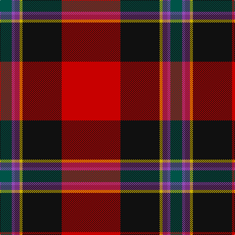

In pattern [GBBYKR](/stripes/gbbykr/).

This was sourced from register-of-tartans.  It is a [6 stripe tartan](/stripes/stripes6/).

Original link https://www.tartanregister.gov.uk/tartanDetails.aspx?ref=3491

## Attestations

This cloth appears in 2 source records; the oldest owns this page.

- 01/01/2007 — Rei Okamoto (Personal) (register-of-tartans, [record](https://www.tartanregister.gov.uk/tartanDetails.aspx?ref=3491))
- 2007 — Rei Okamoto (Personal) (tartans-authority, [record](http://www.tartansauthority.com/tartan-ferret/display/7305/))

## Register references

External register numbers recorded for this tartan.

- Scottish Register of Tartans: [3491](https://www.tartanregister.gov.uk/tartanDetails.aspx?ref=3491)
- Scottish Tartans Authority (ITI): 7305

## Thread count
R/120 K80 Y6 P10 Pa6 G/24

## Palette
Each colour and the base-6 reference it is a variant of.

| Colour | Shade | Base |
|---|---|---|
| G | <code style="background-color:#005448;">#005448</code> `oklch(39.9% 0.073 178.8)` <small>#005448</small> | G <code style="background-color:#006100;">#006100</code> |
| K | <code style="background-color:#101010;">#101010</code> `oklch(17.3% 0.000 89.9)` <small>#101010</small> | K <code style="background-color:#000000;">#000000</code> |
| P | <code style="background-color:#783080;">#783080</code> `oklch(44.3% 0.145 323.6)` <small>#783080</small> | B <code style="background-color:#2A418A;">#2A418A</code> |
| Pa | <code style="background-color:#944CB8;">#944CB8</code> `oklch(55.1% 0.172 312.9)` <small>#944CB8</small> | B <code style="background-color:#2A418A;">#2A418A</code> |
| R | <code style="background-color:#C80000;">#C80000</code> `oklch(52.3% 0.215 29.2)` <small>#C80000</small> | R <code style="background-color:#CC0000;">#CC0000</code> |
| Y | <code style="background-color:#D0B404;">#D0B404</code> `oklch(77.1% 0.159 97.8)` <small>#D0B404</small> | Y <code style="background-color:#F2BF00;">#F2BF00</code> |

# Sample pattern

## Nearest tartans

The nearest existing variants by ΔTartan distance.

1. [Stewart, Anthony C (Personal)](/setts/s7/r72g16k8ly4db8w3k50~x2/) — ΔT 0.79
1. [Gordon of Abergeldie (Portrait)](/setts/s6/r63w4k4dp18ly4dg50~x2/) — ΔT 1.04
1. [Hyland Evening (Personal)](/setts/s8/dp3lo2r19r4dp6k36dp2lo3~x2/) — ΔT 1.12
1. [MacQueen of Dalmagarry (Clan?)](/setts/s8/g3r4k1r26y14r4dp16w2~x2/) — ΔT 1.13
1. [Hewitt (Name)](/setts/s7/r30db12k3g12ly2g3w2~x2/) — ΔT 1.13
1. [MacLeay (Clan)](/setts/s7/r27g4k4g4k4db6lo1~x4/) — ΔT 1.19
1. [Hewitt](/setts/s7/r30db12k6dg12ly2dg3w2~x2/) — ΔT 1.20
1. [Wormeck (2013) Germany](/setts/s5/db4lo4r33k30w2~x2/) — ΔT 1.22
1. [Scottish American Society of Michigan (Official)](/setts/s6/r48t16lo5dg17w8k3~x2/) — ΔT 1.24
1. [MacGleish Formal (Personal)](/setts/s5/r50k25g10o5ly2~x2/) — ΔT 1.25

## Neighbour map

Every grey dot is one of 14299 variants placed by the first two principal components of the ΔTartan feature space (44% of its variance). Red is this tartan; blue dots are its nearest — click one to open its page.

<svg viewBox="0 0 640 380" role="img" style="max-width:100%;height:auto;border:1px solid #e0e0e0;border-radius:4px;display:block" xmlns="http://www.w3.org/2000/svg"><image href="/nn/cloud.v1.png" width="640" height="380"/><a href="/setts/s7/r72g16k8ly4db8w3k50~x2/"><circle cx="248.3" cy="108.5" r="4" fill="#3465a4"><title>Stewart, Anthony C (Personal)</title></circle></a><a href="/setts/s6/r63w4k4dp18ly4dg50~x2/"><circle cx="242.5" cy="141.0" r="4" fill="#3465a4"><title>Gordon of Abergeldie (Portrait)</title></circle></a><a href="/setts/s8/dp3lo2r19r4dp6k36dp2lo3~x2/"><circle cx="254.5" cy="113.0" r="4" fill="#3465a4"><title>Hyland Evening (Personal)</title></circle></a><a href="/setts/s8/g3r4k1r26y14r4dp16w2~x2/"><circle cx="272.1" cy="112.8" r="4" fill="#3465a4"><title>MacQueen of Dalmagarry (Clan?)</title></circle></a><a href="/setts/s7/r30db12k3g12ly2g3w2~x2/"><circle cx="231.0" cy="129.6" r="4" fill="#3465a4"><title>Hewitt (Name)</title></circle></a><a href="/setts/s7/r27g4k4g4k4db6lo1~x4/"><circle cx="325.9" cy="120.6" r="4" fill="#3465a4"><title>MacLeay (Clan)</title></circle></a><a href="/setts/s7/r30db12k6dg12ly2dg3w2~x2/"><circle cx="207.8" cy="131.2" r="4" fill="#3465a4"><title>Hewitt</title></circle></a><a href="/setts/s5/db4lo4r33k30w2~x2/"><circle cx="267.9" cy="163.6" r="4" fill="#3465a4"><title>Wormeck (2013) Germany</title></circle></a><a href="/setts/s6/r48t16lo5dg17w8k3~x2/"><circle cx="232.2" cy="134.7" r="4" fill="#3465a4"><title>Scottish American Society of Michigan (Official)</title></circle></a><a href="/setts/s5/r50k25g10o5ly2~x2/"><circle cx="322.3" cy="146.3" r="4" fill="#3465a4"><title>MacGleish Formal (Personal)</title></circle></a><circle cx="274.9" cy="126.5" r="5" fill="#c00000"/></svg>

ID: /setts/s6/r60k40ly3p5p3dg12~x2/
