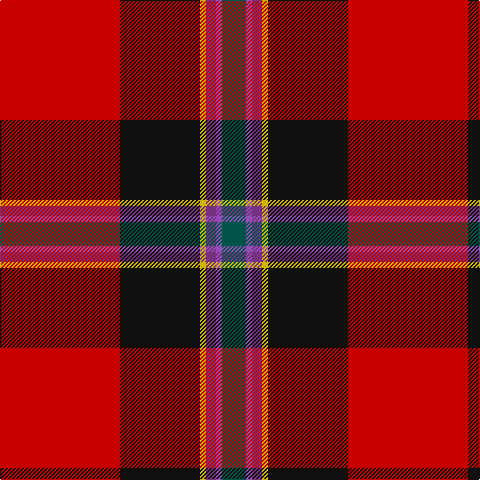

This page is one **sett** — a single exact thread-count. It belongs to the [tartan](/tartans/r60k40ly3pi5p3dg12/)
(the same proportion at any scale), whose colour order is pattern [GBBYKR](/stripes/gbbykr/).

Sourced from register-of-tartans.  It is a [6 stripe tartan](/stripes/stripes6/).

Original link https://www.tartanregister.gov.uk/tartanDetails.aspx?ref=3491

2 attestations — the source records this cloth was collapsed from (oldest owns this page)

<ul>
<li>01/01/2007 — Rei Okamoto (Personal) (register-of-tartans, <a href="https://www.tartanregister.gov.uk/tartanDetails.aspx?ref=3491">record</a>)</li>
<li>2007 — Rei Okamoto (Personal) (tartans-authority, <a href="http://www.tartansauthority.com/tartan-ferret/display/7305/">record</a>)</li>
</ul>

## Register references

External register numbers recorded for this tartan.

- Scottish Register of Tartans: [3491](https://www.tartanregister.gov.uk/tartanDetails.aspx?ref=3491)
- Scottish Tartans Authority (ITI): 7305

## Thread count
R/120 K80 Y6 P10 Pa6 G/24

## Palette

Palette: <strong>Tartan Register</strong> <small style="color:#888">(3 of 6 colours)</small>
<table><thead><tr><th>Colour</th><th>Threads</th><th>Shade</th><th>Base</th><th>OKLCh</th></tr></thead><tbody><tr><td>R/</td><td style="text-align:right;font-variant-numeric:tabular-nums">120</td><td><code style="background-color:#C80000;">#C80000</code> <small style="color:#888">#C80000</small></td><td>R <code style="background-color:#CC0000;">#CC0000</code></td><td><small style="color:#888">oklch(52.3% 0.215 29.2)</small></td></tr><tr><td>K</td><td style="text-align:right;font-variant-numeric:tabular-nums">80</td><td><code style="background-color:#101010;">#101010</code> <small style="color:#888">#101010</small></td><td>K <code style="background-color:#000000;">#000000</code></td><td><small style="color:#888">oklch(17.3% 0.000 89.9)</small></td></tr><tr><td>Y</td><td style="text-align:right;font-variant-numeric:tabular-nums">6</td><td><code style="background-color:#D0B404;">#D0B404</code> <small style="color:#888">#D0B404</small></td><td>Y <code style="background-color:#F2BF00;">#F2BF00</code></td><td><small style="color:#888">oklch(77.1% 0.159 97.8)</small></td></tr><tr><td>P</td><td style="text-align:right;font-variant-numeric:tabular-nums">10</td><td><code style="background-color:#783080;">#783080</code> <small style="color:#888">#783080</small></td><td>B <code style="background-color:#2A418A;">#2A418A</code></td><td><small style="color:#888">oklch(44.3% 0.145 323.6)</small></td></tr><tr><td>Pa</td><td style="text-align:right;font-variant-numeric:tabular-nums">6</td><td><code style="background-color:#944CB8;">#944CB8</code> <small style="color:#888">#944CB8</small></td><td>B <code style="background-color:#2A418A;">#2A418A</code></td><td><small style="color:#888">oklch(55.1% 0.172 312.9)</small></td></tr><tr><td>G/</td><td style="text-align:right;font-variant-numeric:tabular-nums">24</td><td><code style="background-color:#005448;">#005448</code> <small style="color:#888">#005448</small></td><td>G <code style="background-color:#006100;">#006100</code></td><td><small style="color:#888">oklch(39.9% 0.073 178.8)</small></td></tr></tbody></table>

# Sample pattern

## Nearest tartans

The nearest existing variants by ΔTartan distance, with this tartan at the top so the swatches line up against it.

ΔTartan

Tartan

Sett

—

<a href="/ttd/edit/#slug=r60k40ly3pi5p3dg12~x2">Rei Okamoto (Personal)</a> <a class="nn-out" href="/setts/s6/r60k40ly3pi5p3dg12~x2/" title="open its dictionary page">↗</a>

0.79

<a href="/ttd/edit/#slug=r72g16k8ly4db8w3k50~x2">Stewart, Anthony C (Personal)</a> <a class="nn-out" href="/setts/s7/r72g16k8ly4db8w3k50~x2/" title="open its dictionary page">↗</a>

1.04

<a href="/ttd/edit/#slug=r63w4k4dp18ly4dg50~x2">Gordon of Abergeldie (Portrait)</a> <a class="nn-out" href="/setts/s6/r63w4k4dp18ly4dg50~x2/" title="open its dictionary page">↗</a>

1.12

<a href="/ttd/edit/#slug=dp3lo2r19ri4dpi6k36dpi2lo3~x2">Hyland Evening (Personal)</a> <a class="nn-out" href="/setts/s8/dp3lo2r19ri4dpi6k36dpi2lo3~x2/" title="open its dictionary page">↗</a>

1.13

<a href="/ttd/edit/#slug=g3r4k1r26y14r4dp16w2~x2">MacQueen of Dalmagarry (Clan?)</a> <a class="nn-out" href="/setts/s8/g3r4k1r26y14r4dp16w2~x2/" title="open its dictionary page">↗</a>

1.13

<a href="/ttd/edit/#slug=r30db12k3g12ly2g3w2~x2">Hewitt (Name)</a> <a class="nn-out" href="/setts/s7/r30db12k3g12ly2g3w2~x2/" title="open its dictionary page">↗</a>

1.17

<a href="/ttd/edit/#slug=gi18g2db5r45dbi3db18dbi3r5w2">MacNiven Family Tartan Tartan Number: 752. Earliest known date: 1986 Based in part on the MacNaughton of which the MacNivens are a Sept. The name in Mr Cannonito's family was spelt, MacKniffen. Other members of the family have dropped the 'Mac' since arriving in America in 1650. This clan tartan was accredited by the Scottish Tartans Society in 1988. See products available Copyright © Blair Urquhart, Comrie, 2015</a> <a class="nn-out" href="/setts/s9/gi18g2db5r45dbi3db18dbi3r5w2/" title="open its dictionary page">↗</a>

1.19

<a href="/ttd/edit/#slug=r27g4k4g4k4db6lo1~x4">MacLeay (Clan)</a> <a class="nn-out" href="/setts/s7/r27g4k4g4k4db6lo1~x4/" title="open its dictionary page">↗</a>

1.20

<a href="/ttd/edit/#slug=r30db12k6dg12ly2dg3w2~x2">Hewitt</a> <a class="nn-out" href="/setts/s7/r30db12k6dg12ly2dg3w2~x2/" title="open its dictionary page">↗</a>

1.22

<a href="/ttd/edit/#slug=db4lo4r33k30w2~x2">Wormeck (2013) Germany</a> <a class="nn-out" href="/setts/s5/db4lo4r33k30w2~x2/" title="open its dictionary page">↗</a>

1.24

<a href="/ttd/edit/#slug=r48t16lo5dg17w8k3~x2">Scottish American Society of Michigan (Official)</a> <a class="nn-out" href="/setts/s6/r48t16lo5dg17w8k3~x2/" title="open its dictionary page">↗</a>

## Neighbour map

Every grey dot is one of 14359 variants placed by the first two principal components of the ΔTartan feature space (44% of its variance). Red is this tartan; blue dots are its nearest — click one to open its page.

<svg viewBox="0 0 640 380" role="img" style="max-width:100%;height:auto;border:1px solid #e0e0e0;border-radius:4px;display:block" xmlns="http://www.w3.org/2000/svg"><image href="/nn/cloud.v1.png" width="640" height="380"/><a href="/setts/s7/r72g16k8ly4db8w3k50~x2/"><circle cx="247.4" cy="109.1" r="4" fill="#3465a4"><title>Stewart, Anthony C (Personal)</title></circle></a><a href="/setts/s6/r63w4k4dp18ly4dg50~x2/"><circle cx="241.6" cy="141.6" r="4" fill="#3465a4"><title>Gordon of Abergeldie (Portrait)</title></circle></a><a href="/setts/s8/dp3lo2r19ri4dpi6k36dpi2lo3~x2/"><circle cx="253.7" cy="113.7" r="4" fill="#3465a4"><title>Hyland Evening (Personal)</title></circle></a><a href="/setts/s8/g3r4k1r26y14r4dp16w2~x2/"><circle cx="271.0" cy="113.2" r="4" fill="#3465a4"><title>MacQueen of Dalmagarry (Clan?)</title></circle></a><a href="/setts/s7/r30db12k3g12ly2g3w2~x2/"><circle cx="230.1" cy="130.2" r="4" fill="#3465a4"><title>Hewitt (Name)</title></circle></a><a href="/setts/s9/gi18g2db5r45dbi3db18dbi3r5w2/"><circle cx="273.3" cy="100.0" r="4" fill="#3465a4"><title>MacNiven Family Tartan Tartan Number: 752. Earliest known date: 1986 Based in part on the MacNaughton of which the MacNivens are a Sept. The name in Mr Cannonito's family was spelt, MacKniffen. Other members of the family have dropped the 'Mac' since arriving in America in 1650. This clan tartan was accredited by the Scottish Tartans Society in 1988. See products available Copyright © Blair Urquhart, Comrie, 2015</title></circle></a><a href="/setts/s7/r27g4k4g4k4db6lo1~x4/"><circle cx="324.9" cy="121.0" r="4" fill="#3465a4"><title>MacLeay (Clan)</title></circle></a><a href="/setts/s7/r30db12k6dg12ly2dg3w2~x2/"><circle cx="206.9" cy="131.9" r="4" fill="#3465a4"><title>Hewitt</title></circle></a><a href="/setts/s5/db4lo4r33k30w2~x2/"><circle cx="267.0" cy="164.5" r="4" fill="#3465a4"><title>Wormeck (2013) Germany</title></circle></a><a href="/setts/s6/r48t16lo5dg17w8k3~x2/"><circle cx="231.2" cy="135.4" r="4" fill="#3465a4"><title>Scottish American Society of Michigan (Official)</title></circle></a><circle cx="273.9" cy="127.1" r="5" fill="#c00000"/></svg>

ID: /setts/s6/r60k40ly3pi5p3dg12~x2/
