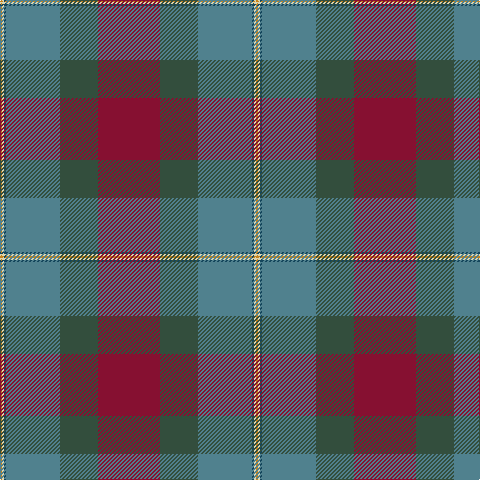

In pattern [RGGBWY](/patterns/rggbwy/).

This was sourced from register-of-tartans.  It is a [6 stripes tartan](/stripes/stripes6/).

Original link https://www.tartanregister.gov.uk/tartanDetails.aspx?ref=10438

## Thread count
DO/2 LR2 DB2 B54 N38 DR/62

## Palette
Each colour and its ΔE from the base-6 reference it is a variant of.

| Colour | Shade | Base | ΔE (OKLab) |
|---|---|---|---|
| B | <code style="background-color:#50818E;">#50818E</code> `#50818E` | G <code style="background-color:#006400;">#006400</code> | 0.20 |
| DB | <code style="background-color:#14465C;">#14465C</code> `#14465C` | B <code style="background-color:#2C4084;">#2C4084</code> | 0.08 |
| DO | <code style="background-color:#C5831B;">#C5831B</code> `#C5831B` | Y <code style="background-color:#E8C000;">#E8C000</code> | 0.17 |
| DR | <code style="background-color:#861031;">#861031</code> `#861031` | R <code style="background-color:#C80000;">#C80000</code> | 0.15 |
| LR | <code style="background-color:#DDD5AF;">#DDD5AF</code> `#DDD5AF` | W <code style="background-color:#F4F4F0;">#F4F4F0</code> | 0.11 |
| N | <code style="background-color:#334E3D;">#334E3D</code> `#334E3D` | G <code style="background-color:#006400;">#006400</code> | 0.11 |

# Sample pattern

ID: /setts/s6/r62g38ga54b2w2y2-b14465c-g334e3d-ga50818e-r861031-wddd5af-yc5831b/
