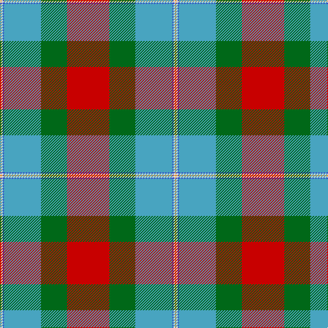

In pattern [RGYBWY](/patterns/rgybwy/).

This was sourced from tartans-authority.  It is a [6 stripes tartan](/stripes/stripes6/).

Original link http://www.tartansauthority.com/tartan-ferret/display/10438/

## Thread count
O/2 LN2 B2 Ba54 G38 R/62

## Palette
Each colour and its ΔE from the base-6 reference it is a variant of.

| Colour | Shade | Base | ΔE (OKLab) |
|---|---|---|---|
| B | <code style="background-color:#3850C8;">#3850C8</code> `#3850C8` | B <code style="background-color:#2C4084;">#2C4084</code> | 0.12 |
| Ba | <code style="background-color:#48A4C0;">#48A4C0</code> `#48A4C0` | Y <code style="background-color:#E8C000;">#E8C000</code> | 0.28 |
| G | <code style="background-color:#006818;">#006818</code> `#006818` | G <code style="background-color:#006400;">#006400</code> | 0.02 |
| LN | <code style="background-color:#E0E0E0;">#E0E0E0</code> `#E0E0E0` | W <code style="background-color:#F4F4F0;">#F4F4F0</code> | 0.06 |
| O | <code style="background-color:#DC943C;">#DC943C</code> `#DC943C` | Y <code style="background-color:#E8C000;">#E8C000</code> | 0.12 |
| R | <code style="background-color:#C80000;">#C80000</code> `#C80000` | R <code style="background-color:#C80000;">#C80000</code> | 0.00 |

# Sample pattern

## Nearest tartans

The nearest existing variants by ΔTartan distance.

1. [Norwegian Migration Period](/setts/s8/r120y16b36w8b4ra24b32rb32-b202020-r8c8c8c-raa0783c-rbb00000-wc8c8c8-yd8d898/) — ΔT 0.95
1. [Gordon of Abergeldie (Red..) Portrait Tartan Tartan Number: 955. Earliest known date: 1723 This sett was reconstructed from a scarf in a painting of Rachael Gordon, hanging in Abergeldie Castle, painted by Alexander in 1723. The count and colour desciption was taken by the Lord Lyon in 1953. See products available Copyright © Blair Urquhart, Comrie, 2015](/setts/s6/r40w2k2ra12y2g36-g006818-k101010-rc80000-rab468ac-we0e0e0-ye8c000/) — ΔT 1.28
1. [Etienne, Paschal Tache Sir...](/setts/s8/w6r2ra58r32g46b6g6y4-b304080-g008000-r806050-rac00000-we0e0e0-yf0c000/) — ΔT 1.32
1. [Berger-MacLaren (Personal)](/setts/s7/y74k24ya34r6ya34k2yb6-k101010-rc80000-y80b4bc-yaa08858-ybe8c000/) — ΔT 1.34
1. [Golden Wedding (Fashion)](/setts/s8/r8y44k32w2ra52k7ra7w3-k101010-rc80000-ra888888-we0e0e0-ybc8c00/) — ΔT 1.34
1. [Westwood (Fashion?)](/setts/s10/r30y60k2w12k2y4g32b8r12w2-b5c8ca8-g003820-k101010-rc80000-we0e0e0-ya08858/) — ΔT 1.35
1. [Gordon of Abergeldie, (Red..)](/setts/s6/r40w2k2b12y2g36-b800070-g008000-k000000-rc00000-we0e0e0-yf0c000/) — ΔT 1.38
1. [COG USA, THE](/setts/s6/y36g72b36r4w4ba4-b5f749c-ba373875-g1e492b-rca2625-wf9f5ef-ye0a126/) — ΔT 1.38
1. [Etienne Paschal Tache Sir... Canadian Tartan Tartan Number: 1877. Earliest known date: 1983 Nothing See products available Copyright © Blair Urquhart, Comrie, 2015](/setts/s8/w6g2r58g32ga46b6ga6y4-b2c2c80-g604000-ga006818-rc80000-we0e0e0-ye8c000/) — ΔT 1.42
1. [State Seal of New Mexico (Fashion)](/setts/s8/w10r98w6g48ra10y8ga60w8-g003820-ga604000-r888888-ra880000-we8ccb8-ybc8c00/) — ΔT 1.44

## Neighbour map

Every grey dot is one of 15726 variants placed by the first two principal components of the ΔTartan feature space (44% of its variance). Red is this tartan; blue dots are its nearest — click one to open its page.

<svg viewBox="0 0 640 380" role="img" style="max-width:100%;height:auto;border:1px solid #e0e0e0;border-radius:4px;display:block" xmlns="http://www.w3.org/2000/svg"><image href="/nn/cloud.v1.png" width="640" height="380"/><a href="/setts/s8/r120y16b36w8b4ra24b32rb32-b202020-r8c8c8c-raa0783c-rbb00000-wc8c8c8-yd8d898/"><circle cx="224.7" cy="104.4" r="4" fill="#3465a4"><title>Norwegian Migration Period</title></circle></a><a href="/setts/s6/r40w2k2ra12y2g36-g006818-k101010-rc80000-rab468ac-we0e0e0-ye8c000/"><circle cx="252.0" cy="132.1" r="4" fill="#3465a4"><title>Gordon of Abergeldie (Red..) Portrait Tartan Tartan Number: 955. Earliest known date: 1723 This sett was reconstructed from a scarf in a painting of Rachael Gordon, hanging in Abergeldie Castle, painted by Alexander in 1723. The count and colour desciption was taken by the Lord Lyon in 1953. See products available Copyright © Blair Urquhart, Comrie, 2015</title></circle></a><a href="/setts/s8/w6r2ra58r32g46b6g6y4-b304080-g008000-r806050-rac00000-we0e0e0-yf0c000/"><circle cx="226.1" cy="112.6" r="4" fill="#3465a4"><title>Etienne, Paschal Tache Sir...</title></circle></a><a href="/setts/s7/y74k24ya34r6ya34k2yb6-k101010-rc80000-y80b4bc-yaa08858-ybe8c000/"><circle cx="247.8" cy="127.6" r="4" fill="#3465a4"><title>Berger-MacLaren (Personal)</title></circle></a><a href="/setts/s8/r8y44k32w2ra52k7ra7w3-k101010-rc80000-ra888888-we0e0e0-ybc8c00/"><circle cx="204.9" cy="123.2" r="4" fill="#3465a4"><title>Golden Wedding (Fashion)</title></circle></a><a href="/setts/s10/r30y60k2w12k2y4g32b8r12w2-b5c8ca8-g003820-k101010-rc80000-we0e0e0-ya08858/"><circle cx="204.8" cy="85.6" r="4" fill="#3465a4"><title>Westwood (Fashion?)</title></circle></a><a href="/setts/s6/r40w2k2b12y2g36-b800070-g008000-k000000-rc00000-we0e0e0-yf0c000/"><circle cx="241.9" cy="128.7" r="4" fill="#3465a4"><title>Gordon of Abergeldie, (Red..)</title></circle></a><a href="/setts/s6/y36g72b36r4w4ba4-b5f749c-ba373875-g1e492b-rca2625-wf9f5ef-ye0a126/"><circle cx="227.9" cy="145.6" r="4" fill="#3465a4"><title>COG USA, THE</title></circle></a><a href="/setts/s8/w6g2r58g32ga46b6ga6y4-b2c2c80-g604000-ga006818-rc80000-we0e0e0-ye8c000/"><circle cx="224.1" cy="112.2" r="4" fill="#3465a4"><title>Etienne Paschal Tache Sir... Canadian Tartan Tartan Number: 1877. Earliest known date: 1983 Nothing See products available Copyright © Blair Urquhart, Comrie, 2015</title></circle></a><a href="/setts/s8/w10r98w6g48ra10y8ga60w8-g003820-ga604000-r888888-ra880000-we8ccb8-ybc8c00/"><circle cx="192.8" cy="132.8" r="4" fill="#3465a4"><title>State Seal of New Mexico (Fashion)</title></circle></a><circle cx="232.4" cy="121.4" r="5" fill="#c00000"/></svg>

ID: /setts/s6/r62g38y54b2w2ya2-b3850c8-g006818-rc80000-we0e0e0-y48a4c0-yadc943c/
