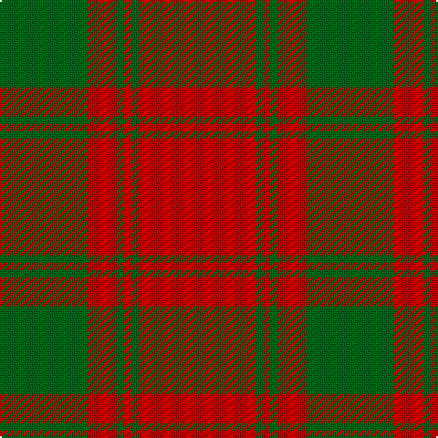

In pattern [GRGRGR](/patterns/grgrgr/).

This was sourced from register-of-tartans.  It is a [6 stripes tartan](/stripes/stripes6/).

Original link https://www.tartanregister.gov.uk/tartanDetails.aspx?ref=2732

## Attestations

This cloth appears in 2 source records; the oldest owns this page.

- 01/01/1886 — MacQuarrie #5 (register-of-tartans, [record](https://www.tartanregister.gov.uk/tartanDetails.aspx?ref=2732))
- 1886 — MacQuarrie - 1886 (Clan) (tartans-authority, [record](http://www.tartansauthority.com/tartan-ferret/display/892/))

## Thread count
G/48 R16 G4 R4 G4 R/64

## Palette
Each colour and its ΔE from the base-6 reference it is a variant of.

| Colour | Shade | Base | ΔE (OKLab) |
|---|---|---|---|
| G | <code style="background-color:#006818;">#006818</code> `#006818` | G <code style="background-color:#006400;">#006400</code> | 0.02 |
| R | <code style="background-color:#C80000;">#C80000</code> `#C80000` | R <code style="background-color:#C80000;">#C80000</code> | 0.00 |

# Sample pattern

ID: /setts/s6/r64g4r4g4r16g48-g006818-rc80000/
