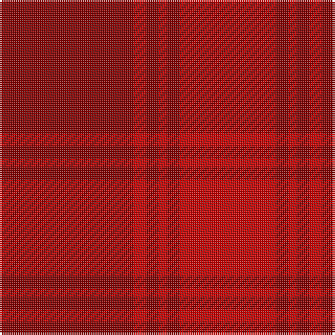

In pattern [RRRRRR](/patterns/rrrrrr/).

This was sourced from register-of-tartans.  It is a [6 stripes tartan](/stripes/stripes6/).

Original link https://www.tartanregister.gov.uk/tartanDetails.aspx?ref=5347

## Attestations

This cloth appears in 2 source records; the oldest owns this page.

- 01/03/2007 — Samye Sangha (register-of-tartans, [record](https://www.tartanregister.gov.uk/tartanDetails.aspx?ref=5347))
- March 2007 — Samye Sangha (Corporate) (tartans-authority, [record](http://www.tartansauthority.com/tartan-ferret/display/7129/))

## Thread count
DR/64 R6 DR6 R4 DR6 R/46

## Palette
Each colour and its ΔE from the base-6 reference it is a variant of.

| Colour | Shade | Base | ΔE (OKLab) |
|---|---|---|---|
| DR | <code style="background-color:#880000;">#880000</code> `#880000` | R <code style="background-color:#CC0000;">#CC0000</code> | 0.15 |
| R | <code style="background-color:#C80000;">#C80000</code> `#C80000` | R <code style="background-color:#CC0000;">#CC0000</code> | 0.01 |

# Sample pattern

## Nearest tartans

The nearest existing variants by ΔTartan distance.

1. [Samye Sangha #2](/setts/s6/r64ra6r6ra4r6ra46-r960000-radc0000/) — ΔT 0.74
1. [Hamilton, Red (Fashion?)](/setts/s5/r46ra8r46ra64r8-r880000-rab84c00/) — ΔT 2.33
1. [Bryce](/setts/s4/r10b70r92ra10-b684038-r880000-raa88000/) — ΔT 2.34
1. [Stirling of Keir (Clan)](/setts/s4/g6b60r60g6-b5c0014-g006840-r8c0020/) — ΔT 2.91
1. [Hamilton, Red](/setts/s8/r64y8r64ra46r8ra46r8ra46-r880000-rab84c00-yd87c00/) — ΔT 2.93
1. [MacNab 2](/setts/s5/r172g6ra6g12ra170-g008000-rd03030-rac00000/) — ΔT 2.96
1. [MacNab 4](/setts/s5/r48g2b2g4ra48-b5480b0-g008000-r900030-rac00000/) — ΔT 2.96
1. [MacNab (Smith)](/setts/s5/r96g4b4g8ra96-b2888c4-g006818-ra00048-rac80000/) — ΔT 2.97
1. [Tune Hotels (Corporate)](/setts/s9/r6ra36rb12r30ra8r6ra8r14w4-rd05054-rac80000-rb880000-we0e0e0/) — ΔT 3.33
1. [Glenshee #2](/setts/s5/r74g18r6ga18g6-g503c14-ga005020-r960028/) — ΔT 3.42

## Neighbour map

Every grey dot is one of 15726 variants placed by the first two principal components of the ΔTartan feature space (44% of its variance). Red is this tartan; blue dots are its nearest — click one to open its page.

<svg viewBox="0 0 640 380" role="img" style="max-width:100%;height:auto;border:1px solid #e0e0e0;border-radius:4px;display:block" xmlns="http://www.w3.org/2000/svg"><image href="/nn/cloud.v1.png" width="640" height="380"/><a href="/setts/s6/r64ra6r6ra4r6ra46-r960000-radc0000/"><circle cx="603.9" cy="264.5" r="4" fill="#3465a4"><title>Samye Sangha #2</title></circle></a><a href="/setts/s5/r46ra8r46ra64r8-r880000-rab84c00/"><circle cx="485.7" cy="318.1" r="4" fill="#3465a4"><title>Hamilton, Red (Fashion?)</title></circle></a><a href="/setts/s4/r10b70r92ra10-b684038-r880000-raa88000/"><circle cx="530.5" cy="324.5" r="4" fill="#3465a4"><title>Bryce</title></circle></a><a href="/setts/s4/g6b60r60g6-b5c0014-g006840-r8c0020/"><circle cx="453.5" cy="303.6" r="4" fill="#3465a4"><title>Stirling of Keir (Clan)</title></circle></a><a href="/setts/s8/r64y8r64ra46r8ra46r8ra46-r880000-rab84c00-yd87c00/"><circle cx="442.0" cy="288.8" r="4" fill="#3465a4"><title>Hamilton, Red</title></circle></a><a href="/setts/s5/r172g6ra6g12ra170-g008000-rd03030-rac00000/"><circle cx="594.2" cy="257.0" r="4" fill="#3465a4"><title>MacNab 2</title></circle></a><a href="/setts/s5/r48g2b2g4ra48-b5480b0-g008000-r900030-rac00000/"><circle cx="472.7" cy="211.4" r="4" fill="#3465a4"><title>MacNab 4</title></circle></a><a href="/setts/s5/r96g4b4g8ra96-b2888c4-g006818-ra00048-rac80000/"><circle cx="474.9" cy="209.9" r="4" fill="#3465a4"><title>MacNab (Smith)</title></circle></a><a href="/setts/s9/r6ra36rb12r30ra8r6ra8r14w4-rd05054-rac80000-rb880000-we0e0e0/"><circle cx="391.2" cy="239.9" r="4" fill="#3465a4"><title>Tune Hotels (Corporate)</title></circle></a><a href="/setts/s5/r74g18r6ga18g6-g503c14-ga005020-r960028/"><circle cx="527.0" cy="254.1" r="4" fill="#3465a4"><title>Glenshee #2</title></circle></a><circle cx="618.4" cy="275.5" r="5" fill="#c00000"/></svg>

ID: /setts/s6/r64ra6r6ra4r6ra46-r880000-rac80000/
