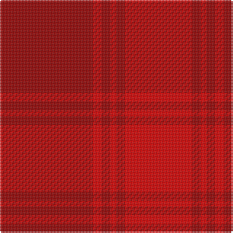

In pattern [RRRRRR](/patterns/rrrrrr/).

This was sourced from register-of-tartans.  It is a [6 stripes tartan](/stripes/stripes6/).

Original link https://www.tartanregister.gov.uk/tartanDetails.aspx?ref=5917

## Thread count
DR/64 R6 DR6 R4 DR6 R/46

## Palette
Each colour and its ΔE from the base-6 reference it is a variant of.

| Colour | Shade | Base | ΔE (OKLab) |
|---|---|---|---|
| DR | <code style="background-color:#960000;">#960000</code> `#960000` | R <code style="background-color:#C80000;">#C80000</code> | 0.11 |
| R | <code style="background-color:#DC0000;">#DC0000</code> `#DC0000` | R <code style="background-color:#C80000;">#C80000</code> | 0.04 |

# Sample pattern

ID: /setts/s6/r64ra6r6ra4r6ra46-r960000-radc0000/
