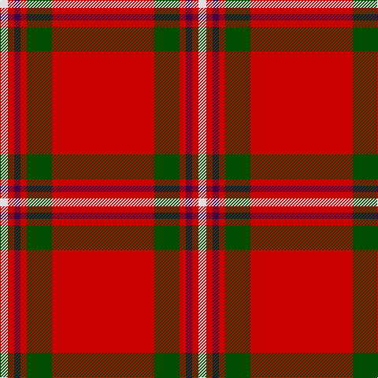

**Bands:** [RGRBRW](/stripes/rgrbrw/) · **Stripes:** [R DG R DP R W](/stripes/stripes6/) R DG R DP R W

This was sourced from register-of-tartans.  It is a [6 band tartan](/bands/bands6/).

Original link https://www.tartanregister.gov.uk/tartanDetails.aspx?ref=11067

## Register references

External register numbers recorded for this tartan.

- Scottish Register of Tartans: [11067](https://www.tartanregister.gov.uk/tartanDetails.aspx?ref=11067)

## Thread count
LN/10 R8 DP8 R8 G32 R/130

## Palette
Each colour and its ΔE from the base-6 reference it is a variant of.

| Colour | Shade | Base | ΔE (OKLab) |
|---|---|---|---|
| DP | <code style="background-color:#440044;">#440044</code> `#440044` | B <code style="background-color:#2A418A;">#2A418A</code> | 0.18 |
| G | <code style="background-color:#004C00;">#004C00</code> `#004C00` | G <code style="background-color:#006100;">#006100</code> | 0.07 |
| LN | <code style="background-color:#E0E0E0;">#E0E0E0</code> `#E0E0E0` | W <code style="background-color:#F7F7F7;">#F7F7F7</code> | 0.07 |
| R | <code style="background-color:#C80000;">#C80000</code> `#C80000` | R <code style="background-color:#CC0000;">#CC0000</code> | 0.01 |

# Sample pattern

## Nearest tartans

The nearest existing variants by ΔTartan distance.

1. [Howard, Vincent (Personal)](/setts/s6/r65g16r4dp4r4w5~x2/) — ΔT 0.22
1. [Masai Shuka 18 (Artefact)](/setts/s4/ly6k3r40w3~x2/) — ΔT 1.23
1. [Glenshee](/setts/s5/r12w1r2lb1n3~x4/) — ΔT 1.24
1. [Rose](/setts/s9/g4r32db9r6db2r3db2r12w3~x2/) — ΔT 1.25
1. [Glen Shee Plaid (Fashion)](/setts/s5/r12w1r2o1n3~x4/) — ΔT 1.29
1. [MacAndrew Dress (Name)](/setts/s6/r72k8r4g16r7o2~x2/) — ΔT 1.30
1. [Cameron Ancient](/setts/s7/r58ly3r6dg16r12dg16r6/) — ΔT 1.30
1. [Princess Elizabeth #2](/setts/s8/r60db8w3db10ly3t4ly3r19~x2/) — ΔT 1.31
1. [Hackston (Green stripe) (Portrait)](/setts/s8/r51lr2k11lo3r11lo3r11g3~x2/) — ΔT 1.32
1. [Rose](/setts/s9/dg2r28db6r5db2r2db2r11lb2/) — ΔT 1.32

## Neighbour map

Every grey dot is one of 14313 variants placed by the first two principal components of the ΔTartan feature space (44% of its variance). Red is this tartan; blue dots are its nearest — click one to open its page.

<svg viewBox="0 0 640 380" role="img" style="max-width:100%;height:auto;border:1px solid #e0e0e0;border-radius:4px;display:block" xmlns="http://www.w3.org/2000/svg"><image href="/nn/cloud.v1.png" width="640" height="380"/><a href="/setts/s6/r65g16r4dp4r4w5~x2/"><circle cx="504.0" cy="149.4" r="4" fill="#3465a4"><title>Howard, Vincent (Personal)</title></circle></a><a href="/setts/s4/ly6k3r40w3~x2/"><circle cx="508.1" cy="173.9" r="4" fill="#3465a4"><title>Masai Shuka 18 (Artefact)</title></circle></a><a href="/setts/s5/r12w1r2lb1n3~x4/"><circle cx="494.7" cy="186.0" r="4" fill="#3465a4"><title>Glenshee</title></circle></a><a href="/setts/s9/g4r32db9r6db2r3db2r12w3~x2/"><circle cx="464.0" cy="145.6" r="4" fill="#3465a4"><title>Rose</title></circle></a><a href="/setts/s5/r12w1r2o1n3~x4/"><circle cx="502.0" cy="193.9" r="4" fill="#3465a4"><title>Glen Shee Plaid (Fashion)</title></circle></a><a href="/setts/s6/r72k8r4g16r7o2~x2/"><circle cx="564.1" cy="133.1" r="4" fill="#3465a4"><title>MacAndrew Dress (Name)</title></circle></a><a href="/setts/s7/r58ly3r6dg16r12dg16r6/"><circle cx="489.5" cy="173.3" r="4" fill="#3465a4"><title>Cameron Ancient</title></circle></a><a href="/setts/s8/r60db8w3db10ly3t4ly3r19~x2/"><circle cx="464.2" cy="114.9" r="4" fill="#3465a4"><title>Princess Elizabeth #2</title></circle></a><a href="/setts/s8/r51lr2k11lo3r11lo3r11g3~x2/"><circle cx="523.5" cy="115.5" r="4" fill="#3465a4"><title>Hackston (Green stripe) (Portrait)</title></circle></a><a href="/setts/s9/dg2r28db6r5db2r2db2r11lb2/"><circle cx="492.5" cy="143.4" r="4" fill="#3465a4"><title>Rose</title></circle></a><circle cx="509.2" cy="152.2" r="5" fill="#c00000"/></svg>

ID: /setts/s6/r65dg16r4dp4r4w5~x2/
