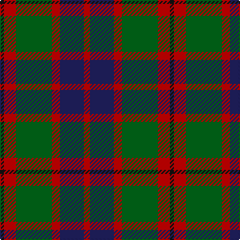

In pattern [KRGRBR](/patterns/krgrbr/).

This was sourced from register-of-tartans.  It is a [6 stripes tartan](/stripes/stripes6/).

Original link https://www.tartanregister.gov.uk/tartanDetails.aspx?ref=1143

## Attestations

This cloth appears in 2 source records; the oldest owns this page.

- 01/01/1963 — Eyre (Personal) (register-of-tartans, [record](https://www.tartanregister.gov.uk/tartanDetails.aspx?ref=1143))
- 1963 — Eyre (Personal) (tartans-authority, [record](http://www.tartansauthority.com/tartan-ferret/display/6605/))

## Thread count
K/4 R12 G36 R8 DB24 R/6

## Palette
Each colour and its ΔE from the base-6 reference it is a variant of.

| Colour | Shade | Base | ΔE (OKLab) |
|---|---|---|---|
| DB | <code style="background-color:#202060;">#202060</code> `#202060` | B <code style="background-color:#2A418A;">#2A418A</code> | 0.11 |
| G | <code style="background-color:#006818;">#006818</code> `#006818` | G <code style="background-color:#006100;">#006100</code> | 0.02 |
| K | <code style="background-color:#101010;">#101010</code> `#101010` | K <code style="background-color:#000000;">#000000</code> | 0.17 |
| R | <code style="background-color:#C80000;">#C80000</code> `#C80000` | R <code style="background-color:#CC0000;">#CC0000</code> | 0.01 |

# Sample pattern

## Nearest tartans

The nearest existing variants by ΔTartan distance.

1. [MacTavish Hunting](/setts/s6/b8g56ga12b24k24b6-b5c8ca8-g603800-ga006818-k101010/) — ΔT 0.72
1. [Thomson (Personal)](/setts/s6/b8g56ga12b24k24b6-b5c8ca8-g604000-ga289c18-k101010/) — ΔT 0.73
1. [Lindsay Htg (Clan?)](/setts/s6/g12k60r32g8ra32k8-g006818-k101010-r880000-ra888888/) — ΔT 0.78
1. [Thompson Hunting Family Tartan Tartan Number: 2093. Earliest known date: 1958 Designed for Lord Thomson of Fleet in 1958 based on a sample in the Moy Hall collection dating from the mid 19th century. The tartan is also suitable for MacTavishs and Thompsons, who claim descent from the Clan MacIntosh. See products available Copyright © Blair Urquhart, Comrie, 2015](/setts/s6/b8g56ga12b24k24b6-b5c8ca8-g604000-ga006818-k101010/) — ΔT 0.85
1. [Portrait, The](/setts/s6/b8r44b8k44b64w8-b441800-k101010-ra07c58-we8ccb8/) — ΔT 0.88
1. [Thompson Black (Fashion)](/setts/s6/g12k60r32g8ra32k8-g006818-k101010-rc80000-ra888888/) — ΔT 0.92
1. [Scottish Ballet](/setts/s6/y10g44b30ba22b10g4-b440044-ba780078-g288028-ye8c000/) — ΔT 0.92
1. [MacTavish Hunting Clan Tartan Tartan Number: 232. Earliest known date: pre 2003 See Lord Thomson See products available Copyright © Blair Urquhart, Comrie, 2015](/setts/s6/b6g52ga8b26k26b4-b5c8ca8-g604000-ga006818-k101010/) — ΔT 0.92
1. [Strathspey (Fashion)](/setts/s6/g6r44b10g20k20g4-b48748c-g006818-k101010-r880000/) — ΔT 0.96
1. [MacMillan - 2002 (Black - Unofficial](/setts/s6/g6k62r34g12y36k6-g004810-k101010-r880000-ybc8c00/) — ΔT 0.98

## Neighbour map

Every grey dot is one of 15726 variants placed by the first two principal components of the ΔTartan feature space (44% of its variance). Red is this tartan; blue dots are its nearest — click one to open its page.

<svg viewBox="0 0 640 380" role="img" style="max-width:100%;height:auto;border:1px solid #e0e0e0;border-radius:4px;display:block" xmlns="http://www.w3.org/2000/svg"><image href="/nn/cloud.v1.png" width="640" height="380"/><a href="/setts/s6/b8g56ga12b24k24b6-b5c8ca8-g603800-ga006818-k101010/"><circle cx="235.5" cy="227.2" r="4" fill="#3465a4"><title>MacTavish Hunting</title></circle></a><a href="/setts/s6/b8g56ga12b24k24b6-b5c8ca8-g604000-ga289c18-k101010/"><circle cx="225.4" cy="223.1" r="4" fill="#3465a4"><title>Thomson (Personal)</title></circle></a><a href="/setts/s6/g12k60r32g8ra32k8-g006818-k101010-r880000-ra888888/"><circle cx="210.8" cy="230.7" r="4" fill="#3465a4"><title>Lindsay Htg (Clan?)</title></circle></a><a href="/setts/s6/b8g56ga12b24k24b6-b5c8ca8-g604000-ga006818-k101010/"><circle cx="236.5" cy="228.4" r="4" fill="#3465a4"><title>Thompson Hunting Family Tartan Tartan Number: 2093. Earliest known date: 1958 Designed for Lord Thomson of Fleet in 1958 based on a sample in the Moy Hall collection dating from the mid 19th century. The tartan is also suitable for MacTavishs and Thompsons, who claim descent from the Clan MacIntosh. See products available Copyright © Blair Urquhart, Comrie, 2015</title></circle></a><a href="/setts/s6/b8r44b8k44b64w8-b441800-k101010-ra07c58-we8ccb8/"><circle cx="231.5" cy="224.8" r="4" fill="#3465a4"><title>Portrait, The</title></circle></a><a href="/setts/s6/g12k60r32g8ra32k8-g006818-k101010-rc80000-ra888888/"><circle cx="199.7" cy="222.8" r="4" fill="#3465a4"><title>Thompson Black (Fashion)</title></circle></a><a href="/setts/s6/y10g44b30ba22b10g4-b440044-ba780078-g288028-ye8c000/"><circle cx="192.9" cy="212.4" r="4" fill="#3465a4"><title>Scottish Ballet</title></circle></a><a href="/setts/s6/b6g52ga8b26k26b4-b5c8ca8-g604000-ga006818-k101010/"><circle cx="249.1" cy="211.2" r="4" fill="#3465a4"><title>MacTavish Hunting Clan Tartan Tartan Number: 232. Earliest known date: pre 2003 See Lord Thomson See products available Copyright © Blair Urquhart, Comrie, 2015</title></circle></a><a href="/setts/s6/g6r44b10g20k20g4-b48748c-g006818-k101010-r880000/"><circle cx="250.0" cy="222.5" r="4" fill="#3465a4"><title>Strathspey (Fashion)</title></circle></a><a href="/setts/s6/g6k62r34g12y36k6-g004810-k101010-r880000-ybc8c00/"><circle cx="216.4" cy="209.9" r="4" fill="#3465a4"><title>MacMillan - 2002 (Black - Unofficial</title></circle></a><circle cx="213.7" cy="221.9" r="5" fill="#c00000"/></svg>

ID: /setts/s6/r6b24r8g36r12k4-b202060-g006818-k101010-rc80000/
