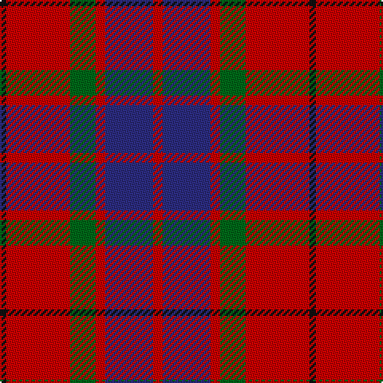

In pattern [KRGRBR](/patterns/krgrbr/).

This was sourced from register-of-tartans.  It is a [6 stripes tartan](/stripes/stripes6/).

Original link https://www.tartanregister.gov.uk/tartanDetails.aspx?ref=1185

## Attestations

This cloth appears in 2 source records; the oldest owns this page.

- 01/01/2005 — Finnigan (Estimated threadcount) (register-of-tartans, [record](https://www.tartanregister.gov.uk/tartanDetails.aspx?ref=1185))
- pre 2005 — Finnigan (Name?) (tartans-authority, [record](http://www.tartansauthority.com/tartan-ferret/display/6752/))

## Thread count
K/4 R40 G16 R6 DB30 R/6

## Palette
Each colour and its ΔE from the base-6 reference it is a variant of.

| Colour | Shade | Base | ΔE (OKLab) |
|---|---|---|---|
| DB | <code style="background-color:#2C2C80;">#2C2C80</code> `#2C2C80` | B <code style="background-color:#2C4084;">#2C4084</code> | 0.05 |
| G | <code style="background-color:#006818;">#006818</code> `#006818` | G <code style="background-color:#006400;">#006400</code> | 0.02 |
| K | <code style="background-color:#101010;">#101010</code> `#101010` | K <code style="background-color:#000000;">#000000</code> | 0.17 |
| R | <code style="background-color:#C80000;">#C80000</code> `#C80000` | R <code style="background-color:#C80000;">#C80000</code> | 0.00 |

# Sample pattern

## Nearest tartans

The nearest existing variants by ΔTartan distance.

1. [Fraser Red Clan Tartan Tartan Number: 1424. Earliest known date: 1842 Early references include Wilson's of Bannockburn, but Wilson did not name the sett. D W Stewart contends that this is in fact an early Grant tartan which he traced to a portrait of Robert Grant of Lurg (1678-1771), hanging at Troup House before it was closed around 1894. It is undoubtedly the most popular Fraser pattern today. See products available Copyright © Blair Urquhart, Comrie, 2015](/setts/s6/r2b12r2g12r24w2-b202060-g003820-rc80000-we0e0e0/) — ΔT 0.60
1. [Fraser VS](/setts/s6/r2b12r2g12r24y2-b000052-g11450d-raa0000-yaaaaaa/) — ΔT 0.77
1. [Carrick (Strathmore) District Tartan Tartan Number: 3216. Earliest known date: c.1999 Sales help Princess Diana Memorial Trust See products available Copyright © Blair Urquhart, Comrie, 2015](/setts/s7/r56b24r6g40ba4g4r14-b202060-ba5c8ca8-g003820-rc80000/) — ΔT 0.78
1. [MacBean/MacElvain](/setts/s7/k4r24b12r6g24r8b2-b2c4084-g005020-k101010-rdc0000/) — ΔT 0.83
1. [Bronte House Check](/setts/s6/r10g60b13y24b24g8-b2c294f-g6b380d-rfc0fc0-yd4ad7d/) — ΔT 0.85
1. [Fraser VS](/setts/s6/r1b6r1g6r12w1-b000064-g004c00-rc80000-wd0d0d0/) — ΔT 0.88
1. [MacDuff #4](/setts/s7/r8k4r48k12b12g32r6-b2c4084-g005020-k101010-rdc0000/) — ΔT 0.92
1. [MacQuarrie #6](/setts/s7/r12g32r8b24r32ba2r4-b2c4084-ba3c82af-g005020-rdc0000/) — ΔT 0.97
1. [Graham of Menteith (Red)](/setts/s6/r72w6r10k42b48k6-b2c2c80-k101010-rc80000-wa8ace8/) — ΔT 1.01
1. [Gates](/setts/s9/b48r6b8r12g16r6g16r60k6-b2c2c80-g006818-k101010-rc80000/) — ΔT 1.05

## Neighbour map

Every grey dot is one of 15726 variants placed by the first two principal components of the ΔTartan feature space (44% of its variance). Red is this tartan; blue dots are its nearest — click one to open its page.

<svg viewBox="0 0 640 380" role="img" style="max-width:100%;height:auto;border:1px solid #e0e0e0;border-radius:4px;display:block" xmlns="http://www.w3.org/2000/svg"><image href="/nn/cloud.v1.png" width="640" height="380"/><a href="/setts/s6/r2b12r2g12r24w2-b202060-g003820-rc80000-we0e0e0/"><circle cx="293.1" cy="188.7" r="4" fill="#3465a4"><title>Fraser Red Clan Tartan Tartan Number: 1424. Earliest known date: 1842 Early references include Wilson's of Bannockburn, but Wilson did not name the sett. D W Stewart contends that this is in fact an early Grant tartan which he traced to a portrait of Robert Grant of Lurg (1678-1771), hanging at Troup House before it was closed around 1894. It is undoubtedly the most popular Fraser pattern today. See products available Copyright © Blair Urquhart, Comrie, 2015</title></circle></a><a href="/setts/s6/r2b12r2g12r24y2-b000052-g11450d-raa0000-yaaaaaa/"><circle cx="298.0" cy="196.3" r="4" fill="#3465a4"><title>Fraser VS</title></circle></a><a href="/setts/s7/r56b24r6g40ba4g4r14-b202060-ba5c8ca8-g003820-rc80000/"><circle cx="308.2" cy="184.6" r="4" fill="#3465a4"><title>Carrick (Strathmore) District Tartan Tartan Number: 3216. Earliest known date: c.1999 Sales help Princess Diana Memorial Trust See products available Copyright © Blair Urquhart, Comrie, 2015</title></circle></a><a href="/setts/s7/k4r24b12r6g24r8b2-b2c4084-g005020-k101010-rdc0000/"><circle cx="259.5" cy="198.0" r="4" fill="#3465a4"><title>MacBean/MacElvain</title></circle></a><a href="/setts/s6/r10g60b13y24b24g8-b2c294f-g6b380d-rfc0fc0-yd4ad7d/"><circle cx="248.2" cy="221.9" r="4" fill="#3465a4"><title>Bronte House Check</title></circle></a><a href="/setts/s6/r1b6r1g6r12w1-b000064-g004c00-rc80000-wd0d0d0/"><circle cx="280.9" cy="185.6" r="4" fill="#3465a4"><title>Fraser VS</title></circle></a><a href="/setts/s7/r8k4r48k12b12g32r6-b2c4084-g005020-k101010-rdc0000/"><circle cx="278.6" cy="183.4" r="4" fill="#3465a4"><title>MacDuff #4</title></circle></a><a href="/setts/s7/r12g32r8b24r32ba2r4-b2c4084-ba3c82af-g005020-rdc0000/"><circle cx="284.8" cy="190.0" r="4" fill="#3465a4"><title>MacQuarrie #6</title></circle></a><a href="/setts/s6/r72w6r10k42b48k6-b2c2c80-k101010-rc80000-wa8ace8/"><circle cx="248.1" cy="194.9" r="4" fill="#3465a4"><title>Graham of Menteith (Red)</title></circle></a><a href="/setts/s9/b48r6b8r12g16r6g16r60k6-b2c2c80-g006818-k101010-rc80000/"><circle cx="268.9" cy="178.4" r="4" fill="#3465a4"><title>Gates</title></circle></a><circle cx="286.3" cy="207.4" r="5" fill="#c00000"/></svg>

ID: /setts/s6/r6b30r6g16r40k4-b2c2c80-g006818-k101010-rc80000/
